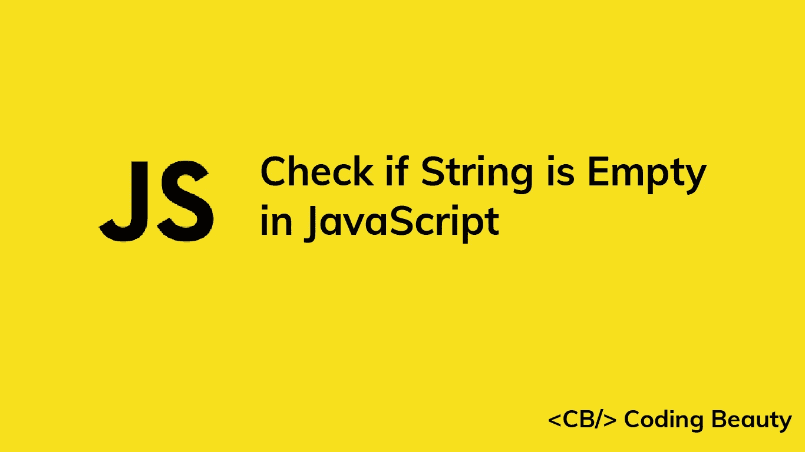

# 如何在 JavaScript 中检查字符串是否为空

> 原文：<https://javascript.plainenglish.io/javascript-check-if-string-is-empty-e12e1bfebd24?source=collection_archive---------1----------------------->

## 了解在 JavaScript 中轻松检查字符串是否为空的多种方法。



# 1.将字符串与空字符串进行比较

为了检查 JavaScript 中的字符串是否为空，我们可以将该字符串与一个`if`语句中的空字符串(`''`)进行比较。

例如:

```
function checkIfEmpty(str) {
  if (str === '') {
    console.log('String is empty');
  } else {
    console.log('String is NOT empty');
  }
}const str1 = 'not empty';
const str2 = ''; // emptycheckIfEmpty(str1); // outputs: String is NOT empty
checkIfEmpty(str2); // outputs: String is empty
```

要将只包含空格的字符串视为空字符串，在与空字符串进行比较之前，对该字符串调用`trim()`方法。

```
function checkIfEmpty(str) {
  if (str.trim() === '') {
    console.log('String is empty');
  } else {
    console.log('String is NOT empty');
  }
}const str1 = 'not empty';
const str2 = ''; // empty
const str3 = '   '; // contains only whitespacecheckIfEmpty(str1); // outputs: String is NOT empty
checkIfEmpty(str2); // outputs: String is empty
checkIfEmpty(str3); // outputs: String is empty
```

`String` `trim()`方法删除一个字符串开头和结尾的所有空格，并返回一个新的字符串，而不修改原来的字符串。

```
const str1 = '  bread  ';
const str2 = '   milk tea    ';console.log(str1.trim()); // 'bread'
console.log(str2.trim()); // 'milk tea'
```

## 小费

在验证表单中的必填字段时修剪字符串有助于确保用户输入的是实际数据，而不仅仅是空白。

# 如何检查一个字符串是否为空、null 或未定义

根据您的场景，您可能希望将该字符串视为一个空值(`null`或`undefined`)。要检查这一点，直接使用字符串`if`语句，如下所示:

```
function checkIfEmpty(str) {
  if (str) {
    console.log('String is NOT empty');
  } else {
    console.log('String is empty');
  }
}const str1 = 'not empty';
const str2 = ''; // empty
const str3 = null;
const str4 = undefined;checkIfEmpty(str1); // outputs: String is NOT empty
checkIfEmpty(str2); // outputs: String is empty
checkIfEmpty(str3); // outputs: String is empty
checkIfEmpty(str4); // outputs: String is empty
```

如果字符串为 nullish 或空，它将在`if`语句中被强制转换为`false`。否则会被强制到`true`。

要删除所有空格并检查 nullish 值，使用可选的链接操作符(`?.`)在字符串上调用`trim()`方法，然后在`if`语句中使用它。

```
function checkIfEmpty(str) {
  if (str?.trim()) {
    console.log('String is NOT empty');
  } else {
    console.log('String is empty');
  }
}const str1 = 'not empty';
const str2 = ''; // empty
const str3 = null;
const str4 = undefined;
const str5 = '    '; // contains only whitespacecheckIfEmpty(str1); // outputs: String is NOT empty
checkIfEmpty(str2); // outputs: String is empty
checkIfEmpty(str3); // outputs: String is empty
checkIfEmpty(str4); // outputs: String is empty
checkIfEmpty(str5); // outputs: String is empty
```

[可选的链接操作符](https://developer.mozilla.org/en-US/docs/Web/JavaScript/Reference/Operators/Optional_chaining)让我们可以在`null`或`undefined`字符串上调用 trim()方法，而不会导致错误。相反，它阻止方法调用并返回`undefined`。

```
const str1 = null;
const str2 = undefined;console.log(str1?.trim()); // undefined
console.log(str2?.trim()); // undefined
```

# 2.将字符串的长度与 0 进行比较

或者，我们可以访问一个字符串的`length`属性，并将其值与`0`进行比较，以检查该字符串是否为空。

```
function checkIfEmpty(str) {
  if (str.length === 0) {
    console.log('String is empty');
  } else {
    console.log('String is NOT empty');
  }
}const str1 = 'not empty';
const str2 = ''; // emptycheckIfEmpty(str1); // outputs: String is NOT empty
checkIfEmpty(str2); // outputs: String is empty
```

为了用这种方法检查只包含空白的字符串，我们还将在用`0`比较被修整的字符串的长度之前调用`trim()`方法。

```
function checkIfEmpty(str) {
  if (str.trim().length === 0) {
    console.log('String is empty');
  } else {
    console.log('String is NOT empty');
  }
}const str1 = 'not empty';
const str2 = ''; // empty
const str3 = '   '; // contains only whitespacecheckIfEmpty(str1); // outputs: String is NOT empty
checkIfEmpty(str2); // outputs: String is empty
checkIfEmpty(str3); // outputs: String is empty
```

*更新于:*[*codingbeautydev.com*](https://cbdev.link/d707b5)

# JavaScript 做的每一件疯狂的事情

一本关于 JavaScript 微妙的警告和鲜为人知的部分的迷人指南。


[**报名**](https://cbdev.link/d3c4eb) 立即免费领取一份。