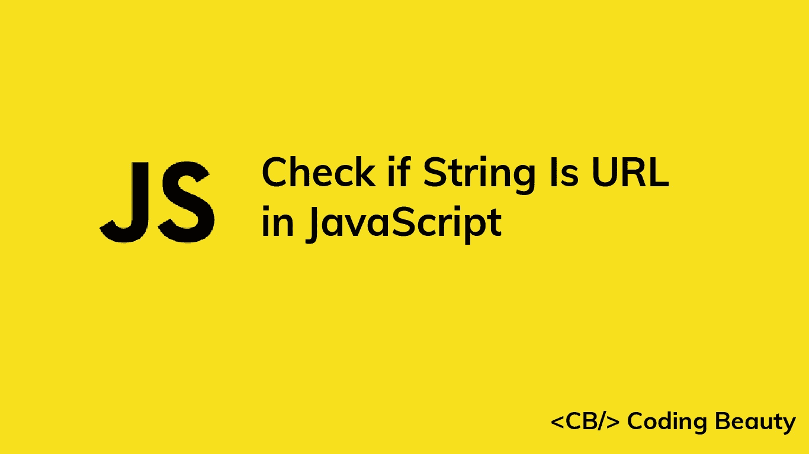

# 如何在 JavaScript 中检查一个字符串是否是 URL

> 原文：<https://javascript.plainenglish.io/javascript-check-if-string-is-url-ddf98d50060a?source=collection_archive---------7----------------------->



在本文中，我们将研究多种方法来轻松检查一个字符串在 JavaScript 中是否是有效的 URL。

# 1.从 URL()构造函数捕获异常

要检查一个字符串是否是 URL，将该字符串传递给`URL()`构造函数。如果字符串是一个有效的 URL，一个新的`URL`对象将被成功创建。否则，将会引发错误。使用`try...catch`块，我们可以处理错误，并在 URL 无效时执行适当的操作。

例如:

```
function isValidUrl(string) {
  try {
    new URL(string);
    return true;
  } catch (err) {
    return false;
  }
}console.log(isValidUrl('https://codingbeautydev.com')); // true
console.log(isValidUrl('app://codingbeautydev.com')); // true
console.log(isValidUrl('Coding Beauty')); // false
```

为了检查一个有效的 **HTTP** URL，我们可以使用`URL`对象的`protocol`属性。

```
function isValidHttpUrl(string) {
  try {
    const url = new URL(string);
    return url.protocol === 'http:' || url.protocol === 'https:';
  } catch (err) {
    return false;
  }
}console.log(isValidHttpUrl('https://codingbeautydev.com')); // true
console.log(isValidHttpUrl('app://codingbeautydev.com')); // false
console.log(isValidHttpUrl('Coding Beauty')); // false
```

`URL` `protocol`属性返回一个表示 URL 协议方案的字符串，包括最后的冒号(`:`)。HTTP URLs 的`protocol`要么是`http:`要么是`https:`。

# 2.正则表达式匹配

或者，我们可以使用正则表达式检查字符串是否是 URL。我们通过在一个`RegExp`对象上调用`test()`方法来实现，这个对象的模式与一个有效 URL 的字符串相匹配。

```
function isValidUrl(str) {
  const pattern = new RegExp(
    '^([a-zA-Z]+:\\/\\/)?' + // protocol
      '((([a-z\\d]([a-z\\d-]*[a-z\\d])*)\\.)+[a-z]{2,}|' + // domain name
      '((\\d{1,3}\\.){3}\\d{1,3}))' + // OR ip (v4) address
      '(\\:\\d+)?(\\/[-a-z\\d%_.~+]*)*' + // port and path
      '(\\?[;&a-z\\d%_.~+=-]*)?' + // query string
      '(\\#[-a-z\\d_]*)?$', // fragment locator
    'i'
  );
  return pattern.test(str);
}console.log(isValidUrl('https://codingbeautydev.com')); // true
console.log(isValidUrl('app://codingbeautydev.com')); // true
console.log(isValidUrl('Coding Beauty')); // false
```

`RegExp` `test()`方法搜索正则表达式和字符串之间的匹配。如果找到匹配，它将返回`true`。否则，返回`false`。

为了检查有效的 **HTTP** URL，我们可以改变正则表达式中与 URL 协议匹配的部分:

```
function isValidHttpUrl(str) {
  const pattern = new RegExp(
    '^(https?:\\/\\/)?' + // protocol
      '((([a-z\\d]([a-z\\d-]*[a-z\\d])*)\\.)+[a-z]{2,}|' + // domain name
      '((\\d{1,3}\\.){3}\\d{1,3}))' + // OR ip (v4) address
      '(\\:\\d+)?(\\/[-a-z\\d%_.~+]*)*' + // port and path
      '(\\?[;&a-z\\d%_.~+=-]*)?' + // query string
      '(\\#[-a-z\\d_]*)?$', // fragment locator
    'i'
  );
  return pattern.test(str);
}console.log(isValidHttpUrl('https://codingbeautydev.com')); // true
console.log(isValidHttpUrl('app://codingbeautydev.com')); // false
console.log(isValidHttpUrl('Coding Beauty')); // false
```

`https?`:图案将只匹配`http:`或`https:`。

# 3.is-url 和 is-url-http NPM 软件包

我们还可以使用 [is-url](https://www.npmjs.com/package/is-url) NPM 包来快速检查一个字符串是否是有效的 url。

```
import isUrl from 'is-url';console.log(isUrl('https://codingbeautydev.com')); // true
console.log(isUrl('app://codingbeautydev.com')); // true
console.log(isUrl('Coding Beauty')); // false
```

为了快速检查一个字符串是否是有效的 HTTP URL，我们可以使用 NPM 的 is-url-http 包。

```
import isUrlHttp from 'is-url-http';console.log(isUrlHttp('https://codingbeautydev.com')); // true
console.log(isUrlHttp('app://codingbeautydev.com')); // false
console.log(isUrlHttp('Coding Beauty')); // false
```

*更新于:*[*codingbeautydev.com*](https://cbdev.link/fca25b)

# JavaScript 做的每一件疯狂的事情

一本关于 JavaScript 微妙的警告和鲜为人知的部分的迷人指南。


[**报名**](https://cbdev.link/d3c4eb) 立即免费领取一份。