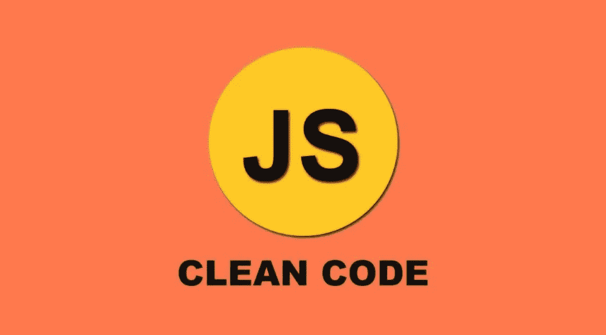

# JavaScript 干净代码:您需要知道的一切

> 原文：<https://javascript.plainenglish.io/javascript-clean-code-all-you-need-to-know-f5db4045a400?source=collection_archive---------2----------------------->

image from morioh

干净的编码意味着你的首要任务是为你自己和你的同事写容易理解和阅读的代码，而不是为机器写。干净的代码对了解我们自己的代码很重要，因为有时我们不知道自己的代码。😁

在本文中，我将讨论 JavaScript 中的一些干净代码技术。

# 1.变量

一个好的变量名使你的代码可读性更好。下面是一些变量命名风格和用法的例子。

## a.使用有意义的变量名

## b.将相同的值赋给多个变量

## c.使用三元运算符有条件地为同一事物赋值

## d.对于**布尔值，**变量名应该是一个问题

# 2.**单一责任原则**

单一职责原则(SRP)规定，一个职能部门只应完成一项具体任务。当函数执行多项任务时，测试和发现 bug 就变得更加困难。下面是一个如何使用 SRP 编写干净代码的例子。

# 3.描述性名称

函数名应该是描述性的，这意味着它需要传达它的意图。有时，我们使用一个短名字，但是一个长的描述性名字比一个短名字或长注释更好。

# 4.移除未使用的函数/代码

如果您的代码中有任何未使用的代码或未使用的函数，那么您为什么要保留它们呢？保留未使用的代码是不好的做法。如果我们在业务逻辑中不使用这些代码/功能，我们应该删除它们。

# 5.尽可能避免回调

我们使用回调来使代码异步。但是嵌套的回调导致了回调地狱，使得我们的代码难看并且难以调试。相反，我们可以使用承诺来使我们的代码看起来漂亮。

# 6.错误处理

高效的错误处理也是干净代码的一部分。大多数时候，我们在错误处理时并不关心 catch 块。我们只关心 try 块。我们也可以捕捉错误。

# 7.少写，多做

尽可能使用 ES6 特性编写代码。有时候，ES6 会减少很多行代码。

## **干净代码的一些值得一提的技巧👇👇**

✔Don't 返回空值

✔Don't 通行证无效

✔布尔变量，或返回布尔值的函数，应该以“是”、“有”或“应该”开头

# 结论:

在这里，我刚刚分享了一些干净的代码技术。有很多技巧可以用来编写干净的代码。只要练习写干净的代码，你会发现很多技巧，你的代码会很漂亮。

非常感谢您阅读我的文章。

如果你觉得这篇文章有些价值，那就随意鼓掌吧。👏

编码快乐！❤❤

*更多内容请看*[***plain English . io***](http://plainenglish.io/)*。报名参加我们的* [***免费周报***](http://newsletter.plainenglish.io/) *。在我们的* [***社区***](https://discord.gg/GtDtUAvyhW) *获得独家获得写作机会和建议。*