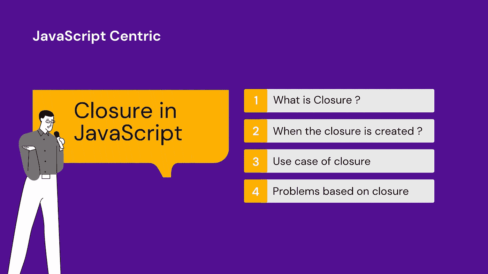
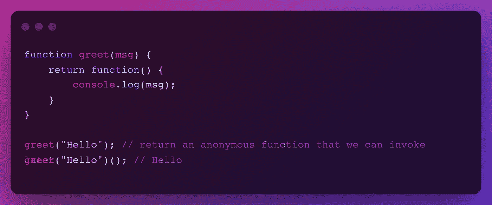
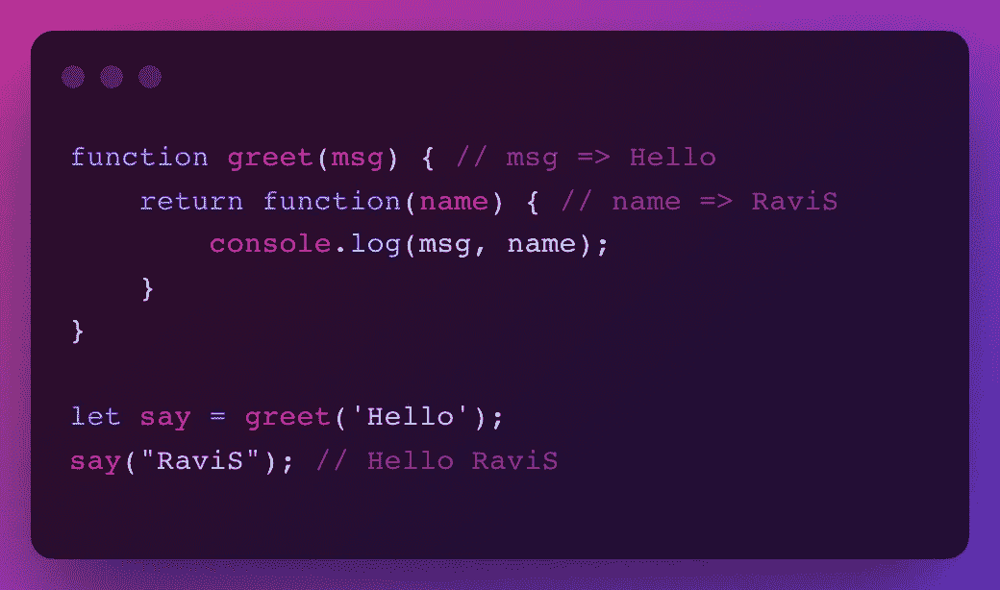

# 关于 JavaScript 闭包你需要知道的一切

> 原文：<https://javascript.plainenglish.io/javascript-closure-explained-f3de8b69ccb1?source=collection_archive---------5----------------------->

## 深入探究 JavaScript 中的闭包概念。



JavaScript Closure Explained

在本文中，我将介绍与 JavaScript 闭包相关的所有内容。到本文结束时，您将对闭包有一个很好的理解。

# 什么是终结？

对于任何编程语言来说，闭包是一种使函数能够捕获定义它的环境的特性，或者我们可以说闭包是函数和定义该函数的词法环境的组合。

*基本上，闭包让你可以从内部函数访问外部函数的范围。*

为了更好地理解它，让我们举一个例子——1:



在上面的例子中，内部函数可以像 msg 一样访问外部函数的作用域及其变量。当我们调用外部函数 **greet** 时，它将返回一个匿名函数，我们可以稍后调用，或者像 **greet("Hello ")()。**

实施例 2:



在这个例子中，当我们调用外部函数 **greet** 时，它将返回一个匿名函数，我们可以将它存储在一个变量**比如说**中，我们可以在**比如说**变量和传递参数 RaviS 的帮助下调用内部函数。所以它会如期返回 **Hello RaviS** 。

**我们来理解一下给定代码的执行:**

当代码开始执行时，我们有我们的全局执行上下文，其中我们有两个执行上下文 **greet()** 和 **anonymous()** 函数。

*执行上下文是 JavaScript 代码执行的环境。对于每个函数调用，都会创建一个单独的执行上下文，并将其推入执行堆栈。一旦函数执行完成，它将从堆栈中弹出。*

每个执行上下文在内存中都有一个存储变量和函数的空间，一旦函数从执行堆栈中弹出，JavaScript 垃圾收集器就会清除所有这些东西。

当我们击中:

```
let say = greet('Hello');
```

它调用 **greet** 函数，创建一个 greet 执行上下文，传递给它的 **msg** 变量存储在其变量环境中，并返回一个新的匿名函数。在 return 语句之后，greet 执行上下文从执行堆栈中弹出。

**但是，**

**一个问题**:曾经 greet()函数从堆栈弹出的 **msg** 怎么了？

**回答** : *在 JavaScript 中，任何东西只有在没有对它的引用时才会被垃圾收集。*

然而，当垃圾收集器看到我们的 **msg** 变量时，它说:“哦！这里有一个闭包，我不能清理它，因为有东西在引用 msg，”然后，JavaScript 引擎把它放在特殊的闭包框中！

在上面的例子中，匿名执行上下文仍然有一个对其外部环境的内存空间的变量的引用。即使 greet()已经完成。(它可以访问**消息**变量并在 console.log( **消息**，name)内部使用)。

# 闭包是什么时候创建的？

要记住的一件重要的事情是，你不是在制造任何结束。当你说，我创建了一个闭包，那么这是错误的，JavaScript 引擎为你创建了闭包，你只是在利用它。

所以，在 JavaScript 中，**每当在创建函数时创建一个函数，或者在另一个函数中定义一个函数时，就会创建闭包。**

# **闭包的用例**

1.  如果你用过或听说过诸如映射、过滤、减少之类的功能，它们都使用闭包来使事情成为可能。
2.  正是因为闭包，我们可以做高阶函数的事情，如 currying、memoization、pipe、compose 等。
3.  在 JavaScript 中，闭包是用于实现数据隐私的主要机制。当您使用闭包来保护数据隐私时，包含的变量只在包含函数的范围内。

# 基于闭包的问题

您可以访问这篇文章了解与闭包相关的问题。我已经分享了许多解决方案的例子。

[](https://blog.bitsrc.io/collection-of-closure-problems-in-javascript-fcd38ac1c765) [## JavaScript 中常见的闭包问题

### 在这篇文章中，我分享了一些基于 JavaScript 闭包的最常见和最复杂的问题。

blog.bitsrc.io](https://blog.bitsrc.io/collection-of-closure-problems-in-javascript-fcd38ac1c765) 

希望你喜欢这篇文章。关注我即将发布的文章。

快乐学习！

*更多内容看* [***说白了。报名参加我们的***](https://plainenglish.io/) **[***免费周报***](http://newsletter.plainenglish.io/) *。关注我们关于*[***Twitter***](https://twitter.com/inPlainEngHQ)*和*[***LinkedIn***](https://www.linkedin.com/company/inplainenglish/)*。加入我们的* [***社区不和谐***](https://discord.gg/GtDtUAvyhW) *。***