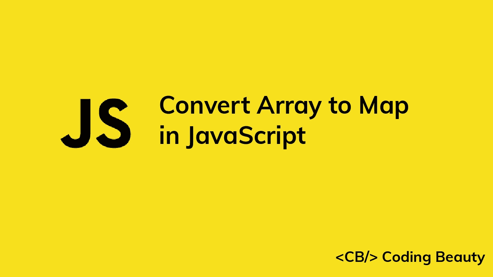

# 如何在 JavaScript 中将数组转换成地图

> 原文：<https://javascript.plainenglish.io/javascript-convert-array-to-map-12907a8a334a?source=collection_archive---------1----------------------->



在本文中，我们将研究两种在 JavaScript 中将对象数组快速转换为`Map`对象的方法。

# 1.Map()构造函数和数组 map()

要将对象数组转换成地图，我们可以使用`Array` `map()`方法创建一个键值对数组，然后将得到的数组传递给`Map()`构造函数来创建一个`Map`对象。

```
const arr = [
  { key: 'user1', value: 'John' },
  { key: 'user2', value: 'Kate' },
  { key: 'user3', value: 'Peter' },
];
const map = new Map(arr.map((obj) => [obj.key, obj.value]));// Map(3) { 'user1' => 'John', 'user2' => 'Kate', 'user3' => 'Peter' }
console.log(map);
```

在传递给`map()`方法的回调中，我们返回一个包含每个对象的键和值的数组。这将产生一个键值对数组:

```
// [ [ 'user1', 'John' ], [ 'user2', 'Kate' ], [ 'user3', 'Peter' ] ]
console.log(arr.map((obj) => [obj.key, obj.value]));
```

`Map`构造函数可以将这种形式的数组作为参数来创建一个`Map`对象。

# 2.映射集()和数组 forEach()

另一种将对象数组转换成地图的方法是使用`Array` `forEach()`方法。首先，我们创建一个新的`Map`对象。然后，我们通过调用传递给`forEach()`的回调中的`Map` `set()`方法，将所有数组元素的条目添加到`Map`。这里有一个例子:

```
const arr = [
  { key: 'user1', value: 'John' },
  { key: 'user2', value: 'Kate' },
  { key: 'user3', value: 'Peter' },
];const map = new Map();
arr.forEach((obj) => {
  map.set(obj.key, obj.value);
});// Map(3) { 'user1' => 'John', 'user2' => 'Kate', 'user3' => 'Peter' }
console.log(map);
```

*更新于:*[*codingbeautydev.com*](https://codingbeautydev.com/blog/javascript-convert-array-to-map/)

每周获取新的 web 开发技巧和教程。


[**订阅**](https://codingbeautydev.com/newsletter)