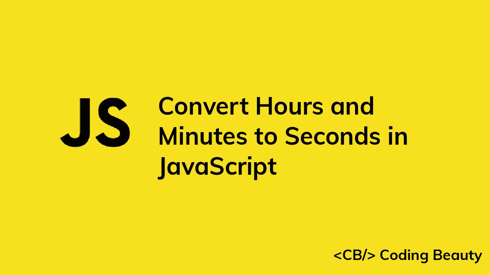

# 如何在 JavaScript 中将小时和分钟转换成秒

> 原文：<https://javascript.plainenglish.io/javascript-convert-hours-and-minutes-to-seconds-3de0401a9355?source=collection_archive---------11----------------------->



要在 JavaScript 中将小时和分钟转换为秒:

1.  将小时乘以 3600，将其转换为秒。
2.  将分钟乘以 60，将其转换为秒。
3.  将这些秒数加到秒数时间值上，得到总秒数。

例如:

`JavaScript`

```
function toSeconds(hours, minutes, seconds) {
  return hours * 3600 + minutes * 60 + seconds;
}

console.log(toSeconds(2, 15, 10)); // 8110

console.log(toSeconds(1, 5, 30)); // 3930
```

我们创建了一个可重用的`toSeconds()`函数来轻松地将小时和分钟转换成秒。

功能相当容易理解；1 小时等于 3600 秒，所以我们将小时值乘以 3600，得到等效的秒数。类似地，1 分钟等于 60 秒，因此我们将分钟值乘以 60 来获得等效的秒。

在此之后，我们将等效的秒值添加到`seconds`参数中，以获得总秒数。

我们可以重写函数，将时间值作为对象的命名属性来接受，而不是作为多个参数。

`JavaScript`

```
function toSeconds({ h: hours, m: minutes, s: seconds }) {
  return hours * 3600 + minutes * 60 + seconds;
}

console.log(toSeconds({ h: 2, m: 15, s: 10 })); // 8110

console.log(toSeconds({ h: 1, m: 5, s: 30 })); // 3930
```

这种方法更容易理解传递给函数的每个值的作用

# 在 JavaScript 中将`HH:mm:ss`转换成秒

有时候要转换成秒的时间输入是一个时间格式的字符串，比如`HH:mm:ss`。在这种情况下，为了转换成秒，我们将使用分隔符(在这种情况下为`:`)分隔各个时间值，将它们转换成数字，并执行与前面示例中相同的时间转换步骤。

例如:

`JavaScript`

```
function toSeconds(timeStr) {
  const [hours, minutes, seconds] = timeStr.split(':').map(Number);
  return hours * 3600 + minutes * 60 + seconds;
}

console.log(toSeconds('02:15:10')); // 8110

console.log(toSeconds('01:05:30')); // 3930
```

这里的输入字符串是`HH:mm:ss`格式的；小时、分钟和秒钟值由冒号(`:`)分隔，每个值至少由两位数字表示。

`[String](https://developer.mozilla.org/en-US/docs/Web/JavaScript/Reference/Global_Objects/String/split)` [](https://developer.mozilla.org/en-US/docs/Web/JavaScript/Reference/Global_Objects/String/split)`[split()](https://developer.mozilla.org/en-US/docs/Web/JavaScript/Reference/Global_Objects/String/split)`方法将一个字符串拆分成一个由原始字符串中给定分隔符分隔的子字符串数组。我们传递一个冒号作为分隔符来获取一个单独时间值的数组。

`JavaScript`

```
const timeStr = '02:15:10';

console.log(timeStr.split(':')); // [ '02', '15', '10' ]
```

得到这个数组后，我们使用`[map()](https://developer.mozilla.org/en-US/docs/Web/JavaScript/Reference/Global_Objects/Array/map)`方法将每个时间值转换成一个数字。`map()`方法接受一个回调并在数组的每个元素上调用它，并使用结果填充一个新数组。对于我们的场景，回调只是简单的`[Number()](https://developer.mozilla.org/en-US/docs/Web/JavaScript/Reference/Global_Objects/Number/Number)`构造函数，所以数组中的每个时间值都被转换成一个数字。

`JavaScript`

```
console.log(['02', '15', '10'].map(Number)); // [ 2, 15, 10 ]
```

**注**

这个:

`JavaScript`

```
const [hours, minutes, seconds] = timeStr.split(':').map(Number);
```

相当于这样:

`JavaScript`

```
const [hours, minutes, seconds] = timeStr
    .split(':')
    .map((str) => Number(str));
```

第二个更长，但是它清楚地表明了传递给`map()`回调的参数。在第一个例子中，`map()`自动传递 3 个参数给它的回调函数，如果回调函数根据它接收到的参数的数量返回不同的结果，例如一个`[parseInt()](https://developer.mozilla.org/en-US/docs/Web/JavaScript/Reference/Global_Objects/parseInt)`回调函数，这可能会有问题。

然后，我们使用一个[析构赋值](https://developer.mozilla.org/en-US/docs/Web/JavaScript/Reference/Operators/Destructuring_assignment)将数字数组值解包到单独的小时、分钟和秒变量中。

`JavaScript`

```
const [hour, minute, seconds] = [2, 15, 10];

console.log(hour); // 2

console.log(minute); // 15

console.log(seconds); // 10
```

完成此操作后，我们执行与第一个示例中相同的乘法和加法，将小时和分钟转换为秒，并获得总秒数。

*最初发表于*[*codingbeautydev.com*](https://cbdev.link/05116c)

# JavaScript 做的每一件疯狂的事情

一本关于 JavaScript 微妙的警告和鲜为人知的部分的迷人指南。


[**注册**](https://cbdev.link/d3c4eb) 即可免费领取一份。

## 更多内容请访问 [PlainEnglish.io](https://plainenglish.io/) 。

*报名参加我们的* [***免费周报***](http://newsletter.plainenglish.io/) *。关注我们上* [***推特***](https://twitter.com/inPlainEngHQ) ， [***领英***](https://www.linkedin.com/company/inplainenglish/) ***，***[***YouTube***](https://www.youtube.com/channel/UCtipWUghju290NWcn8jhyAw)***，以及****[***不和***](https://discord.gg/GtDtUAvyhW) *

## *想扩大你的软件创业规模吗？检查[电路](https://circuit.ooo/?utm=publication-post-cta)。*