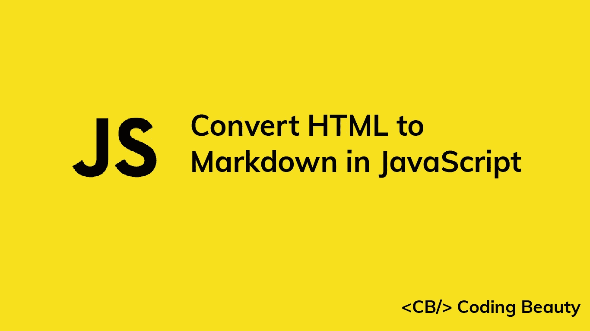

# 如何在 JavaScript 中轻松地将任何 HTML 字符串转换为 Markdown

> 原文：<https://javascript.plainenglish.io/javascript-convert-html-to-markdown-de907c2dfa33?source=collection_archive---------10----------------------->



我们可以使用 [Turndown](https://github.com/domchristie/turndown) 库轻松地将 HTML 转换成 JavaScript 中的 markdown。

# 从 NPM 安装翻板

要开始使用 Turndown，我们可以使用以下命令从 NPM 安装它:

```
npm i turndown
```

安装完成后，我们可以将其导入 JavaScript 模块，如下所示:

```
import TurndownService from 'turndown';
```

对于一个常见的 JS 模块，我们将改为这样导入它:

```
const TurndownService = require('turndown');
```

现在我们可以使用`turndown`模块轻松地将任何 HTML 字符串转换成 markdown:

```
import TurndownService from 'turndown';const html = `
<h1>Learn Web Development</h1>
<p>Check out <a href="https://codingbeautydev.com/blog">Coding Beauty</a> for some great tutorials!</p>
`;// Create an instance of the Turndown service
const turndownService = new TurndownService();const markdown = turndownService.turndown(html);console.log(markdown);
```

该代码将有以下输出:

```
Learn Web Development
=====================Check out [Coding Beauty](https://codingbeautydev.com/blog) for some great tutorials!
```

# 在带有脚本标签的浏览器中使用关闭

我们也可以在浏览器中使用 Turndown，方法是使用`script`标签导入 Turndown 脚本:

```
<script src="https://unpkg.com/turndown/dist/turndown.js"></script>
```

包含该脚本后，我们将能够像在前面的代码示例中一样轻松地将 HTML 转换为 Markdown:

```
const html = `
<h1>Learn Web Development</h1>
<p>Check out <a href="https://codingbeautydev.com/blog">Coding Beauty</a> for some great tutorials!</p>
`;// Create an instance of the Turndown service
const turndownService = new TurndownService();const markdown = turndownService.turndown(html);console.log(markdown);
```

在浏览器中，我们还可以将 DOM 节点作为输入传递给 Turndown:

```
// convert document <body> to Markdown
const bodyMarkdown = turndownService.turndown(document.body);// convert first <div> tag to Markdown
const divMarkdown = turndownService.turndown(document.body);
```

# 传递拒绝选项

我们可以将选项传递给 Turndown 来定制它应该如何将 HTML 字符串转换为 Markdown。创建拒绝服务的新实例时，可以在构造函数中指定选项。

例如:

```
import TurndownService from 'turndown';const html = `
<ul>
<li>HTML</li>
<li>CSS</li>
<li>JavaScript<li>`;// Specifying options when creating an instance of the
// Turndown service
const turndownService = new TurndownService({ bulletListMarker: '-' });const markdown = turndownService.turndown(html);console.log(markdown);
```

这里，我们使用`bulletListMarker`属性来指定 Turndown 应该使用`-`符号来表示减价中的列表项。这将是代码的输出:

```
-   HTML
-   CSS
-   JavaScript
```

`bullerListMarker`也接受其他值，比如`*`字符:

```
import TurndownService from 'turndown';const html = `
<ul>
<li>HTML</li>
<li>CSS</li>
<li>JavaScript<li>`;// Specifying options when creating an instance of the
// Turndown service
const turndownService = new TurndownService({ bulletListMarker: '*' });const markdown = turndownService.turndown(html);console.log(markdown);
```

这将产生以下输出:

```
*   HTML
*   CSS
*   JavaScript
```

*转自*[*codingbeautydev.com*](https://cbdev.link/0af2bb)

# JavaScript 做的每一件疯狂的事情

[注册](https://cbdev.link/d3c4eb)并立即免费获得这本引人入胜的指南，了解 JavaScript 微妙的注意事项和鲜为人知的部分。


*更多内容请看*[***plain English . io***](https://plainenglish.io/)*。报名参加我们的* [***免费周报***](http://newsletter.plainenglish.io/) *。关注我们关于*[***Twitter***](https://twitter.com/inPlainEngHQ)[***LinkedIn***](https://www.linkedin.com/company/inplainenglish/)*[***YouTube***](https://www.youtube.com/channel/UCtipWUghju290NWcn8jhyAw)*[***不和***](https://discord.gg/GtDtUAvyhW) *。***