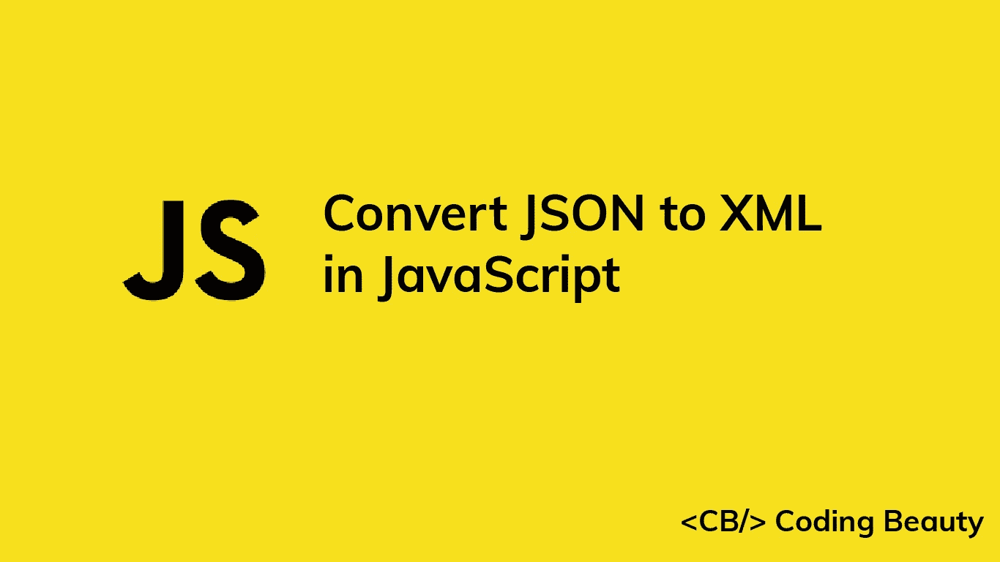

# 如何用 JavaScript 将 JSON 转换成 XML

> 原文：<https://javascript.plainenglish.io/javascript-convert-json-to-xml-80caf3148886?source=collection_archive---------10----------------------->

## 了解如何用 JavaScript 轻松地将 JSON 字符串转换成 XML 字符串。



我们可以使用`xml-js`库轻松地将 JSON 字符串转换成 JavaScript 中的 XML 字符串。

```
import { json2xml } from 'xml-js';const jsonObj = {
  name: 'Garage',
  cars: [
    { color: 'red', maxSpeed: 120, age: 2 },
    { color: 'blue', maxSpeed: 100, age: 3 },
    { color: 'green', maxSpeed: 130, age: 2 },
  ],
};const json = JSON.stringify(jsonObj);const xml = json2xml(json, { compact: true, spaces: 4 });console.log(xml);
```

该代码将有以下输出:

```
<name>Garage</name>
<cars>
    <color>red</color>
    <maxSpeed>120</maxSpeed>
    <age>2</age>
</cars>
<cars>
    <color>blue</color>
    <maxSpeed>100</maxSpeed>
    <age>3</age>
</cars>
<cars>
    <color>green</color>
    <maxSpeed>130</maxSpeed>
    <age>2</age>
</cars>
```

# 安装 xml-js

在使用`xml-js`之前，我们需要将它安装到我们的项目中。我们可以使用 NPM 命令行界面来实现这一点。

```
npm i xml-js
```

或使用纱线 CLI:

```
yarn add xml-js
```

安装完成后，我们可以将其导入 JavaScript 模块，如下所示:

```
import { json2xml } from 'xml-js';
```

我们使用导入析构直接从库中访问`json2xml()`方法。

对于 CommonJS 模块，我们将改为这样导入它:

```
const { json2xml } = require('xml-js');
```

# json2xml()函数

库中的`json2xml()`函数有两个参数。第一个是要转换成 XML 的 JSON 字符串，第二个是对象。

```
const xml = json2xml(json, { compact: true, spaces: 4 });
```

# 定制 JSON 到 XML 的转换

此对象用于指定自定义转换过程的各种选项。

在我们的例子中，我们将`compact`属性设置为`true`，以表明 JSON 字符串输入是紧凑形式的。

我们将`spaces`属性设置为`4`，将嵌套的 XML 节点缩进 4 个空格。因此，我们可以通过将`spaces`设置为`1`来减少缩进:

```
import { json2xml } from 'xml-js';const jsonObj = {
  name: 'Garage',
  cars: [
    { color: 'red', maxSpeed: 120, age: 2 },
    { color: 'blue', maxSpeed: 100, age: 3 },
    { color: 'green', maxSpeed: 130, age: 2 },
  ],
};const json = JSON.stringify(jsonObj);const xml = json2xml(json, { compact: true, spaces: 1 });console.log(xml);
```

现在，我们将得到以下 XML 输出:

```
<name>Garage</name>
<cars>
 <color>red</color>
 <maxSpeed>120</maxSpeed>
 <age>2</age>
</cars>
<cars>
 <color>blue</color>
 <maxSpeed>100</maxSpeed>
 <age>3</age>
</cars>
<cars>
 <color>green</color>
 <maxSpeed>130</maxSpeed>
 <age>2</age>
</cars>
```

# JSON 到 XML 的本机转换

如果不想使用任何第三方库，那么可以使用这个递归函数将 JSON 转换成 XML:

```
function JSONtoXML(obj) {
  let xml = '';
  for (let prop in obj) {
    xml += obj[prop] instanceof Array ? '' : '<' + prop + '>';
    if (obj[prop] instanceof Array) {
      for (let array in obj[prop]) {
        xml += '\n<' + prop + '>\n';
        xml += JSONtoXML(new Object(obj[prop][array]));
        xml += '</' + prop + '>';
      }
    } else if (typeof obj[prop] == 'object') {
      xml += JSONtoXML(new Object(obj[prop]));
    } else {
      xml += obj[prop];
    }
    xml += obj[prop] instanceof Array ? '' : '</' + prop + '>\n';
  }
  xml = xml.replace(/<\/?[0-9]{1,}>/g, '');
  return xml;
}const jsonObj = {
  name: 'Garage',
  cars: [
    { color: 'red', maxSpeed: 120, age: 2 },
    { color: 'blue', maxSpeed: 100, age: 3 },
    { color: 'green', maxSpeed: 130, age: 2 },
  ],
};const xml = JSONtoXML(jsonObj);console.log(xml);
```

该代码将产生以下输出:

```
<name>Garage</name><cars>
<color>red</color>
<maxSpeed>120</maxSpeed>
<age>2</age>
</cars>
<cars>
<color>blue</color>
<maxSpeed>100</maxSpeed>
<age>3</age>
</cars>
<cars>
<color>green</color>
<maxSpeed>130</maxSpeed>
<age>2</age>
</cars>
```

*原载于*[*codingbeautydev.com*](https://cbdev.link/247182)

# JavaScript 做的每一件疯狂的事情

一本关于 JavaScript 微妙的警告和鲜为人知的部分的迷人指南。


[**报名**](https://cbdev.link/d3c4eb) 立即免费领取一份。

*更多内容请看*[***plain English . io***](https://plainenglish.io/)*。报名参加我们的* [***免费周报***](http://newsletter.plainenglish.io/) *。关注我们关于*[***Twitter***](https://twitter.com/inPlainEngHQ)[***LinkedIn***](https://www.linkedin.com/company/inplainenglish/)*[***YouTube***](https://www.youtube.com/channel/UCtipWUghju290NWcn8jhyAw)*[***不和***](https://discord.gg/GtDtUAvyhW) *。对增长黑客感兴趣？检查* [***电路***](https://circuit.ooo/) *。***