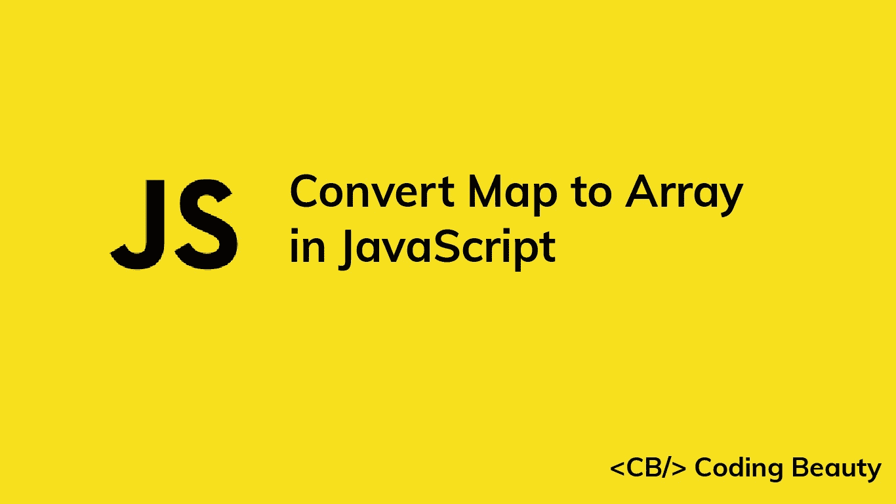

# 如何在 JavaScript 中将地图转换成数组

> 原文：<https://javascript.plainenglish.io/javascript-convert-map-to-array-9c93fe20e647?source=collection_archive---------2----------------------->

## 了解在 JavaScript 中将地图对象轻松转换为对象数组的多种方法。



在本文中，我们将学习在 JavaScript 中将一个`Map`对象转换成一个对象数组的不同方法。

# 1.数组 from()方法

要将映射转换为数组，我们可以使用静态的`Array.from()`方法，将`Map`作为第一个参数传递，并将映射函数转换`Map`条目作为第二个参数。

```
const map = new Map();
map.set('user1', 'John');
map.set('user2', 'Kate');
map.set('user3', 'Peter');const arr = Array.from(map, function (entry) {
  return { key: entry[0], value: entry[1] };
});/**
  [
    { key: 'user1', value: 'John' },
    { key: 'user2', value: 'Kate' },
    { key: 'user3', value: 'Peter' }
  ]
*/
console.log(arr);
```

**注意**:我们可以使用数组析构和箭头函数来缩短上面的代码:

```
const arr = Array.from(map, ([key, value]) => ({
  key,
  value,
}));
```

**注意**:要将`Map`转换成一个键值对象数组:

```
const arr = Array.from(map, ([key, value]) => ({
  [key]: value,
}));// [ { user1: 'John' }, { user2: 'Kate' }, { user3: 'Peter' } ]
console.log(arr);
```

**注意**:如果我们不将 map 函数作为参数传递，`Array.from()`将返回一个键值对数组，每个键值对对应一个`Map`条目。例如:

```
const map = new Map();
map.set('user1', 'John');
map.set('user2', 'Kate');
map.set('user3', 'Peter');const arr = Array.from(map);// [ [ 'user1', 'John' ], [ 'user2', 'Kate' ], [ 'user3', 'Peter' ] ]
console.log(arr);
```

这意味着我们可以使用 Array `map()`方法将这个数组转换成一个对象数组:

```
const map = new Map();
map.set('user1', 'John');
map.set('user2', 'Kate');
map.set('user3', 'Peter');const arr = Array.from(map).map(([key, value]) => ({
  key,
  value,
}));/**
  [
    { key: 'user1', value: 'John' },
    { key: 'user2', value: 'Kate' },
    { key: 'user3', value: 'Peter' }
  ]
*/
console.log(arr);
```

# 2.展开运算符和数组映射()

在`Map`上使用 JavaScript spread 操作符(`...`)会将其条目解包到一个键值对数组中，就像`Array.from()`没有收到回调时一样。例如:

```
const map = new Map();
map.set('user1', 'John');
map.set('user2', 'Kate');
map.set('user3', 'Peter');const arr = [...map];// [ [ 'user1', 'John' ], [ 'user2', 'Kate' ], [ 'user3', 'Peter' ] ]
console.log(arr);
```

这意味着我们也可以通过将 spread 操作符与 Array `map()`方法结合起来，将一个`Map`转换成一个对象数组:

```
const map = new Map();
map.set('user1', 'John');
map.set('user2', 'Kate');
map.set('user3', 'Peter');const arr = [...map].map(([key, value]) => ({
  key,
  value,
}));/**
  [
    { key: 'user1', value: 'John' },
    { key: 'user2', value: 'Kate' },
    { key: 'user3', value: 'Peter' }
  ]
*/
console.log(arr);
```

# 3.迭代映射并将元素添加到数组

将`Map`转换为数组的另一种方法是迭代每个`Map`条目，用条目创建一个对象，并将该对象添加到结果数组中。比如我们可以用`Map` `forEach()`方法迭代`Map`，用`Array` `push()`方法添加数组元素。

```
const map = new Map();
map.set('user1', 'John');
map.set('user2', 'Kate');
map.set('user3', 'Peter');const arr = [];
map.forEach((value, key) => arr.push({ key, value }));/**
  [
    { key: 'user1', value: 'John' },
    { key: 'user2', value: 'Kate' },
    { key: 'user3', value: 'Peter' }
  ]
*/
console.log(arr);
```

或者，我们可以使用`for...of`循环来迭代地图:

```
const map = new Map();
map.set('user1', 'John');
map.set('user2', 'Kate');
map.set('user3', 'Peter');const arr = [];
for (const [key, value] of map) {
  arr.push({ key, value });
}/**
  [
    { key: 'user1', value: 'John' },
    { key: 'user2', value: 'Kate' },
    { key: 'user3', value: 'Peter' }
  ]
*/
console.log(arr);
```

*更新于:*[*codingbeautydev.com*](https://codingbeautydev.com/blog/javascript-convert-map-to-array/)

每周获取新的 web 开发技巧和教程。


[**订阅**](https://codingbeautydev.com/newsletter)