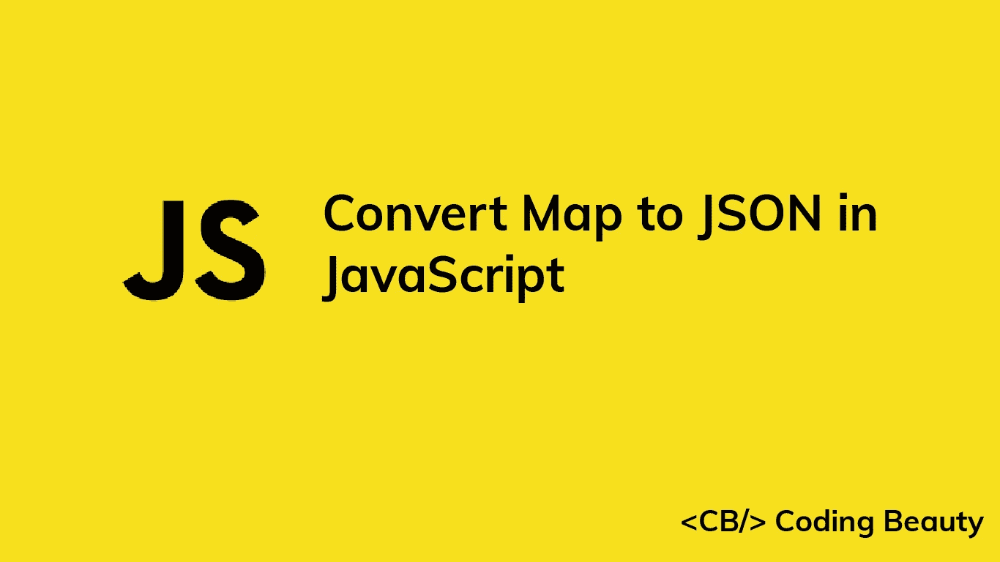

# 如何用 JavaScript 将地图转换成 JSON

> 原文：<https://javascript.plainenglish.io/javascript-convert-map-to-json-51ee1232e2b9?source=collection_archive---------11----------------------->

## 了解如何用 JavaScript 轻松地将地图转换成 JSON 字符串。



要在 JavaScript 中将一个`Map`转换成 JSON，调用带有`Map`作为参数的`Object.fromEntries()`方法，并将结果传递给`JSON.stringify()`方法。例如:

```
const map = new Map([
  ['user1', 'John'],
  ['user2', 'Kate'],
  ['user3', 'Peter'],
]);const json = JSON.stringify(Object.fromEntries(map));// {"user1":"John","user2":"Kate","user3":"Peter"}
console.log(json);
```

我们首先用`Object.fromEntries()`转换`Map`，因为我们不能直接将`Map`序列化为 JSON 字符串。`Object.fromEntries()`方法将任何键值对列表转换成一个对象:

```
const map = new Map([
  ['user1', 'John'],
  ['user2', 'Kate'],
  ['user3', 'Peter'],
]);const obj = Object.fromEntries(map);// { user1: 'John', user2: 'Kate', user3: 'Peter' }
console.log(obj);
```

# 将 JSON 转换为 Map

要将 JSON 字符串转换回一个`Map`:

1.  用`JSON.parse()`将 JSON 字符串解析成一个对象。
2.  用这个对象作为参数调用`Object.entries()`。
3.  创建一个新的`Map`对象，将`Object.entries()`的结果传递给构造函数。

例如:

```
const map = new Map([
  ['user1', 'John'],
  ['user2', 'Kate'],
  ['user3', 'Peter'],
]);const jsonFromMap = JSON.stringify(Object.fromEntries(map));const obj = JSON.parse(jsonFromMap);
const mapFromObj = new Map(Object.entries(obj));// Map(3) { 'user1' => 'John', 'user2' => 'Kate', 'user3' => 'Peter' }
console.log(mapFromObj);
```

我们首先将字符串转换为对象，然后转换为数组，因为我们不能将 JSON 字符串直接解析为`Map`。`Object.entries()`方法获取一个对象并返回一个键值对列表，这些键值对对应于该对象的每个属性的键和值:

```
const obj = {
  user1: 'John',
  user2: 'Kate',
  user3: 'Peter',
};const arr = Object.entries(obj);// [ [ 'user1', 'John' ], [ 'user2', 'Kate' ], [ 'user3', 'Peter' ] ]
console.log(arr);
```

`Map()`构造函数可以接受一个键值对的 iterable 来创建`Map`元素，所以我们将`Object.entries()`的结果直接传递给它。

*更新于:*[【codingbeautydev.com】T21](https://codingbeautydev.com/blog/javascript-convert-map-to-json/)

每周获取新的 web 开发技巧和教程。


[**订阅**](https://codingbeautydev.com/newsletter)