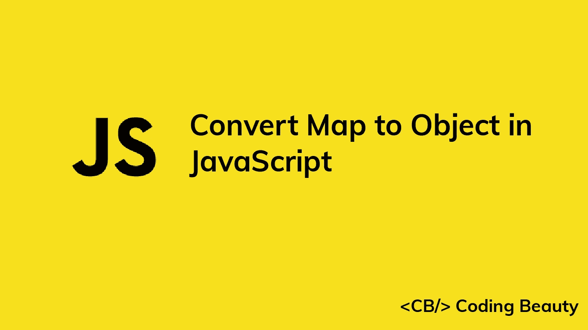

# 如何在 JavaScript 中将地图转换成对象

> 原文：<https://javascript.plainenglish.io/javascript-convert-map-to-object-5f610a75fcd?source=collection_archive---------3----------------------->



在本文中，我们将探讨一些在 JavaScript 中将`Map`轻松转换为对象的方法。

# 1.Object.fromEntries()

要将地图转换为对象，我们可以使用`Object.fromEntries()`方法，将`Map`作为参数传递。例如:

```
const map = new Map([
  ['user1', 'John'],
  ['user2', 'Kate'],
  ['user3', 'Peter'],
]);const obj = Object.fromEntries(map);// { user1: 'John', user2: 'Kate', user3: 'Peter' }
console.log(obj);
```

**注意** : `Object.fromEntries()`可以将任何键值对列表转换成一个对象。例如，它可以直接转换我们传递给`Map()`构造函数的键值对数组:

```
const arr = [
  ['user1', 'John'],
  ['user2', 'Kate'],
  ['user3', 'Peter'],
];
const obj = Object.fromEntries(arr);// { user1: 'John', user2: 'Kate', user3: 'Peter' }
console.log(obj);
```

# 2.迭代映射并在对象中创建键

将`Map`转换为对象的另一种方法是迭代映射的条目，并在对象上为每个条目创建一个新的键。对于每个条目，我们分别将键名称和值设置为条目名称和值。例如:

```
const map = new Map([
  ['user1', 'John'],
  ['user2', 'Kate'],
  ['user3', 'Peter'],
]);const obj = {};
map.forEach((value, key) => {
  obj[key] = value;
});// { user1: 'John', user2: 'Kate', user3: 'Peter' }
console.log(obj);
```

**注意**:我们也可以用`for...of`循环迭代`Map`:

```
const map = new Map([
  ['user1', 'John'],
  ['user2', 'Kate'],
  ['user3', 'Peter'],
]);const obj = {};
for (const [key, value] of map) {
  obj[key] = value;
}// { user1: 'John', user2: 'Kate', user3: 'Peter' }
console.log(obj);
```

*更新于:*[*codingbeautydev.com*](https://codingbeautydev.com/blog/javascript-convert-map-to-object/)

每周获取新的 web 开发技巧和教程。


[**订阅**](https://codingbeautydev.com/newsletter)