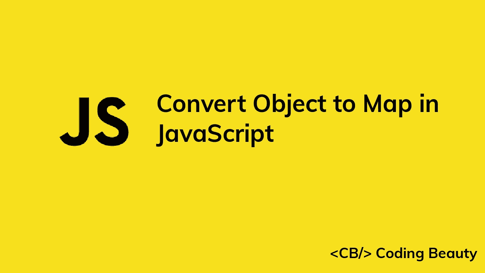

# 如何在 JavaScript 中将对象转换成地图

> 原文：<https://javascript.plainenglish.io/javascript-convert-object-to-map-8f7b064fdc0f?source=collection_archive---------11----------------------->



让我们看看在 JavaScript 中将对象快速转换成`Map`的一些方法。

# 1.Map()构造函数中的 Object.entries()

要将一个对象转换成一个`Map`，我们可以用该对象作为参数调用`Object.entries()`方法，并将结果传递给`Map()`构造函数来创建`Map`对象。例如:

```
const obj = {
  user1: 'John',
  user2: 'Kate',
  user3: 'Peter',
};const map = new Map(Object.entries(obj));// Map(3) { 'user1' => 'John', 'user2' => 'Kate', 'user3' => 'Peter' }
console.log(map);
```

**注意** : `Object.entries()`将一个对象转换成一个键值对数组，构造函数`Map()`用它来创建`Map`元素。

```
const obj = {
  user1: 'John',
  user2: 'Kate',
  user3: 'Peter',
};const entries = Object.entries(obj);// [ [ 'user1', 'John' ], [ 'user2', 'Kate' ], [ 'user3', 'Peter' ] ]
console.log(entries);
```

我们可以不使用`Object.entries()`来生成数组，就像这样:

```
const obj = {
  user1: 'John',
  user2: 'Kate',
  user3: 'Peter',
};const entries = Object.keys(obj).map((key) => [
  key,
  obj[key],
]);// [ [ 'user1', 'John' ], [ 'user2', 'Kate' ], [ 'user3', 'Peter' ] ]
console.log(entries);
```

# 2.迭代对象键并将元素添加到映射中

我们还可以通过遍历对象键将一个对象转换为一个`Map`，使用`Map` `set()`方法为每个键的结果`Map`添加一个元素。我们可以用`Object.keys()`方法获得密钥，并用`forEach()`方法遍历它们。例如:

```
const obj = {
  user1: 'John',
  user2: 'Kate',
  user3: 'Peter',
};const map = new Map();
Object.keys(obj).forEach((key) => {
  map.set(key, obj[key]);
});// Map(3) { 'user1' => 'John', 'user2' => 'Kate', 'user3' => 'Peter' }
console.log(map);
```

*更新于:*[*codingbeautydev.com*](https://codingbeautydev.com/blog/javascript-convert-object-to-map/)

每周获取新的 web 开发技巧和教程。


[**订阅**](https://codingbeautydev.com/newsletter)