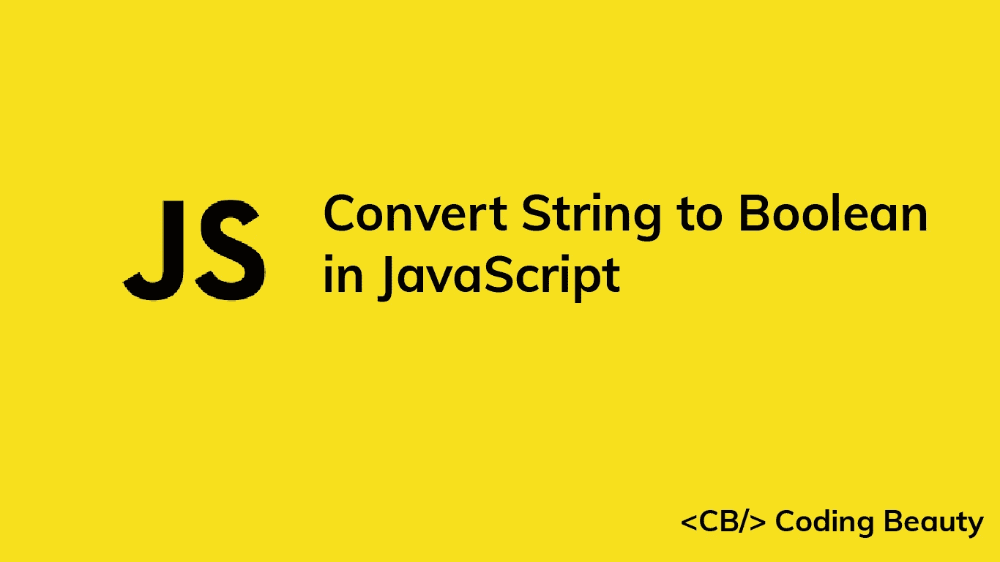

# 如何在 JavaScript 中将字符串转换为布尔值

> 原文：<https://javascript.plainenglish.io/javascript-convert-string-to-boolean-cdb7cd89a6ac?source=collection_archive---------20----------------------->



让我们看看在 JavaScript 中将字符串转换为布尔值的一些方法。

# 1.将字符串与真实值进行比较

要将一个字符串转换为布尔型，我们可以使用严格的等式运算符将该字符串与`true`字符串进行比较。例如:

```
const str1 = 'true';
const str2 = 'false';const bool1 = str1 === 'true';
const bool2 = str2 === 'true';console.log(bool1); // true
console.log(bool2); // false
```

**注**:转换前用`toLowerCase()`忽略管柱套管；

```
const str1 = 'TRUE';const bool1 = str1.toLowerCase() === 'true';console.log(bool1); // true
```

**注意:**使用`Boolean`构造函数对字符串进行转换，如果字符串不是假的，就会产生`true`。空字符串是唯一虚假的字符串。所有其他的弦都是真实的。

```
const str1 = 'true';
const str2 = 'false';
const str3 = '';
const str4 = 'a';const bool1 = Boolean(str1);
const bool2 = Boolean(str2);
const bool3 = Boolean(str3);
const bool4 = Boolean(str4);console.log(bool1); // true
console.log(bool2); // true
console.log(bool3); // false
console.log(bool4); // true
```

# 2.JSON.parse()

我们也可以用`JSON.parse()`方法在 JavaScript 中将字符串转换成布尔值。例如:

```
const str1 = 'true';
const str2 = 'false';const bool1 = JSON.parse(str1);
const bool2 = JSON.parse(str2);console.log(bool1); // true
console.log(bool2); // false
```

**注意:**解析`true`或`false`字符串时，如果不全是小写，会产生错误:

```
const str1 = 'TRUe';const bool1 = JSON.parse(str1); // throws SyntaxError
```

*更新于:*[*codingbeautydev.com*](https://codingbeautydev.com/blog/javascript-convert-string-to-boolean/)

每周获取新的网站开发技巧和教程。


[**订阅**](https://codingbeautydev.com/newsletter)