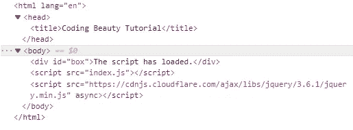
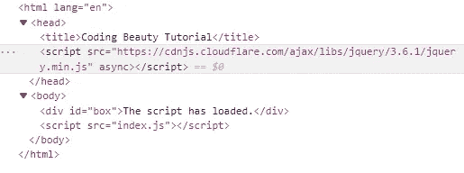

# 如何在 JavaScript 中创建脚本元素

> 原文：<https://javascript.plainenglish.io/javascript-create-script-element-d520d1dc4f64?source=collection_archive---------6----------------------->

## 了解如何在 JavaScript 中轻松创建脚本元素，并为您的网页添加丰富的功能。


在 JavaScript 中创建一个`script`元素:

1.  使用`document.createElement()`方法创建`script`元素。
2.  将元素对象上的`src`属性设置为脚本文件。
3.  使用`appendChild()`方法在 HTML 中包含脚本元素。

考虑这个 HTML 标记示例:

**index.html**

```
<!DOCTYPE html>
<html>
  <head>
    <title>Coding Beauty Tutorial</title>
  </head>
  <body>
    <div id="box"></div> <script src="index.js"></script>
  </body>
</html>
```

下面是我们如何使用 JavaScript 在 HTML 中创建一个`script`元素:

**index.js**

```
const script = document.createElement('script');// use local file
// script.src = 'script.js';script.src =
  'https://cdnjs.cloudflare.com/ajax/libs/jquery/3.6.1/jquery.min.js';script.async = true;// make code in script to be treated as JavaScript module
// script.type = 'module';script.onload = () => {
  console.log('Script loaded successfuly');
  const box = document.getElementById('box');
  box.textContent = 'The script has loaded.';
};script.onerror = () => {
  console.log('Error occurred while loading script');
};document.body.appendChild(script);
```

方法创建一个由标签名指定的 HTML 元素并返回该元素。通过传递一个`script`标签，我们创建了一个脚本元素。

```
const script = document.createElement('script');
```

我们在`script`元素上设置`src`属性来指定要加载的脚本文件。我们用 URL 指定一个远程文件，但是我们也可以用相对或绝对文件路径指定一个本地文件。

```
// use local file
// script.src = 'script.js';script.src =
  'https://cdnjs.cloudflare.com/ajax/libs/jquery/3.6.1/jquery.min.js';
```

通过将`async`属性设置为`true`，浏览器将不必在继续解析 HTML 之前加载和评估脚本。相反，脚本文件将被并行加载，以减少延迟并加快页面的处理速度。

```
script.async = true;
```

`type`属性表示文件是什么类型的脚本。如果它是一个 [JavaScript 模块](https://developer.mozilla.org/en-US/docs/Web/JavaScript/Guide/Modules)，我们需要将`type`属性设置为`module`来显示它。

```
script.type = 'module';
```

有关`script`元素支持的所有属性的完整列表，请访问脚本元素的 MDN 文档。

我们监听`onload`事件，以便在脚本文件成功加载后执行操作。

```
script.onload = () => {
  console.log('Script loaded successfuly');
  const box = document.getElementById('box');
  box.textContent = 'The script has loaded.';
};
```

我们监听`onerror`事件，以便在加载脚本出错时执行不同的操作。

```
script.onerror = () => {
  console.log('Error occurred while loading script');
};
```

方法添加一个 DOM 元素作为指定父元素的最后一个子元素。通过在`document.body`上调用`appendChild()`，我们将脚本文件添加到主体中。

```
document.body.appendChild(script);
```



The script file is included in the body of the document.

要将脚本文件添加到文档的头部，我们可以将`document.body`替换为`document.head`。

```
document.head.appendChild(script);
```



The script file is included in the head of the document.

*原载于*[*codingbeautydev.com*](https://cbdev.link/2697be)

# ES13 中 11 个惊人的新 JavaScript 特性

本指南将带您快速了解 ECMAScript 13 中添加的所有最新功能。这些强大的新特性将会用更短、更富于表现力的代码来更新您的 JavaScript。


[**报名**](https://cbdev.link/900477) 立即免费领取一份。