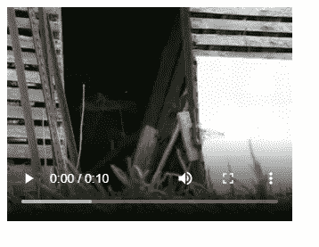
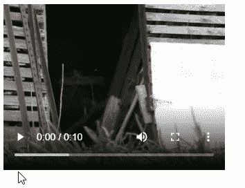

# 如何使用 JavaScript 创建视频元素

> 原文：<https://javascript.plainenglish.io/javascript-create-video-element-ded3d63367c4?source=collection_archive---------16----------------------->

## 了解如何使用 JavaScript 轻松创建视频元素。


要使用 JavaScript 创建视频元素:

1.  使用`document.createElement()`方法创建视频元素
2.  设置视频元素的各种属性，如`src`、`height`、`width`等。
3.  使用`appendChild()`方法在 HTML 中包含视频元素。

考虑这个 HTML 标记示例:

**index.html**

```
<!DOCTYPE html>
<html>
  <head>
    <title>Coding Beauty Tutorial</title>
  </head>
  <body>
    <div id="box"></div> <script src="index.js"></script>
  </body>
</html>
```

下面是我们如何从 JavaScript 创建一个视频元素:

**index.js**

```
// Create video element
const video = document.createElement('video');// Use local file
// video.src = 'video.mp4';// Use remote file
video.src =
  'https://archive.org/download/C.E.PriceCatWalksTowardCamera/cat_walks_toward_camera_512kb.mp4'; video.controls = true;
video.muted = false;
video.height = 240; // in px
video.width = 320; // in pxconst box = document.getElementById('box');// Include in HTML as child of #box
box.appendChild(video);
```

现在，视频将出现在网页上:



如果需要，我们可以控制播放视频:



方法创建一个由标签名指定的 HTML 元素并返回该元素。通过传递一个`video`标签，我们创建了一个[视频](https://developer.mozilla.org/en-US/docs/Web/HTML/Element/video)元素。

视频元素附带了许多属性，我们可以使用这些属性来定制它的外观和行为。以下是一些最常用的方法:

*   `src`:最重要的属性，设置为 URL 或文件路径，决定要播放的视频。
*   `autoplay`:该属性指定视频是否应该尽快自动开始播放，而不停止加载数据。
*   `controls`:`controls`属性确定浏览器是否应该显示允许用户控制视频回放的控件，例如，调节音量、移动到视频中的新位置(查找)、暂停/恢复等。
*   `poster`:图像仍在下载时显示的图像的 URL。
*   `muted`:这是一个布尔属性，用于指定视频是否默认静音。
*   `height`:设置视频显示区域的高度，单位为像素。
*   `width`:设置视频显示区域的宽度，单位为像素。

有关视频元素支持的所有属性的完整列表，请访问视频元素上的 [MDN 文档。](https://developer.mozilla.org/en-US/docs/Web/HTML/Element/video)

方法可以将一个 DOM 元素添加到指定父节点的子节点列表的末尾。在使用 [getElementById()](https://developer.mozilla.org/en-US/docs/Web/API/Document/getElementById) 从我们的 HTML 中访问`#box`元素后，我们调用它的`appendChild()`方法，通过将视频元素添加为`#box`的子元素，将它包含在 HTML 中。

# 确保视频元素的跨浏览器兼容性

由于浏览器不支持相同的视频格式，当嵌入视频时，我们需要根据用户浏览器支持的格式指定不同的格式。

要检查浏览器是否支持特定的视频类型，我们可以使用`canPlayType()`方法。

```
// Create video element
const video = document.createElement('video');video.autoplay = false;
video.controls = true;
video.muted = false;
video.height = 240; // in px
video.width = 320; // in pxif (video.canPlayType('video/mp4')) {
  video.src = 'video.mp4';
} else if (video.canPlayType('video/ogg')) {
  video.src = 'video.ogg';
} else {
  // Provide video link to user
}const box = document.getElementById('box');// Include in HTML as child of box
box.appendChild(video);
```

如果浏览器不支持任何视频格式，最好的办法是给用户提供视频链接，让他们下载并离线观看。这样，每个用户都可以观看您的视频，不管他们的浏览器支持什么级别的视频。

*最初发表于:*[*codingbeautydev.com*](https://cbdev.link/de5439)

# JavaScript 做的每一件疯狂的事情

一本关于 JavaScript 微妙的警告和鲜为人知的部分的迷人指南。


[**报名**](https://cbdev.link/d3c4eb) 立即免费领取一份。

*更多内容看* [***说白了。报名参加我们的***](https://plainenglish.io/)***[***免费每周简讯***](http://newsletter.plainenglish.io/) *。关注我们关于* [***推特***](https://twitter.com/inPlainEngHQ) ， [***领英***](https://www.linkedin.com/company/inplainenglish/) *，以及* [***不和***](https://discord.gg/GtDtUAvyhW) *。****