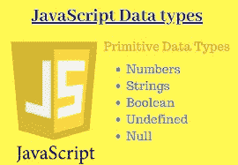

# JavaScript 数据类型介绍

> 原文：<https://javascript.plainenglish.io/javascript-data-types-34c79b9a4616?source=collection_archive---------9----------------------->


# 介绍

JavaScript 数据类型指的是我们将要处理并存储在变量中的不同类型的数据。我们必须了解每一种数据类型，因为如果不这样做，数据可能会以不正确的格式存储，这将导致我们以后的代码出现问题。

在本文中，我们将讨论 JavaScript 中更常见的数据类型，以及如何在我们的代码中应用它们。



# 描述

数据类型本质上说明了什么类型的数据可以存储和部署在程序中。JavaScript 中有六种基本数据类型。这些可以进一步分为三个关键组:

*   **原始(初级)**

原始数据类型有字符串、数字和布尔。这些数据类型一次只能保存一个值。

*   **复合(参考)**

对象、数组和函数等所有类型的对象都是复合数据类型。这些数据类型可以保存值组和附加的复杂实体

*   **特殊数据类型**

Undefined 和 Null 是特殊的数据类型。

现在，我们将逐一深入讨论每种数据类型。

# 字符串类型

字符串类型用于表示文本数据。这些是字母数字字符和符号组。这就是我们储存字母和单词的方式。它是 16 位无名整数值的元素集合。字符串中的每个元素都位于字符串中的一个位置。第一个组件在索引 0 处，后面的在索引 1 处，依此类推。字符串长度是其中元素的数量。字符串是不可变的，因为一旦创建了一个字符串，就不可能改变它。

我们通过用单引号或双引号括住一个或多个字符来创建字符串。看看下面的代码:

```
<!DOCTYPE html>
<html lang="en">
<head>
    <meta charset="utf-8">
    <title>JavaScript String Data Type</title>
</head>
<body>
    <script>
    // Creating variables
    var a = 'Hi there!';  // using single quotes
    var b = "Hi there!";  // using double quotes
    // Printing variable values
    document.write(a + "<br>");
    document.write(b);
    </script>
</body>
</html>
```

[我们可以接受字符串中的引号，条件是它们与括起来的引号不匹配。](https://www.technologiesinindustry4.com/)

```
<!DOCTYPE html>
<html lang="en">
<head>
    <meta charset="utf-8">
    <title>Including Quotes inside the JavaScript String</title>
</head>
<body>
    <script>
    // Creating variables
    var a = "Let's have a cup of coffee.";
    var b = 'He said "Hello" and left.';
    var c = 'We\'ll never give up.';
    // Printing variable values
    document.write(a + "<br>");
    document.write(b + "<br>");
    document.write(c);
    </script>
</body>
</html>
```

**数字类型**

数字表示整数和浮点数，如小数和指数。

**示例:**

```
const number1 = 3;
const number2 = 3.433;
const number3 = 3e5 // 3 * 10^5
```

*   数字类型也可以是；
*   +无穷大
*   -无限
*   [南(非一数)。](https://www.technologiesinindustry4.com/)

**例如:**

```
const number1 = 3/0;
console.log(number1); // Infinity
const number2 = -3/0;
console.log(number2); // -Infinity
// strings can't be divided by numbers
const number3 = "abc"/3;
console.log(number3);  // NaN
```

# 布尔类型

布尔数据类型可能只保存*真*或*假*值数据。它通常用于存储类似于 yes(真)或 no(假)的值，如下所示:

```
<!DOCTYPE html>
<html lang="en">
<head>
    <meta charset="utf-8">
    <title>JavaScript Boolean Data Type</title>
</head>
<body>
    <script>
    // Creating variables
    var isReading = true;   // yes, I'm reading
    var isSleeping = false; // no, I'm not sleeping
    // Printing variable values
    document.write(isReading + "<br>");
    document.write(isSleeping);
    </script>
</body>
</html>
```

# 对象类型

对象是一种复杂的数据类型，允许我们存储数据集合。

**例如:**

```
const student = {
    firstName: 'ram',
    lastName: null,
    class: 10
};
```

# 数组类型

数组是一种对象。它用于在一个变量中存储几个值。数组中的每个值或元素都有一个数字位置。这就是所谓的指数。它可以涵盖任何数据类型的数据——数字、字符串、布尔值、函数、对象，甚至其他数组。

创建数组最简单的方法是将数组值用方括号括起来，用逗号分隔。

**举例:**

```
<!DOCTYPE html>
<html lang="en">
<head>
    <meta charset="utf-8">
    <title>JavaScript Array Data Type</title>
</head>
<body>
    <script>
    // Creating arrays
    var colors = ["Red", "Yellow", "Green", "Orange"];
    var cities = ["London", "Paris", "New York"];
    // Printing array values
    document.write(colors[0] + "<br>");   // Output: Red
    document.write(cities[2]);   // Output: New York
    </script>
</body>
</html>
```

# 函数类型

函数是一个可调用的对象。它实现了一个代码块。很可能将函数分配给变量，因为函数是对象。

**举例:**

```
<!DOCTYPE html>
<html lang="en">
<head>
    <meta charset="utf-8">
    <title>JavaScript Function Data Type</title>
</head>
<body>
    <script>
    var greeting = function(){
        return "Hello World!";
    }
    // Check the type of greeting variable
    document.write(typeof greeting) // Output: function
    document.write("<br>");
    document.write(greeting());     // Output: Hello World!
    </script>
</body>
</html>
```

# 未定义的类型

未定义的数据类型可能只有一个值。它有一个未定义的特殊值。

```
<!DOCTYPE html>
<html lang="en">
<head>
    <meta charset="utf-8">
    <title>JavaScript Undefined Data Type</title>
</head>
<body>
    <script>
    // Creating variables
    var a;
    var b = "Hello World!"
    // Printing variable values
    document.write(a + "<br>");
    document.write(b);
    </script>
</body>
</html>
```

**空数据类型**

[Null 是另一种特殊的数据类型。它只能有一个值-空值。意思是没有价值。通过为变量分配空值，可以清楚地清空变量的当前内容。](https://www.technologiesinindustry4.com/)

```
<!DOCTYPE html>
<html lang="en">
<head>
<meta charset="utf-8">
<title>JavaScript Null Data Type</title>
</head>
<body>
<script>
var a = null;
document.write(a + "<br>"); // Print: null
var b = "Hello World!"
document.write(b + "<br>"); // Print: Hello World!
b = null;
document.write(b) // Print: null
</script>
</body>
</html>
```

# 结论

*   此时，我们应该对 JavaScript 中可用的一些主要数据类型有了很好的理解。
*   当我们用 JavaScript 语言开发编程项目时，所有这些数据类型都将变得至关重要。

更多详情请访问:[https://www . technologiesinindustry 4 . com/2022/01/JavaScript-data-types . html](https://www.technologiesinindustry4.com/2022/01/javascript-data-types.html)

*更多内容看* [***说白了。报名参加我们的***](http://plainenglish.io/) **[***免费周报***](http://newsletter.plainenglish.io/) *。在我们的* [***社区不和谐***](https://discord.gg/GtDtUAvyhW) *获得独家获取写作机会和建议。***