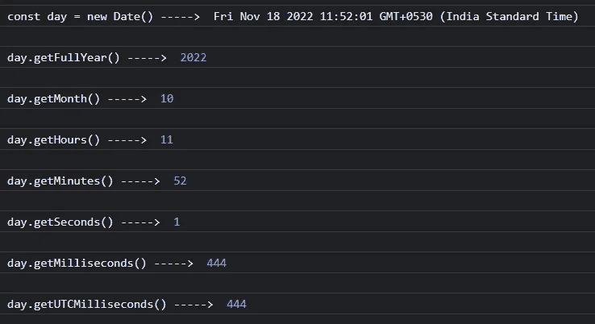

# JavaScript 日期和时间

> 原文：<https://javascript.plainenglish.io/javascript-dates-and-times-e39bdc3758a3?source=collection_archive---------4----------------------->

日期和时间

Photo by [Panos Sakalakis](https://unsplash.com/@meymigrou?utm_source=medium&utm_medium=referral) on [Unsplash](https://unsplash.com?utm_source=medium&utm_medium=referral)

JavaScript 定义了一个用于表示和操作数字的 **Date** 类来表示日期和时间。

我们可以用 date()构造函数创建一个日期对象。我们可以使用这个对象让年、月和日像一个计时器一样显示在网页上。

Date()构造函数的结果随我们传递给它的参数而变化。

举个例子，

1.  不带参数的构造函数(Date())—给出当前时间。
2.  带一个参数的构造函数(日期(毫秒))—将该参数解释为自 1970 年以来的毫秒数。
3.  具有两个或更多参数的构造函数(Date(year，month，day，hours，minutes，seconds，milliseconds)) —解释为本地时区中的年、月、日、小时、分钟、秒和毫秒。

> 在日期 API 中，一年中的第一个月被表示为 **0** ，该月的第一天被表示为 **1。**

Date()构造函数使用本地计算机时区解释参数。

> 我的本地计算机被设置为印度标准时间，所以本文中的日期和时间是按照印度标准时间解释的。

我们添加一个特定的时区来指定该时区中的日期和时间。

示例:添加 UTC 时区

约会。UTC() —这将采用与 Date()构造函数相同的参数，并用 UTC 解释它们，并返回一个可以传递给 Date()构造函数的毫秒时间戳。但是默认情况下，结果将以本地计算机时区显示。要用 UTC 显示日期，我们必须应用 toString()、toUTCString()或 toISOString()。

date displayed in local time zone

date displayed after passed in toString(), toUTCString() or toISOString() formats

## JavaScript 日期方法

有 get 和 set 方法来查询和修改日期的年、月、日、小时、分钟、秒和毫秒字段。

这些方法有两种使用方式，使用本地时间和 UTC 时间。

*   为了获得我们可以使用的日期的完整年份

getFullYear()

getUTCFullYear()

*   要设置我们可以使用的日期的完整年份

setFullYear()

setUTCFullYear()

> 要获取和设置日期的其他字段，我们必须用特定的字段名替换上面提到的获取和设置方法“FullYear”。(示例 getMonth、getUTCMonth、setMonth、setUTCMonth)

set methods of Date object

get methods of Date object

**注:**

查询方法

一个月中的某一天— → getDate()和 getUTCDate()。

星期几(0 表示星期日，6 表示星期六)— → getDay()和 getUTCDay()(星期几是只读的，因此没有相应的 setDay()方法。)

getDate() and getDay()

## 时间戳

JavaScript 在内部将日期表示为整数，这些整数指定从 UTC 时间 1970 年 1 月 1 日午夜(或之前)开始的毫秒数。这被称为时间戳。静态的 **Date.now()** 方法以时间戳的形式返回当前时间。

## 格式化和解析日期字符串

Date 类有一些字符串格式化方法。

toString() —此方法使用本地时区，但不以区域设置感知的方式格式化日期和时间。

toUTCString()-此方法使用 UTC 时区，但不以可识别区域设置的方式设置日期格式。

toISOString() —此方法以 ISO-8601 标准的标准年-月-日小时:分钟:秒. ms 格式打印日期和时间。字母“T”将输出的日期部分与时间部分分开。时间用 UTC 表示，并用字母“Z”作为输出的最后一个字母来表示。

toLocaleString() —此方法使用本地时区和适合用户语言环境的格式。

toDateString() —此方法仅格式化日期的日期部分，并忽略时间。它使用本地时区，并且不进行适合本地的格式设置。

toLocaleDateString() —此方法仅格式化日期。它使用本地时区和适合本地的日期格式。

toTimeString() —此方法仅格式化时间，而忽略日期。它使用本地时区，但不以区域设置方式设置时间格式。

toLocaleTimeString() —此方法以区域设置方式格式化时间，并使用本地时区。

Example of formatting date string

Date 对象中有一个名为 parse()的静态方法，它以日期的字符串表示形式作为参数，如果该字符串是不可识别的或不合适的日期值，则返回表示自 1970 年 1 月 1 日 00:00:00 UTC 或 NaN 以来的日期的时间戳。

Example of using parse()

*更多内容请看*[***plain English . io***](https://plainenglish.io/)*。报名参加我们的* [***免费周报***](http://newsletter.plainenglish.io/) *。关注我们关于*[***Twitter***](https://twitter.com/inPlainEngHQ)[***LinkedIn***](https://www.linkedin.com/company/inplainenglish/)*[***YouTube***](https://www.youtube.com/channel/UCtipWUghju290NWcn8jhyAw)*[***不和***](https://discord.gg/GtDtUAvyhW) *。对增长黑客感兴趣？检查* [***电路***](https://circuit.ooo/) *。***