# JavaScript 中的深度复制和浅度复制是什么

> 原文：<https://javascript.plainenglish.io/javascript-deep-and-shallow-copy-e519c64493d5?source=collection_archive---------2----------------------->

## 我破坏应用程序的旅程以及如何避免它

# 重要的事情先来

在讨论我如何破坏我一直在构建的 web 应用程序之前，这也是我写这篇文章的动机，让我们了解一下深层复制和浅层复制的含义，以及 JavaScript 如何在幕后管理它们。

# 浅拷贝

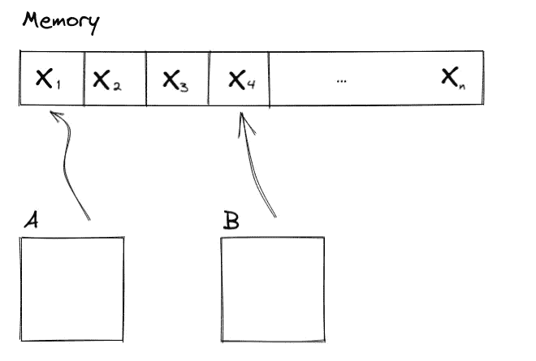

Objects referencing values in memory

假设您创建了两个对象 A 和 B，并为它们分配了一些属性。

```
A = {
name: "Johny",
Age: "47
}
B = {
name: "Annie",
age: 42
}
```

它们是一样的吗？嗯，不。它们看起来不一样，当然，JavaScript 在这里符合常识，但事实往往并非如此。

如果我们把 B 赋值给 A 呢？

```
A = B
```

现在它们是相同的，它们共享相同的属性，也许…对内存的引用是相同的？让我们不要超越自己，但 Javascript 确实认为它们是一样的，正如计划中的那样

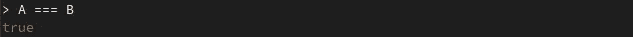

但是你知道吗？这是一个错误，我从来没有想过有两个副本的 B，没有个人，安妮。幸运的是，我记得什么是 A 属性，所以让我们通过把它们分配给我们的 A 对象键来回到这个问题。

```
A.name = "Johny"
A.age = 47
```

很好，现在我们的好兄弟张诗钟回来了。希望 A 打印出我们给他的最新属性

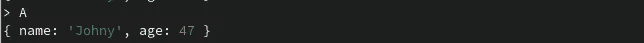

那是什么？安妮刚刚打电话来，她现在感觉像张诗钟。

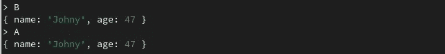

这里发生了什么？嗯，浅显的抄。还记得我们的第一幅画吗？当我们把 B 赋值给 A 时

```
A = B
```

在这个黑暗、泥泞、难闻的内存管理世界中发生的事情是，A 现在指向 B 指向的相同内存区域。

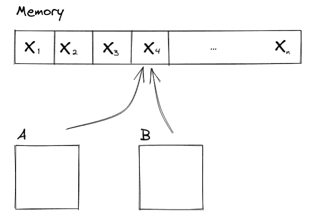

Shallow copy — Now B refers to the same memory as A

这是什么意思？这意味着它们在你能想象到的任何方面都是同一个物体。**如果您对 A 或 B 进行更新、删除或添加值，相同的更改将会反映在对应部分中。**

```
B.name = "Johny"
```

这实质上改变了存储在内存中的值。由于 A 和 B 使用相同的内存，因此 A 和 B 的参数“name”值将是相同的

如果我们给 B 添加一个新的密钥，A 也会被更新:

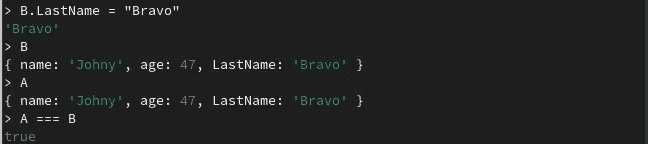

Key being added to the Shallow Copy

现在让我们重置我们的对象 A 和 b。因为它们是“相同的”,我们可以说:

```
A = {}
```

他们都将变得空虚…或者他们会吗？

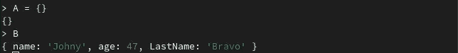

Assigning a new Object to A changes its memory reference

他们不会。我们的空对象{}有它自己的内存区域，这意味着 A 现在指向那个区域，并且与 B 分离，因为**他们不再引用同一块内存。**

当谈到浅层拷贝时，有大量的例子可以用来检验它有时有多直观。如果不小心的话，很容易搞乱整个应用程序，对吗？但是在我们到达那里之前…

# 深层拷贝

谈论深层拷贝就没那么有趣了。深度复制意味着您希望将属性从一个对象复制到另一个对象，而不使它们共享对内存的相同引用。这在很多方面都是有用的，主要是为了避免意外打破东西。这样，您可以将值从 A 复制到 B，并在不更改 B 的情况下更改 A 的值，反之亦然。

有多种方法可以实现深度复制。

最简单的一种是通过使用 [spread 语法](https://developer.mozilla.org/en-US/docs/Web/JavaScript/Reference/Operators/Spread_syntax)，用现有对象的属性创建一个全新的对象，我们来看看。

```
A = {name: "Johny", age: 47}
B = A
C = {...A}
```

让我们看看 Javascript 是如何看待我们新创建的对象的。

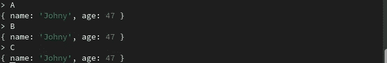

Three Objects with the same parameters

然而，并非一切都像它看起来那样:

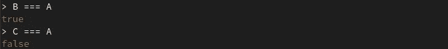

Shallow and deep copy output different Boolean on equality check

我们的 spread 操作符完成了它的工作，我们最终得到了**两个属性相同但不相同的对象**。我们可以安全地改变 A 的属性，而不会影响到 c。

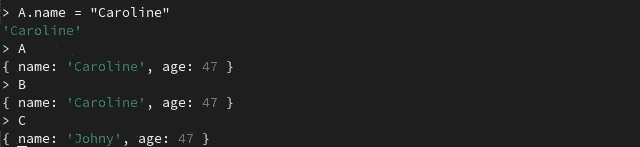

The deep Copy doesn’t change values

各种其他方法是可用的，为了更深入地解释它们，我强烈推荐 [MDN 文档的深层拷贝。](https://developer.mozilla.org/en-US/docs/Glossary/Deep_copy)

# 我是怎么弄坏我的 APP 的？

你可能会想

是的，当然，这种深度复制和浅层复制的东西会让你大吃一惊，但这并不完全是火箭科学，似乎很容易就能发现发生了什么。

在很大程度上，你是对的，然而……事情还是发生了。我不会演示应用程序运行的整个过程，但假设我到处滥用浅层拷贝，突然一个数组变成了另一个数组的浅层拷贝，而我并不想这样做。

让我们看一个更简单的例子，它准确地展示了基本问题是什么。我将分享所有的代码，这样你就可以打开你最喜欢的 IDE 并创建一个. js 文件。

所以我有两个数组。两者都将保存我从 API 中获取的项目，但它们有一个关键的区别:虽然一个是可变的，会发生变化，但另一个应该保持不变，以防我想重置第一个。让我们用 datausa.io API 把它写下来。

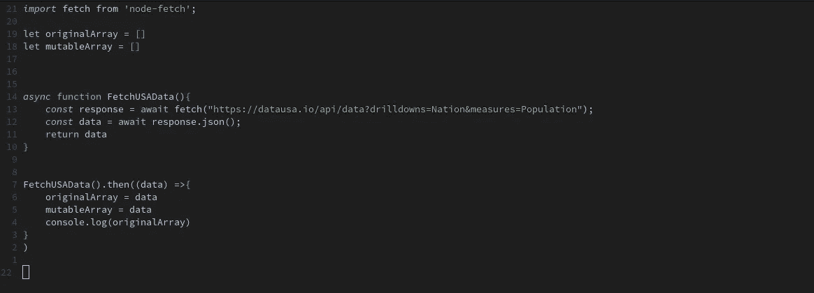

Code snippet

让我们检查一下控制台，看看我们得到了什么:


Output saved to our Mutable Array

听起来差不多。两个数组打印的是一样的，让我们把我们的 mutableArray 的 2020 年改为我们的老 A 对象和 console.log()两个数组。

```
mutableArray.data[0] = {name: "Johny", age: 47}
console.log(mutableArray.data[0], originalArray.data[0])
```

我敢打赌你已经猜到这是怎么回事了。

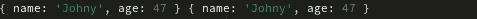

Both arrays change their value

发生了什么事？FetchUSAData()返回一个 Javascript 对象 Data，它引用内存的某个区域，然后我们告诉 originalArray 和 mutableArray 引用完全相同的区域。正如我们在本文前面看到的，这意味着改变一个数组也会改变另一个数组。

我们如何解决这个问题？我们前面已经看到，我们可以使用“…”spread 语法进行修复，但是我们也可以使用 JSON stringify()和 parse()方法的组合:

```
mutableArray = JSON.parse(JSON.stringify(data))
```


Thanks to parse() and stringify() we have a deep copy

我们修好了！值得注意的是，这是更普遍推荐的方法。

# 提出的方法的局限性

“…”spread 语法和 JSON . parse(JSON . stringify(Object))都有其局限性。

# 扩展语法

我们以下面的对象 A 为例。

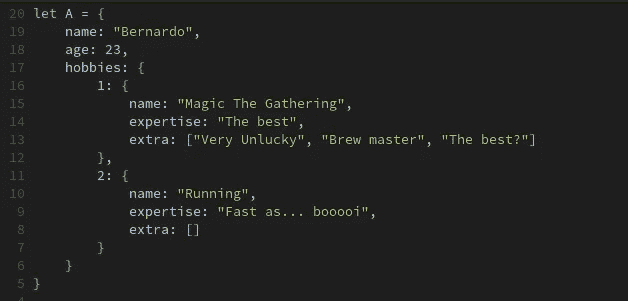

Nested Object A

对象 A 有名字，年龄，还有一个对象叫爱好。让我们使用“…”展开语法将 A 深度复制到一个名为 B 的新对象。

```
B = {...A}
```

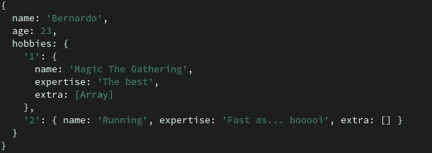

“Deep copy” of Object A using “…” spread syntax

正如计划的那样，我们最终得到了 A 的副本。但是你知道吗，让我们换个名字和爱好，说实话，我可能不太擅长魔法聚会，我宁愿被叫做本尼。

```
A.name = "Benny"
A.hobbies[1].expertise = "A little above average"
console.log(B)
```

我们最好看起来像这样:

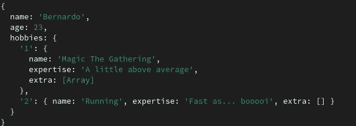

Deep copy doesn’t go deep enough

看起来名字没有改变，这是应该发生的，因为我们刚刚了解到“…”展开语法对一个对象进行深层复制，然而…爱好改变了？

这是“…”展开语法的一个已知限制，它的行为取决于被复制的对象是否嵌套。如果它不是嵌套的，整个对象将被深度复制。如果它是嵌套的，它将只深度复制最上面的数据，而浅度复制其余的数据。

您可以通过对每个数据级别使用“…”展开语法来解决这一限制，在这种情况下:

```
B = {...A, hobbies.{...A.hobbies}}
```


Create deep copy for each data level using “…” spread syntax fixes the problem

它工作了..但是代价是什么呢？随着对象嵌套越来越多，这种解决方案会变得越来越糟糕。

# Parse()和 Stringify()一个对象

这种方法适用于大多数情况，包括上述情况。然而，当您的对象不可序列化时，它将会失败，而事实往往并非如此。您将会遇到的不可序列化对象的最常见示例有:

类
类方法
函数
DOM 节点

# 结论

像这样的 bug 很难捕捉。想象一下，你有一个完整的应用程序状态，函数调用其他函数，其中一部分使用状态，一些改变状态，也许你有一些道具训练正在进行。很快就会变得一团糟。

*更多内容尽在* [***说白了. io***](https://plainenglish.io/) *。报名参加我们的* [***免费周报***](http://newsletter.plainenglish.io/) *。关注我们关于* [***推特***](https://twitter.com/inPlainEngHQ) ，[***LinkedIn***](https://www.linkedin.com/company/inplainenglish/)*，*[***YouTube***](https://www.youtube.com/channel/UCtipWUghju290NWcn8jhyAw)*，* [***不和***](https://discord.gg/GtDtUAvyhW) *。对增长黑客感兴趣？检查* [***电路***](https://circuit.ooo/) *。*