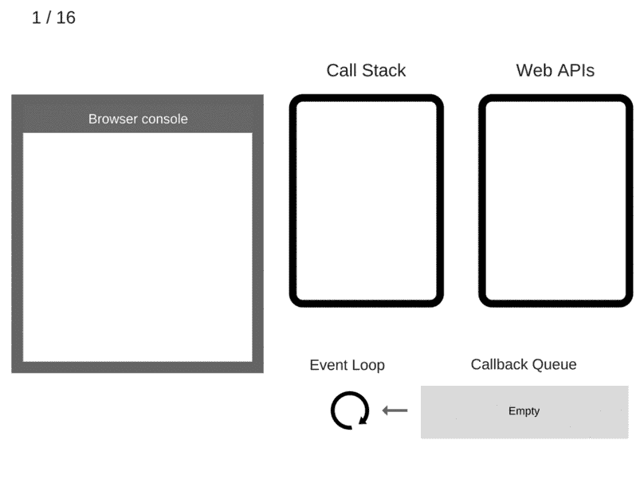

# 你应该知道的 JavaScript 深层概念

> 原文：<https://javascript.plainenglish.io/javascript-deep-concepts-you-should-know-8965d4e409d3?source=collection_archive---------0----------------------->

## 第 2 部分:学习 JavaScript 令人困惑的部分的下一步，比如事件循环、Web APIs 和异步的东西。

Photo by [Jonas Allert](https://unsplash.com/@visuallert?utm_source=medium&utm_medium=referral) on [Unsplash](https://unsplash.com?utm_source=medium&utm_medium=referral)

您可以通过以下链接访问第 1 部分:

第一部分:[https://JavaScript . plain English . io/JavaScript-deep-concepts-you-should-know DDE 14 aafd 8d 2](/javascript-deep-concepts-you-should-know-dde14aafd8d2)。

# 异步的

在谈论事件循环和 web workers 之前，我们应该清楚什么是 JavaScript 的异步，以及当 JavaScript 是单线程语言时，它是如何处理的！

JavaScript 是一种单线程同步编程语言，本身不支持多线程或异步的东西，但是在浏览器(**浏览器 API** 和 JavaScript 中的一些机制的帮助下，我们可以拥有**异步** **JavaScript** ！

下面的图片告诉我们 JavaScript 引擎和我们从浏览器获得的 Web API 发生了什么，让我们来解释一下。

JavaScript 有一个名为**“调用堆栈”**的简单列表，它逐个管理任务(堆栈算法)，但当一个异步任务被传递时，JavaScript 会将其弹出到 web APIs，浏览器会处理它，就像 **setTimeout** API 一样，当异步任务的结果准备好时，浏览器会通过某种机制将其带回堆栈，稍后我会告诉你。

# 事件循环

还记得上一节我告诉你异步的东西在后台完成后会被带回调用栈吗？！处理这种机制的部分称为“**事件循环**”。

事件循环会不断检查调用栈，如果里面没有任务，并且是空闲的，它会把事情按优先级推入调用栈，我稍后会告诉你。

Gif that explains the event loop from [SessionStack Blog](https://blog.sessionstack.com/?source=post_page-----2f077c4438b5--------------------------------)

# 回拨和微任务队列

想象一下，在同一秒钟内完成两个异步任务，并且它们都刚刚从 web APIs 返回，那么哪一个将首先被推送到回调？

JavaScript 对此有一个机制，它将回调请求分成两部分:微任务和宏任务。

**宏任务队列**在定时器超时后获取来自***setTimeout()****API 的普通回调函数*

***宏任务**比**微任务队列**优先级低，无法将回调函数提取到事件循环中。*

***微任务队列**通过承诺和变异观察器获得回调函数。*

## *总结:*

*感谢您阅读本文，您可以关注我的媒体页面，了解即将发布的 JavaScript 文章。*

**更多内容请看*[***plain English . io***](https://plainenglish.io/)*。报名参加我们的* [***免费周报***](http://newsletter.plainenglish.io/) *。关注我们关于*[***Twitter***](https://twitter.com/inPlainEngHQ)[***LinkedIn***](https://www.linkedin.com/company/inplainenglish/)*[***YouTube***](https://www.youtube.com/channel/UCtipWUghju290NWcn8jhyAw)*[***不和***](https://discord.gg/GtDtUAvyhW) *。对增长黑客感兴趣？检查* [***电路***](https://circuit.ooo/) *。****