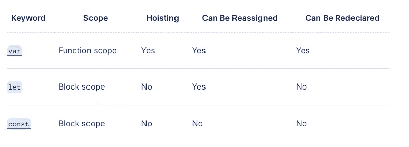

# 你应该知道的 JavaScript 深层概念

> 原文：<https://javascript.plainenglish.io/javascript-deep-concepts-you-should-know-dde14aafd8d2?source=collection_archive---------1----------------------->

## 第 1 部分:学习这些概念以深入理解 JavaScript。

用 JavaScript 写第一个代码可能需要 1 天左右的时间，但是深入了解未知和背景知识可能会给你带来整个职业生涯！


Photo by [Alexander Hafemann](https://unsplash.com/@mlenny?utm_source=medium&utm_medium=referral) on [Unsplash](https://unsplash.com?utm_source=medium&utm_medium=referral)

其他零件链接将在准备就绪后发布并粘贴到此处！

## 范围

简而言之，**“在这里你可以在名为 Scope 的代码中访问你的声明”。**

我们有两种作用域，全局作用域和局部作用域，区别在于你可以在代码中的任何地方访问全局作用域，但是局部作用域在块内声明，所以你只能在块内访问它们。

请注意，`var`关键字在提升部件旁边的行为可能稍有不同。

```
{
  // Local scope and correct
  const access_inside_block = 'test';
  console.log(access_inside_block);
}// Error, you can't access the variable here 
// You're not in the scope 
console.log(access_inside_block);
```

## `let`&`const`var 的区别

现在我们知道什么是范围，所以我们可以猜测这里最大的区别之一就是这些关键字的范围。



Picture of the table to compare these keywords

## 提升

你可能会经常听到这个词！但这实际上是什么呢？简而言之，提升是 JavaScript 中的一种机制，一些声明在执行之前会这样做，就像一个气泡，JS 引擎会将它们带到第一个声明之前，在其他声明之前声明它们，就像变量声明的`var`关键字，用`var`引入的变量可以在赋值之前调用，你会得到`undefined`结果，或者用`function`关键字声明的`functions`可以在 JavaScript 声明之前调用。

```
foo();function foo() {
   // Your function code
}
```

## 生活

这个短语代表“**立即调用的函数表达式”，**其中表示声明一个函数，该函数一旦被定义就运行，并允许将变量和函数私有，并确保循环中的异步代码正确执行。

```
(function () {
  // …
})();
```

## Currying

这是一种处理 JavaScript 函数的高级技术，实际上是转换函数，允许您在不同的步骤中向函数传递参数，并使它在不同的步骤中可调用。

```
function curry(f) { 
    // curry(f) does the currying transform   
    return function(a) 
    {     
        return function(b) 
        {       
            return f(a, b);     
        };   
     }; 
} // usage 
function sum(a, b) {
   return a + b; 
}  
let curriedSum = curry(sum);  
alert( curriedSum(1)(2) ); 
// 3
```

## 下一步

感谢您阅读《您应该知道的 JavaScript 深层概念》——第 1 部分，我尽可能保持文章短小精悍，您可以按照本系列学习所有课程。谢了。

*更多内容请看*[***plain English . io***](https://plainenglish.io/)*。报名参加我们的* [***免费周报***](http://newsletter.plainenglish.io/) *。关注我们关于*[***Twitter***](https://twitter.com/inPlainEngHQ)[***LinkedIn***](https://www.linkedin.com/company/inplainenglish/)*[***YouTube***](https://www.youtube.com/channel/UCtipWUghju290NWcn8jhyAw)*[***不和***](https://discord.gg/GtDtUAvyhW) *。对增长黑客感兴趣？检查* [***电路***](https://circuit.ooo/) *。***