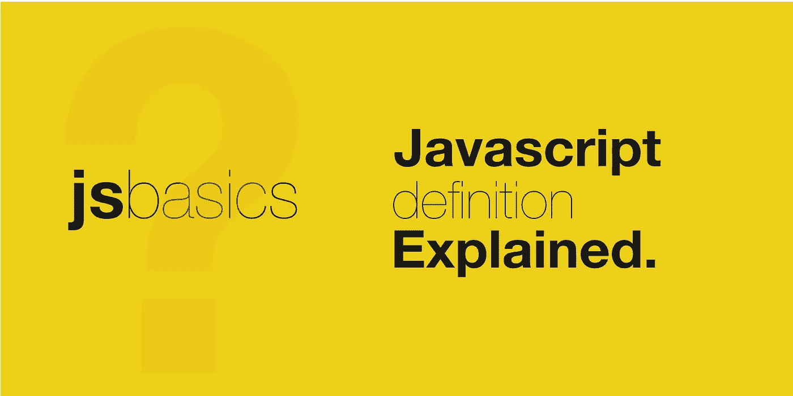

# 解释了 JavaScript 定义

> 原文：<https://javascript.plainenglish.io/javascript-definition-explained-265d2710e2e2?source=collection_archive---------21----------------------->

根据 [MDN](https://developer.mozilla.org/en-US/docs/Web/JavaScript) ，

> JavaScript 是一种轻量级的、解释的或即时编译的、基于原型的、多范例的动态语言，具有对函数的一流支持。

那么这些术语的含义是什么呢？下面是每个术语的博客列表。

## **轻量级**

 [## JavaScript 为什么叫轻量级？

### 理解 JavaScript 的“轻量级”特性意味着什么。

javascript.plainenglish.io](/why-javascript-is-called-lightweight-5a1996db9ef6) 

## 解释或及时编译

 [## 为什么 JavaScript 被称为解释的或 JIT(即时)编译的

### 了解 JavaScript 为什么被解释或 JIT 编译，以及这意味着什么。

javascript.plainenglish.io](/why-javascript-is-called-interpreted-or-jit-just-in-time-compiled-c8cc490682bd) 

## 基于原型的

 [## JavaScript 为什么叫基于原型？

### 什么是基于原型的编程？

javascript.plainenglish.io](/why-javascript-is-called-prototype-based-e9326562bf43) 

## 多范式

 [## 为什么 JavaScript 是一种多范式语言？

### 范式可以被定义为解决问题的方法。编程范式是一种通过…解决问题的方法

javascript.plainenglish.io](/why-is-javascript-a-multi-paradigm-language-3b6cc22fee94) 

## 动态的

 [## 为什么 JavaScript 是一种动态语言？

### JavaScript 的特性使其成为一种动态编程语言。

javascript.plainenglish.io](/why-javascript-is-a-dynamic-language-ff4e849406f0) 

## 一流的功能

 [## JavaScript 中的一级函数是什么？

### 了解什么是一级函数，以及它们如何融入 JavaScript。

javascript.plainenglish.io](/what-are-first-class-functions-in-javascript-6af46d5ae18d) 

*关注我，获取更多关于 JavaScript Web 开发的有趣帖子。还有，请给我一个* [*跟着*](https://twitter.com/jsbasics_dev) *上推特。*

*更多内容看* [***说白了。报名参加我们的***](http://plainenglish.io/) **[***免费周报***](http://newsletter.plainenglish.io/) *。在我们的* [***社区不和谐***](https://discord.gg/GtDtUAvyhW) *获得独家获取写作机会和建议。***