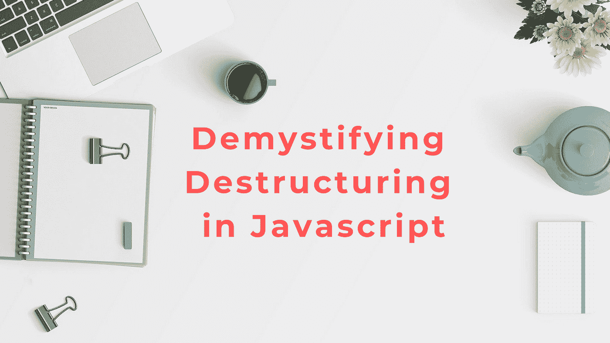

# 每个开发人员都应该知道的 JavaScript 析构技术

> 原文：<https://javascript.plainenglish.io/javascript-destructuring-techniques-that-every-developer-should-know-dbe9b6d25e6c?source=collection_archive---------6----------------------->

## 为每个人揭开 JavaScript 析构的神秘面纱，以提高生产力

BG Image — [Unsplash](https://unsplash.com/)

析构是 JavaScript 开发人员中非常流行的术语，也是最不常用的。大多数人在开始使用 JavaScript 时听到或学习了这个术语，但是一旦他们开始在现实世界的项目中工作，就忘记了使用它。不是说没有开发人员使用这个，但是我见过有人在代码中使用析构时看起来像是一些复杂的语法。虽然快速浏览可以让你看起来像是在为两行代码就能解决的事情编写复杂的语法，但是只有在所有可能的应用中使用析构的人才能理解析构的威力。根据 MDN:

***“析构赋值语法是一个 JavaScript 表达式，可以将数组中的值或对象中的属性解包到不同的变量中。”***

这就引出了我的下一个观点，大多数人认为析构只是为了扩展数组，但事实并非如此。在 JavaScript 中，对象为王，您创建的数组也是 JS 的对象，其工作原理超出了本文的范围。但是析构可以应用于 js 数组和对象。在本文中，我们将介绍一些最常见的析构应用和技术。为了更好地理解，我们将看一看每个例子——有/没有析构。

# 1.基本数组析构

这里没有什么特别的，基本的析构是经常需要的，也是最容易被忽视的，因为它违背了干净代码的干燥原则。这里没有什么特别的，只是一个有三个字符串的数组，并根据它们的位置将它们一个接一个地提取到三个独立的变量中。

Without destructuring

With Destructuring

正如你在上面看到的，通过使用数组析构，我们可以在一行中编写相同的代码。我们使用同一行代码提取三个数组值，并将它们分配给各自的变量。这是析构数组最常见的用例。

# 2.析构为拆分数组

我们刚刚学习了基本的析构，现在让我们把它应用到一个更一般的任务中。如果我们有一个包含 6 个元素的数组，我们希望从数组中提取第一个元素，并创建一个包含最后 5 个元素的新数组。通常，我们可以创建一个新变量，将位置 0 的元素赋给它，然后创建另一个变量，在使用操作符对数组进行切片后，我们将在该变量中存储数组的第二部分。

Without Destructuring

With Destructuring

正如你在上面看到的，我们使用了析构来提取第一个元素，并用其余的元素创建了一个新的数组。如果我们需要提取更多的单个变量，我们也可以使用相同的技术，只要我们只在左边的析构数组的最后一项上使用 spread 操作符。

# 3.使用默认值进行析构

我们刚刚学习了基本的析构，但是可能会有这样的情况，由于一些错误，比如长度不匹配，被赋值的变量变得未定义。在这种情况下，我们可以在析构时提供一个默认值。在下面的例子中，我们试图从一个长度为 1 的数组中给变量 a 和 b 赋值。如你所见，我们在同一行中为两个变量定义了默认值，这就是为什么' b '不是未定义的，而是打印出默认值 7。

Default Value with Destructuring.

# 4.交换值

这是一个非常有趣的析构用例。使用正常方法交换两个变量的值需要使用一个临时变量或对两个变量执行一些数学运算。如果场景是在一个数组中的不同位置交换值，则需要更多的步骤。这是析构最简单但有效的应用之一。

Swapping with destructuring

在上面的代码中，我们通过析构来交换两个变量*‘a’&‘b’*的值，而没有使用任何临时或数学运算。我们只需要把左侧数组的变量包装起来，它们会自动取左侧对应位置的变量的值。这可以在第二个示例中观察到，在第二个示例中，*‘a’，‘b’&‘c’*之间的交换值也在一行中。最后一个例子展示了如何交换数组中两个位置的值，我们交换的是数组中位置 1 和位置 2 的值。

# 5.功能参数

另一个我们可以在函数参数中使用析构的地方。让我们考虑下面的例子。我们有一个函数，它将用户的*名字* & *姓氏*作为参数，并返回一个完整的带有全名的字符串。如你所见，通常我们可以通过调用函数来传递函数的参数，并根据函数定义分别传递两个参数。但是这种方法的问题是，每次我们调用函数时，我们必须分别传递变量名，如果变量的数量超过一个或两个，代码看起来会很混乱。

Without Destructuring

With Destructuring

在上面的代码中，如果您检查函数定义，您可以看到我们已经在函数定义本身的参数中添加了数组析构。这样，我们就可以直接使用数组来调用函数，而不必传递单独的元素或一次又一次地重复相同的代码。

# 6.函数返回值

就像函数参数一样，我们也可以在返回数组的函数上有效地使用析构。考虑下面的例子，我们有一个函数返回两个元素的数组。为了得到这些值，我们可以首先将它们存储在一个数组变量中，然后分别提取它们。

Without Destructuring

With Destructuring

这里，我们在一行中使用数组析构直接声明数组元素并将其分配给*‘a’&‘b’*。

# 7.基本对象析构

我们学习了常见的数组析构技术，但是如果我们有一个属性很少的对象，我们需要将一些属性提取到一个变量中，这样我们就不必调用这个对象了，该怎么办呢？每次我们需要使用属性名时。我们用于数组的技术也可以应用于对象。考虑下面这段代码，其中我们有一个具有 4 个属性的对象，我们需要将其中三个提取到单独的变量中。这就是我们通常的写法。

Without destructuring

With destructuring

但是正如你在上面看到的，使用对象析构，我们可以把它简化成一行代码，同时提取新变量并赋值。

# 8.具有新名称或默认值的

基本析构可能不会一直用于对象，因为声明对象属性并将它们析构为同名变量看起来有点多余。但是对象析构可以应用到更多的用例中，你可以在下面的例子中看到。

*   析构和重命名新变量。
*   析构和为未定义的属性提供默认值。
*   用新的变量名和默认值进行析构。

# 9 .组合数组和对象析构

让我们看看如何将数组和对象析构结合起来用于一个常见的用例。例如，如果您想要对象数组中的第三个元素，然后您想要访问特定对象中的属性。我们可以结合数组和对象析构来快速有效地访问属性。

正如你所看到的，我们通过析构和重命名属性来访问来自 *users* 数组中不同用户对象的用户名，就像我们上一个例子一样。如果您观察`name:FirstUserName`，您可以看到我们已经将它包装在一个对象中，该对象包装在一个数组和两个尾随逗号(，，)中。逗号在这里是一个关键部分，因为它定义了我们试图访问的数组中对象的位置。

为了进一步澄清，对于 *firstUsername* ，我们在对象后有两个尾随逗号，对于 *secondUserName* 我们在 secondUserName 对象前后有一个逗号，在第三个用户名前有两个逗号(参见代码片段)。在析构的时候，你可以即兴创作更多，甚至为属性赋予默认值。

目前关于 JavaScript 中的析构技术就这些了。相信大部分日常用例都已经涵盖了。出于文章篇幅的考虑，我们省略了几个非常相似的。如果你有更多你认为会增加价值的析构技术，请在回复中添加它们。

*更多内容请看*[***plain English . io***](http://plainenglish.io/)*。报名参加我们的* [***免费周报***](http://newsletter.plainenglish.io/) *。在我们的* [***社区***](https://discord.gg/GtDtUAvyhW) *获得独家获得写作机会和建议。*