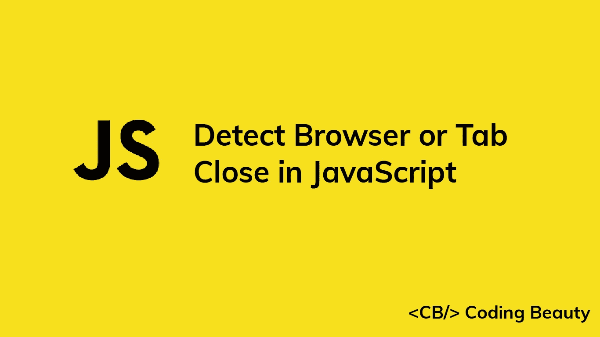
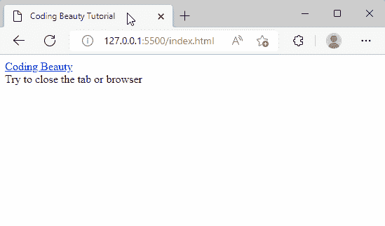
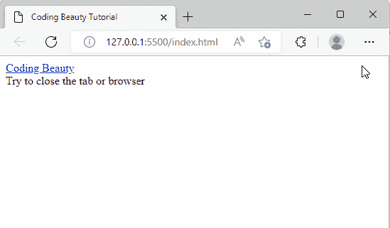
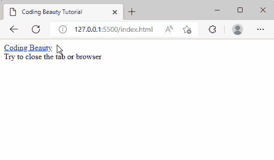
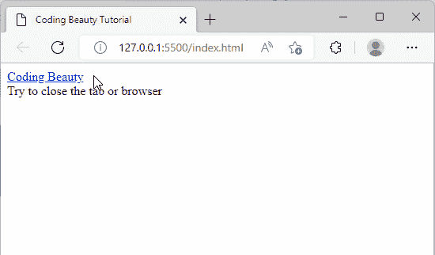

# 如何用 JavaScript 检测浏览器或标签关闭事件

> 原文：<https://javascript.plainenglish.io/javascript-detect-browser-tab-close-840a44c82d17?source=collection_archive---------2----------------------->

## 了解如何使用 JavaScript 轻松检测浏览器或标签关闭事件



要在 JavaScript 中检测浏览器或标签关闭事件:

1.  向全局`window`对象添加一个`beforeunload`事件监听器。
2.  在这个监听器中，调用传递给它的`Event`对象上的`preventDefault()`方法。
3.  将这个`Event`对象的`returnValue`属性设置为空字符串(`''`)。

`JavaScript`

```
window.addEventListener('beforeunload', (event) => {
  event.preventDefault();
  event.returnValue = '';
});
```

我们需要检测浏览器或标签关闭的事件，以提醒用户网页上任何未保存的更改。

我们使用`addEventListener()`方法将事件处理程序附加到任何 DOM 对象，比如 HTML 元素、HTML `document`或`window`对象。

在即将卸载窗口、文档及其资源之前，触发了`beforeunload`事件。此时，文档仍然可见，事件仍然可以取消。

我们必须在处理程序接收的`Event`对象上调用`preventDefault()`来在浏览器中显示确认对话框。`preventDefault()`方法防止事件的默认动作。对于`beforeunload`事件，`preventDefault()`停止卸载资源、窗口和文档。

当用户试图关闭浏览器或选项卡时，这段 JavaScript 代码将导致显示一个确认对话框。这里有一些使用 JavaScript 的 HTML 示例。

`HTML`

```
<a href="codingbeautydev.com">Coding Beauty</a>
<br />
Try to close the tab or browser
```



A confirmation dialog is shown when the user tries to close the tab.



A confirmation dialog is shown when the user tries to close the browser.

注意，`beforeunload`事件不仅在浏览器或选项卡关闭时被触发，而且在单击链接、提交表单、按下后退/前进按钮或刷新页面时也被触发。



A confirmation dialog is shown when a link is clicked on the page.



A confirmation dialog is shown when the user tries to refresh the page.

*原载于*【codingbeautydev.com】

# *JavaScript 做的每一件疯狂的事情*

*一本关于 JavaScript 微妙的警告和鲜为人知的部分的迷人指南。*

**

*[**报名**](https://cbdev.link/d3c4eb) 立即免费领取一份。*