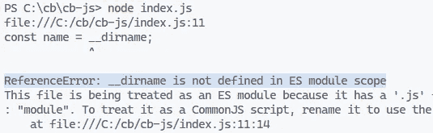
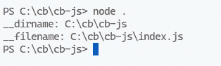

# 如何修复 JavaScript 中的“__dirname 未在 ES 模块作用域中定义”错误

> 原文：<https://javascript.plainenglish.io/javascript-dirname-is-not-defined-in-es-module-scope-41acd96e122d?source=collection_archive---------7----------------------->

## 了解如何轻松修复 JavaScript 中的“__dirname 未在 ES 模块范围内定义”错误。


当我们试图访问 ES 模块中的`__dirname`全局变量时，JavaScript 中出现“__dirname 未在 ES 模块范围内定义”错误。`__dirname`和`__filename`全局变量是在 CommonJS 模块中定义的，而不是在 es 模块中。



The “__dirname is not defined in ES module scope” error occurring in JavaScript.

我们可以通过使用某些函数创建一个自定义的`__dirname`变量来修复“_ _ dirname is not defined in ES module scope”错误，该变量的工作方式就像全局变量一样，直接包含文件当前工作的完整路径。

`index.js`

```
import path from 'path';
import { fileURLToPath } from 'url';

const __filename = fileURLToPath(import.meta.url);
const __dirname = path.dirname(__filename);

// C:/cb/cb-js
console.log(__dirname);

// C:\cb\cb-js\index.html
console.log(path.join(__dirname, 'index.html'));
```

`import.meta`对象包含与某个模块相关联的上下文特定的元数据，例如模块的文件 URL。

```
// file:///C:/cb/cb-js/index.js
console.log(import.meta.url);
```

因此，我们从`url`模块获取当前模块的文件 URL，并将其传递给`fileURLToPath`函数，以将其转换为文件路径。`fileURLToPath`返回完全解析的、特定于平台的 Node.js 文件路径。

```
// C:\cb\cb-js\index.js
console.log(fileURLToPath('file:///C:/cb/cb-js/index.js'));
```

获取文件路径后，我们从`path`模块将它传递给`dirname`方法，以从文件路径中获取完整的目录路径。

```
// C:\cb\cb-js
console.log(path.dirname('C:\\cb\\cb-js\\index.js'));
```

这样，我们现在有了自己的`__dirname`和`__filename`变量。

这是从我电脑上的一个文件中记录它们的输出。



Logging the `__dirname` and `__filename` variables to the console.

`__filename`包含当前模块文件的绝对路径。

`__dirname`包含当前模块文件目录的绝对路径。

# 为`__dirname`和`__filename`创建实用程序

如果我们经常访问`__dirname`和`__filename`变量，我们可以抽象出在实用程序模块中创建它们的逻辑，避免不必要的重复。

`file-dir-name.js`

```
import { fileURLToPath } from 'url';
import { dirname } from 'path';

export default function fileDirName(meta) {
  const __filename = fileURLToPath(meta.url);
  const __dirname = dirname(__filename);
  return { __dirname, __filename };
}
```

我们将能够在项目中的各种其他模块文件中使用这个实用程序。

`index.js`

```
import fileDirName from './file-dir-name.js';

const { __dirname, __filename } = fileDirName(import.meta);

// C:\cb\cb-js
console.log(__dirname);

// C:\cb\cb-js\index.js
console.log(__filename);
```

【codingbeautydev.com】原载于[](https://cbdev.link/e8944f)

# *JavaScript 做的每一件疯狂的事情*

*一本关于 JavaScript 微妙的警告和鲜为人知的部分的迷人指南。*

**

*[**报名**](https://cbdev.link/d3c4eb) 立即免费领取一份。*