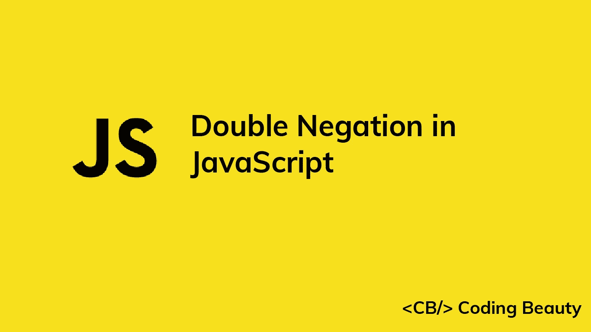

# 双重否定是什么意思！！)用 JavaScript 做什么？

> 原文：<https://javascript.plainenglish.io/javascript-double-negation-e667b993e408?source=collection_archive---------10----------------------->



您可能已经在一些 JavaScript 代码中看到了双重否定运算符(`!!`)。它的功能是什么？

双重否定将真实的价值观转化为`true` `Boolean`，将虚假的价值观转化为`false` `Boolean`。它不是一个独特的 JavaScript 运算符，而实际上只是两个否定的序列。应用`false`中的第一个否定结果得到真值，应用`true`得到假值。然后，第二个否定将对结果的正常布尔值进行运算。

下面是一个例子:

```
!!2; // -> true
!!''; // -> false
!!NaN; // -> false
!!'word'; // -> true
!!undefined; // -> false
```

**注**:如果需要将一个值转换为`Boolean`值，最好是显式的，使用`Boolean`构造函数，不要使用双重否定。我们本可以把上面的例子写得更清楚:

```
Boolean(2); // -> true
Boolean(''); // -> false
Boolean(NaN); // -> false
Boolean('word'); // -> true
Boolean(undefined); // -> false
```

**注**:我们不需要将一个值转换成`Boolean`来检查它在三元运算符或`if`语句中是真是假。我们可以直接使用价值:

```
if (2) console.log('executed');
if ('') console.log('NOT executed');
if (NaN) console.log('NOT executed');
if ('word') console.log('executed');
if (undefined) console.log('NOT executed');
```

*更新于:*[*codingbeautydev.com*](https://codingbeautydev.com/blog/javascript-double-negation/)

每周获取新的网站开发技巧和教程


[**订阅**](https://codingbeautydev.com/newsletter)