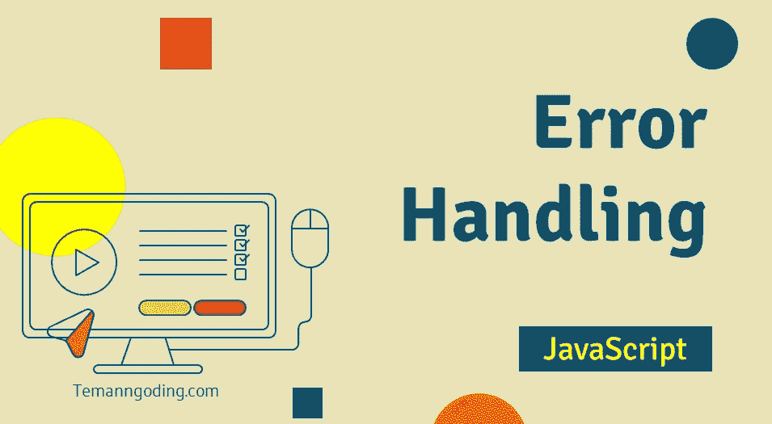

# JavaScript 中的错误处理

> 原文：<https://javascript.plainenglish.io/javascript-error-handling-3ec6729ad83e?source=collection_archive---------2----------------------->

## 如何处理 JavaScript 中的错误



你好，朋友们，我祝你们身体健康，永远成功。这次我们将讨论 JavaScript 中的错误处理。

当我们制作一个应用程序时，我们总是会发现错误。是因为我们在编写代码时的错误还是用户的输入错误？一个好的应用程序会在代码执行时创建一个错误消息作为选项，因为这将使我们更容易处理发生的错误。

还可以学习其他 JavaScript 教程。

[Javascript 教程:将时间 am pm 转换为 24 小时](https://temanngoding.com/tutorial-javascript-convert-waktu-am-pm-to-24-jam/)

[加载页面时进行加载](https://temanngoding.com/membuat-loading-saat-memuat-halaman/)

[JavaScript 教程 Part1 ~认识 Javascript](https://temanngoding.com/tutorial-javascript-part1-mengenal-javascript/)

如何处理错误信息以防止崩溃。好吧，让我们直接进入教程。

# 试着抓住

要处理 JavaScript 错误，请使用 try and catch。编写处理错误的 try-catch 代码如下:

```
try {
    // code
} catch (error) {
    // error handling
}
```

在上面的代码中，我们已经创建了代码，第一个 try 代码是为 try 代码提供一个被 catch 代码块捕获和处理的机会。同时，如果代码中没有错误，catch 块将被忽略。

```
try {
    console.log("first blok try");
    console.log("last blok try");
} catch (error) {
    console.log("No error occurs, then this code is ignored");
}

/* output
first blok try
last blok try
*/
```

上面的 try 块中的代码不会返回错误，因此 catch 块中的代码将被忽略并且不被执行。下面是生成错误的代码示例:

```
try {
    console.log("First blok try");   // (1)
    errorCode;                      // (2)
    console.log("Last blok try");  // (3)
} catch (error) {
    console.log("An error occurred!");  // (4)
}

/* output
First blok try
An error occurred!
*/
```

代码行(2)将产生一个错误。try 块内的代码执行将被停止，因此代码行(3)将不被执行。然后代码将继续到第(4)行或 catch 块。

现在考虑 catch 块。catch 有一个名为 error 的参数(变量名可以更改)。错误变量是存储所发生错误的详细信息的对象。

错误对象中有几个主要属性，即:

**名称**:发生的错误的名称。
**消息**:关于错误详情的消息。
堆栈:关于导致错误的事件序列的信息。通常用于调试，因为它包含哪一行导致了错误的信息。
现在让我们尝试修改代码并显示上面的错误属性。

```
try {
    console.log("First blok try");   // (1)
    errorCode;                      // (2)
    console.log("Last blok try");  // (3)
} catch (error) {
    console.log(error.name);
    console.log(error.message);
    console.log(error.stack);
}

/* output
Awal blok try
ReferenceError
errorCode is not defined
ReferenceError: errorCode is not defined
    at file:///home/dicoding/Playground/javascript/CoffeeMachine/error.js:3:5
    at ModuleJob.run (internal/modules/esm/module_job.js:152:23)
    at async Loader.import (internal/modules/esm/loader.js:166:24)
    at async Object.loadESM (internal/process/esm_loader.js:68:5)
*/
```

从上面的信息中，我们可以知道出现的错误是 ReferenceError，因为 errorCode 被认为是一个未定义的变量或值。

# 尝试-捕捉-最终

除了 try and catch，JavaScript 的错误处理机制中还有一个模块，即 finally。不管 try-catch 块的结果如何，finally 块仍将执行。

```
try {
    console.log("First blok try");
    console.log("Last blok try");
} catch (error) {
    console.log("This line is ignored");
} finally {
    console.log("Will still be executed");
}

/* output
First blok try
Last blok try
Will still be executed
*/
```

# 投掷错误

现在我们将尝试一个更常见的情况。请注意以下代码:

```
let json = '{ "name": "Johon", "age": 20 }';

try {
    let user = JSON.parse(json);

    console.log(user.name);
    console.log(user.age);
} catch (error) {
    console.log(error.name);
    console.log(error.message);
}
```

在上面的代码中，JSON.parse 函数将 JSON 变量(字符串)解析或转换成一个对象。当我们向 API 发出请求时，我们会遇到许多类似上面的场景。

在文本编辑器中运行上面的代码。应用程序应该运行顺畅，不会导致错误。

那么，JSON 字符串和 JavaScript 对象格式不匹配怎么办？

```
try {
    let user = JSON.parse(json);

    console.log(user.name);
    console.log(user.age);
} catch (error) {
    console.log(error.name);
    console.log(error.message);
}

/* output
SyntaxError
Unexpected token b in JSON at position 2
*/
```

如果 JSON 与格式不匹配，那么 JSON.parse 将导致错误。catch 块将捕获该错误，并执行其中的代码。

因此，这次的教程可能对你们所有人都有用。

***谢了。***

*更多内容看* [***说白了就是***](https://plainenglish.io/) *。报名参加我们的* [***免费周报***](http://newsletter.plainenglish.io/) *。关注我们关于*[***Twitter***](https://twitter.com/inPlainEngHQ)*和*[***LinkedIn***](https://www.linkedin.com/company/inplainenglish/)*。查看我们的* [***社区不和谐***](https://discord.gg/GtDtUAvyhW) *加入我们的* [***人才集体***](https://inplainenglish.pallet.com/talent/welcome) *。*