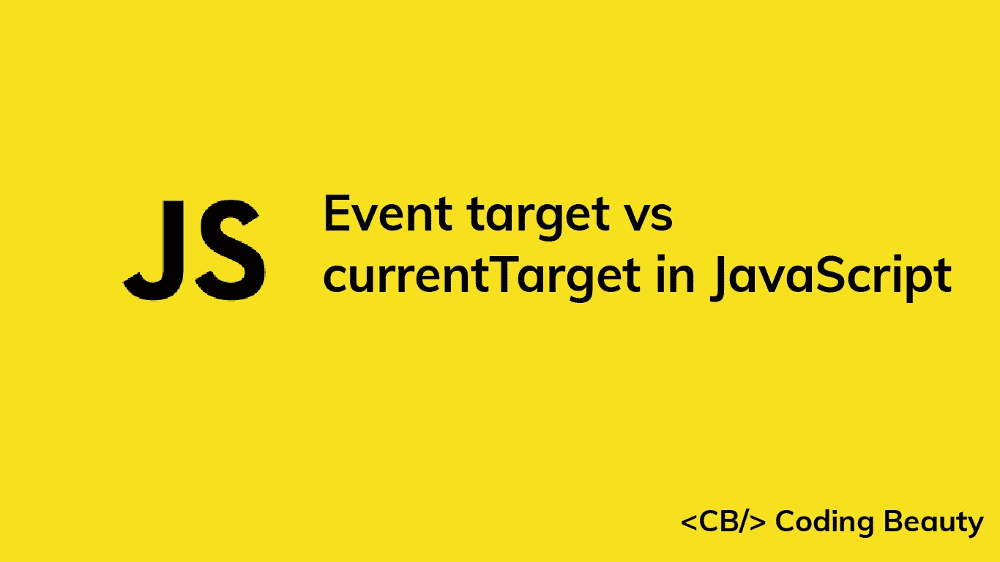

# JavaScript 中事件目标与当前目标的重要区别

> 原文：<https://javascript.plainenglish.io/javascript-event-target-vs-currenttarget-64c84007cc21?source=collection_archive---------1----------------------->



我们使用 HTML DOM `Event`对象来获取关于事件的更多信息，并执行与之相关的某些操作。像`click`、`mousedown`和`keyup`这样的事件都有不同类型的`Event`与之相关联。两个关键的`Event`属性是`target`和`currentTarget`。这些属性有些相似，有时会返回相同的对象，但重要的是我们要理解它们之间的区别，这样我们才能知道哪一个更适合不同的情况。

如果 DOM 树中元素的每一个祖先直到根元素都触发了 DOM 元素**上发生的事件，那么这个事件就会冒泡**。当访问事件侦听器中的`Event`时，`target`属性返回 DOM 中触发事件的最内层元素(冒泡从该元素开始)。然而,`currentTarget`属性将返回事件监听器附加到的元素。

我们用一个简单的例子来说明这一点。我们将有三个嵌套的`div`元素，它们都用相同的处理函数监听点击事件。

```
<!DOCTYPE html>
<html>
  <head>
    <style>
      #div1 {
        height: 200px;
        width: 200px;
        background-color: red;
      }
      #div2 {
        height: 150px;
        width: 150px;
        background-color: green;
      }
      #div3 {
        height: 100px;
        width: 100px;
        background-color: blue;
      }
    </style>
  </head>
  <body>
    <div id="div1" onclick="handleClick(event)">
      <div id="div2" onclick="handleClick(event)">
        <div id="div3" onclick="handleClick(event)"></div>
      </div>
    </div>
    <script>
      function handleClick(event) {
        console.log(
          `target: ${event.target.id}, currentTarget: ${event.currentTarget.id}`
        );
      }
    </script>
  </body>
</html>
```


嗯，点击蓝色最里面的`div`会发生什么？您在控制台中得到以下输出:

```
target: div3, currentTarget: div3
target: div3, currentTarget: div2
target: div3, currentTarget: div1
```

单击 div 触发了调用`div3`处理程序的事件。`click`事件冒泡，因此它被传播到两个外部 div。正如所料，`target`在所有侦听器中保持不变，但是`currentTarget`在每个侦听器中是不同的，因为它们被附加到 DOM 层次结构的不同级别的元素上。

*更新于:*【codingbeautydev.com】

# *JavaScript 做的每一件疯狂的事情*

*一本关于 JavaScript 微妙的警告和鲜为人知的部分的迷人指南。*

**

*[**报名**](https://cbdev.link/d3c4eb) 立即免费领取一份。*