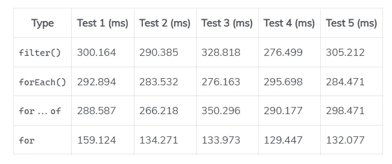

# 如何用 JavaScript 找到数组中的偶数

> 原文：<https://javascript.plainenglish.io/javascript-find-even-numbers-in-array-90943d5480ec?source=collection_archive---------8----------------------->


# 1.数组 filter()方法

要用 JavaScript 找到数组中的偶数，调用数组上的`filter()`方法，传递一个回调函数，当元素是偶数时返回`true`，否则返回`false`

```
const numbers = [7, 10, 15, 8, 13, 18, 6];const evens = numbers.filter((num) => num % 2 === 0);// [10, 8, 18, 6]
console.log(evens);
```

`filter()`方法创建一个新数组，其中包含通过测试回调函数中指定的测试的所有元素。只有偶数在被`2`除时还有余数`0`，所以`filter()`返回一个原始数组中所有偶数的数组。

**注意:** `filter()`保留原始数组中元素的顺序。

# 2.数组 forEach()方法

或者，我们可以用`Array` `forEach()`方法找到数组中的奇数。我们在数组上调用`forEach()`，在回调中，我们只在结果数组是偶数时添加一个元素。

```
const numbers = [7, 10, 15, 8, 13, 18, 6];const evens = [];
numbers.forEach((num) => {
  if (num % 2 === 0) {
    evens.push(num);
  }
});// [ 10, 8, 18, 6 ]
console.log(evens);
```

# 3.for…of 循环

我们可以使用`for...of`循环代替`forEach()`来遍历数组并找到偶数。

```
const numbers = [7, 10, 15, 8, 13, 18, 6];const evens = [];
for (const num of numbers) {
  if (num % 2 === 0) {
    evens.push(num);
  }
}// [ 10, 8, 18, 6 ]
console.log(evens);
```

# 4.传统 for 循环

我们不能忘记传统的`for`循环:

```
const numbers = [7, 10, 15, 8, 13, 18, 6];const evens = [];
for (let i = 0; i < numbers.length; i++) {
  const num = numbers[i];
  if (num % 2 === 0) {
    evens.push(num);
  }
}// [ 10, 8, 18, 6 ]
console.log(evens);
```

# 性能比较

让我们使用一个包含 1000 万个元素(元素从 1 到 1000 万)的数组来比较这四种方法的性能。

```
const numbers = [...Array(10000000)].map(
  (_, index) => index + 1
);function measurePerf(label, method) {
  console.time(label);
  method();
  console.timeEnd(label);
}measurePerf('filter', () => {
  const evens = numbers.filter((num) => num % 2 === 0);
});measurePerf('forEach', () => {
  const evens = [];
  numbers.forEach((num) => {
    if (num % 2 === 0) {
      evens.push(num);
    }
  });
});measurePerf('for...of', () => {
  const evens = [];
  for (const num of numbers) {
    if (num % 2 === 0) {
      evens.push(num);
    }
  }
});measurePerf('for', () => {
  const evens = [];
  for (let i = 0; i < numbers.length; i++) {
    const num = numbers[i];
    if (num % 2 === 0) {
      evens.push(num);
    }
  }
});
```

## 结果



## 平均的

*   `filter()` : 300.216 毫秒
*   `forEach()` : 286.516 毫秒
*   `for...of` : 298.750 毫秒
*   `for` : 137.778 毫秒

在这次比较中，传统的`for`循环始终名列前茅。然而，这并不意味着你必须一直使用它。您并不经常需要过滤一个有 1000 万个元素的数组——在典型的用例中，您从`for`循环中获得的性能增益将是微乎其微的。在大多数情况下，您最好使用`filter()`,因为它更简洁、可读性更好，如果您更喜欢函数式方法，尽管它速度较慢。

*更新于:*[*codingbeautydev.com*](https://cbdev.link/01bd73)

# JavaScript 做的每一件疯狂的事情

一本关于 JavaScript 微妙的警告和鲜为人知的部分的迷人指南。


[**报名**](https://cbdev.link/d3c4eb) 立即免费领取一份。