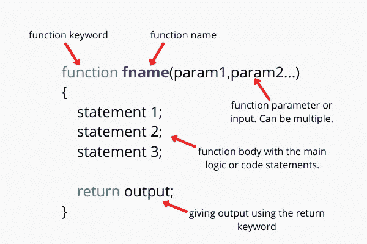
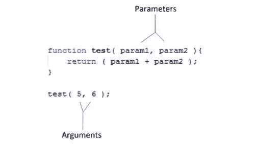
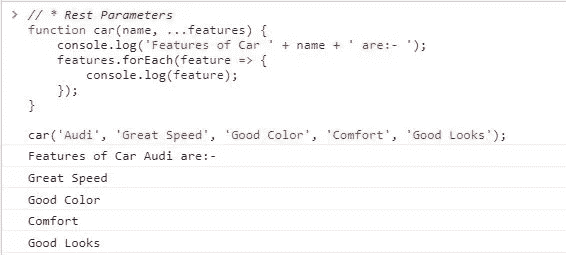
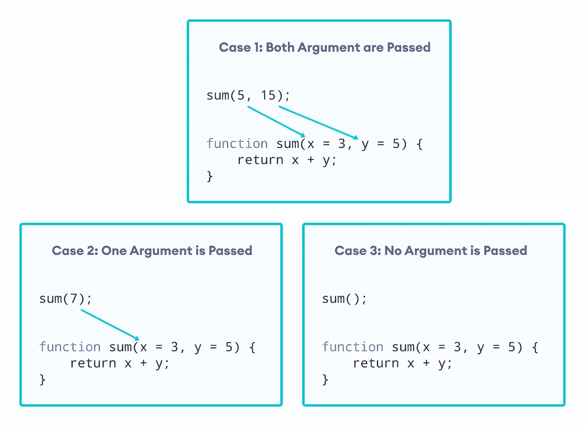

# 作为一名 JavaScript 开发人员，3 个函数概念将成为你的武器库

> 原文：<https://javascript.plainenglish.io/javascript-functions-part-1-definitions-and-arguments-ef2643e73233?source=collection_archive---------6----------------------->

## JavaScript 函数第 1 部分:函数定义和参数赋值


在这篇博客中，我们将讨论以下主题:

1.  充当一级对象
2.  定义函数的各种方法
3.  参数赋值的真实性

# **1。充当一级对象**

JavaScript 中的函数拥有对象的所有功能，因此和语言中的其他对象一样。我们说函数是*一级*对象，也可以是:

*   **通过文字创建**

```
function testFunction() {}
```

*   **赋给变量、数组条目和其他对象的属性**

```
const testFunction = function() {}  // Assigned to a variable
testArray.push(function(){})  // Added to an array
test.data = function(){}  // Assigned to property of another object
```

*   **作为参数传递给其他函数**

```
function call(testFunction) {
    testFunction();
}
call(testFunction(){})  // Newly created function passed as argument
```

*   **作为函数**的值返回

```
function returnNewTestFunction(){
    return function(){};  // Return a new function
}
```

*   **它们可以拥有可动态创建和分配的属性**

```
let testFunction  = function(){}
testFunction.name = "Naruto"   // add property to a function
```

无论我们能对对象做什么，我们也能对函数做什么。函数是对象，只是有一个额外的特殊能力，即*可调用*:函数可以被调用以执行一个动作。

同时将一个函数作为参数传递给另一个函数，该函数可能会在应用程序执行的后期调用传入的函数。这是一个更一般的概念，称为*回调函数*。

*   **回调函数**

回调是有效使用 JavaScript 的重要部分，我敢打赌你已经在代码中大量使用了回调。

我们将从一个完全无用的函数的示例开始，该函数接受对另一个函数的引用作为参数，并将该函数作为回调调用:

```
function useless(testCallback){
    return testCallback();
}
```

这个函数解释了如何将一个函数作为参数传递给另一个函数，然后使用传递的参数调用那个函数，尽管它毫无意义。

```
var text = "Uzumaki Naruto!";function useless(testCallback){
    return testCallback();
}console.log(useless(function (){return text:}))// Prints: Uzumaki Naruto!
```

JavaScript 最重要的特性是能够在表达式出现的地方创建函数。当一个函数不会从代码中的很多地方被访问时，这个特性还可以避免用无关的名字污染全局名称空间，从而使代码更加紧凑和易于理解。

带函数的简单排序示例:

```
const values = [0,2,5,3,9,6,8,7]
values.sort(function(v0, v1){
   return v0 - v1
})
```

我们可以提供一个回调函数，JavaScript 引擎每次需要比较两个条目时都会调用这个函数。

# 2.定义函数的各种方法

声明 JavaScript 函数的最常见方式是使用函数文字，它的工作方式类似于数字文字，因为它创建一个函数值。请记住，像字符串和数字一样，函数是一级对象，可以在语言中作为值使用。

你已经在做了，不管你有没有意识到。

JavaScript 中有几种定义函数的方法，可以分为四类:

## **2.1 函数声明和函数表达式**

定义函数的两种最常见但又微妙不同的方式。通常人们甚至不认为它们是独立的，但是正如您将看到的，意识到它们的差异可以帮助我们理解何时我们的函数可供调用:

```
function myFun(){ return 1; }
```

## **2.1.1 函数声明**

在每个函数声明中，强制 function 关键字后面跟一个强制 function 名和一列用逗号分隔的可选参数名，这些参数名用强制括号括起来。必须使用左大括号和右大括号来封装函数体，函数体可能是一个空的语句列表。除此之外，还有一个标准，每个函数声明都必须满足:函数声明应该包含在它自己的 JavaScript 语句中。



```
//defines headphone in global code
function headphone() {
   return 'boat headphone'
}//defines laptop in global code
function laptop() {   
    // defines keyboard within laptop
    function keyboard() { return 'keyboard here' }
return hiddenMouse()
} 
```

## **2.1.2 函数表达式**

如前所述，JavaScript 对象是一级对象，这意味着它们可以使用文字创建，分配给变量和属性，并在其他函数中用作参数和返回值。

我们可以像 JavaScript 中的其他表达式一样考虑函数，因为它们是如此基本的实体。总是另一个语句的一部分的语句称为函数表达式。它们很有帮助，因为它们允许我们准确地在需要的地方声明函数，使我们的代码更容易理解。

```
//Standalone function declaration
function myTestDeclarations(){
    // inner function declaration
    function innerFunction(){}
} // function expressions
const myFun = function() {};//call function expression, with function expression as return value 
myFun(function () { return function (){}})//named function expression as part of function call
( function **namedFunctionExpression**() {})();
```

## **2.2 箭头函数(或λ函数)**

JavaScript 标准的最新增强 ES6 允许我们用更少的语法负担来定义函数。

```
const values = [0,2,5,3,9,6,8,7]
values.sort(function(v0, v1){
   return v0 - v1
})
```

这个例子使用了一个回调函数表达式发送给 array 对象的 sort 方法:这个回调函数将被 JavaScript 调用，以降序对数组的值进行排序。

现在让我们用箭头函数来做这个例子:

```
const values = [0,2,5,3,9,6,8,7]
values.sort((v0, v1) => v0 - v1)
```

function 关键字、括号和 return 语句不会增加任何混乱。arrow 函数声明:这个函数接受两个参数，并以比函数表达式更简单的形式返回它们的差。注意一个新的操作符 **= >** 是如何引入的，即所谓的胖箭头操作符(等号后面紧跟一个大于号)，它对于构建箭头函数是必不可少的。

## **2.3 函数构造器**

一种不常使用的函数定义方式，它使我们能够从一个也可以动态生成的字符串中动态构造一个新函数。此示例动态创建了一个带有两个参数 a 和 b 的函数，该函数返回这两个参数的和:

```
new Function('a', 'b', 'return a+b')
```

[](https://developer.mozilla.org/en-US/docs/Web/JavaScript/Reference/Global_Objects/Function/Function) [## Function()构造函数- JavaScript | MDN

### 函数构造器创建一个新的函数对象。直接调用构造函数可以创建函数…

developer.mozilla.org](https://developer.mozilla.org/en-US/docs/Web/JavaScript/Reference/Global_Objects/Function/Function) 

## **2.4 发电机功能**

ES6 对 JavaScript 的这一创新允许我们编写不同于常规函数的函数，这些函数可以在应用程序执行过程中的任何时候离开和重新进入，同时保持它们的变量值。
函数声明、函数表达式、函数构造器都可以定义为生成器:

```
function* tesGen(){ yield 1; }
```

您可以在本文中阅读关于生成器函数的更多内容:

[](https://medium.com/@shriomtripathi33/the-alchemy-of-javascript-generators-f58e81c9f269) [## JavaScript 生成器的魔力

### 这是 JavaScript 函数第 2 部分的延续

medium.com](https://medium.com/@shriomtripathi33/the-alchemy-of-javascript-generators-f58e81c9f269) 

# 3.参数赋值的真实性

在讨论函数时，我们通常互换使用实参和形参这两个词，就好像它们是同一个词一样。
现在，让我们变得正式一点:

*   *参数*是我们作为函数定义的一部分列出的变量。
*   一个*参数*是我们在调用函数时传递给它的一个值。



如您所见，函数参数是用函数的定义来指定的，所有类型的函数都可以有参数:

*   函数声明
*   函数表达式
*   箭头功能

另一方面，参数与函数调用相关联；它们是在调用函数时提供给函数的值。当一个函数调用包含一个实参列表时，实参按照指定的顺序被分配给函数定义的形参。第一个参数与第一个参数相关联，第二个参数与第二个参数相关联，依此类推。
参数个数超过形参个数没有错误。这种情况对 JavaScript 来说完全没问题，它以下面的方式处理。当实参多于形参时，不会将“额外”实参赋给形参名。

## **3.1 休息参数**

其余参数以`…`为前缀



我们通过在函数的最后一个参数前面加一个省略号(…)将它改为一个名为 remainder parameters 的数组，该数组包含其余传入的参数。

rest 参数只能用作最后一个函数参数。试图将省略号放在任何不是最后一个的参数前面只会导致失望。

```
SyntaxError: parameter after rest parameter
```

## **3.2 默认参数**

如下表所示，ES6 标准现在包括对默认参数的支持。



JavaScript 中默认函数参数的语法如下所示。
我们给一个函数参数赋值来创建一个默认参数。

我们可以给默认参数任何我们想要的值:简单的原始值，如数字或文本，以及更复杂的类型，如对象、数组，甚至函数。在每个函数调用中，这些值是从左到右进行评估的，我们可以在为后面的默认参数提供值时引用前面的默认参数，如下面的清单所示。

```
// **We can place arbitrary expressions as default parameter values, in the process even referencing previous function parameters.**function performSomeThing(
  p0, 
  something = 'schooling', 
  somewhere = p0 + " "+ something
) {
   return somewhere;
}
```

尽管 JavaScript 允许我们做类似的事情，我还是建议谨慎。在我们看来，这并不能提高代码的可读性，应该尽可能避免。然而，明智地使用缺省参数——作为避免空值的一种方式，或者作为设置函数行为的相对基本的标志——可以产生更干净、更优雅的代码。

这些都是关于函数的。我希望你已经发现这是有用的。感谢您的阅读。

*更多内容请看*[***plain English . io***](https://plainenglish.io/)*。报名参加我们的* [***免费周报***](http://newsletter.plainenglish.io/) *。关注我们关于*[***Twitter***](https://twitter.com/inPlainEngHQ)*和*[***LinkedIn***](https://www.linkedin.com/company/inplainenglish/)*。加入我们的* [***社区不和谐***](https://discord.gg/GtDtUAvyhW) *。*