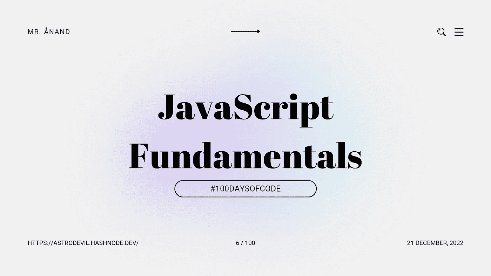

# JavaScript 基础:For 循环和模数运算符

> 原文：<https://javascript.plainenglish.io/javascript-fundamentals-for-loop-and-modulus-operator-e61d83daba7e?source=collection_archive---------17----------------------->

## # 100 日代码的第 6 天



今天是我的 JavaScript 之旅的第六天。

我通过我的[博客](https://astrodevil.hashnode.dev/)和社交网站以一种解释的方式写下我的学习。如果你想加入我的学习之旅，一定要关注我的博客和社交网站，并分享你的博客和社交网站。**一起学习吧！🫱🏼‍🫲🏼**

本文是 [JavaScript 基础](https://astrodevil.hashnode.dev/series/js-fundamentals)系列的一部分。

# 环

循环提供了一种快速简单的方法来重复一个动作。程序员通过创建脚本来利用这种速度，这些脚本重复执行一项任务，直到满足预定的条件。

在*伪代码*中，这可能看起来有点像这样:

```
while we have book
    read book
    while we have pages in this book
        read page
            while we have words on the page
                read word
```

# For 循环

重复一个`for`循环，直到指定的条件评估为假。

*   **数字求和**举例:

我们来思考一下数字 1、2、3、4 如何反复相加:第一步，一个和数加 1。然后我们到 2，把这个加到总数上，以此类推，直到我们到 4。每次我们加到总数上，就会发生一次迭代。当值大于 4 时，我们迭代直到达到退出条件。

```
let sum = 0;
for(let i = 1; i <= 4; i++) { 
    sum = sum + i; 
}
```

`for`循环可以分解为*初始化*、*条件*、*更新*和*语句*:比较👇🏼随着👆🏼

```
for ([initialization]; [condition]; [update]) {
    statement
}
```

**初始化**在循环开始时运行一次。每次迭代前检查**条件**。**更新**在每次迭代结束时运行。只要条件为真，就会运行**语句**。

*   **数字的阶乘**示例:

在数学中，阶乘通常用感叹号`!`来表示。所有大于 0 且包含阶乘数`n`的正整数之和称为阶乘。

让我们来看几个阶乘的例子:

`4! = 4 * 3 * 2 * 1 = 24`

`3! = 3 * 2 * 1 = 6`

`2! = 2 * 1 = 2`

**示例:**接受某个整数值`n`，找出该数字的阶乘并返回。

```
function factorial(n){
let result = 1;
for (let i = 1; i <= n; i++){
result = result * i; // or result *= i;
}
return result;
}
```

*   **循环中的字符串**示例:

再给`"Hello World"`加点感叹号吧！

```
let str = "Hello World";
for(let i = 1; i <= 3; i++) {
    str += "!";
}
console.log(str); // Hello World!!!
```

**示例:**让我们创建一个函数`scream`，它将接受一个值`n`并返回一个字符串，该字符串包含像`scream(5); // "aaaaa"`一样重复多次的字母“`a`

```
function scream(n) {
    let str = "";
    let i = 1;
    for (let i = 1; i<=n; i++){
        str += "a"
        }
    return str;
}
```

# 模数算子

`%`算符叫做模算符。它会告诉我们除法的余数。用`9`除以`2`得到。或者`4`加上`1`的余数。表达式`9` % `2`计算余数:`1`

让我们来看几个例子:

```
console.log(8 % 3) // 2
console.log(9 % 2) // 1
console.log(7 % 4) // 3
```

**示例:**让我们修改我们的函数，返回一个大小写交替的尖叫，如下所示:

`console.log( scream(4) ); // aAaA console.log( scream(9) ); // aAaAaAaAa`

```
function scream(n) {
    let str = "";

for (let i = 1; i <= n; i++) {
        const remainder = i % 2;
        const isEven = remainder === 0;
        if (isEven) {
            str += "A";
        }
        else {
            str += "a";
    }
}
    return str;
}
```

# 结论

以关于 JavaScript 函数的额外信息结束…

在`for`循环开始时，会执行一次**初始化**。每次迭代都从检查**条件**开始。如果表达式评估为真，将执行**语句**。如果不真实，语句就不会执行。每次迭代以执行**更新**结束。对于**语句**的后续执行，它可能会更新一个变量。只要**条件**为真，则执行**语句**。循环的实际工作在这里完成。

今天我学习了 JavaScript 中的 For 循环，模数运算符。

## 如果你❤️我的内容！在推特[上联系我](https://mobile.twitter.com/Astrodevil_)或者通过[给我买一辆 Coffee☕](https://www.buymeacoffee.com/Astrodevil) 来支持我

## 更多内容请访问 [PlainEnglish.io](https://plainenglish.io/) 。

*报名参加我们的* [***免费周报***](http://newsletter.plainenglish.io/) *。关注我们上* [***推特***](https://twitter.com/inPlainEngHQ) ， [***领英***](https://www.linkedin.com/company/inplainenglish/) ***，***[***YouTube***](https://www.youtube.com/channel/UCtipWUghju290NWcn8jhyAw)***，以及****[***不和***](https://discord.gg/GtDtUAvyhW) *

## *想扩大你的软件创业规模吗？检查[电路](https://circuit.ooo/?utm=publication-post-cta)。*