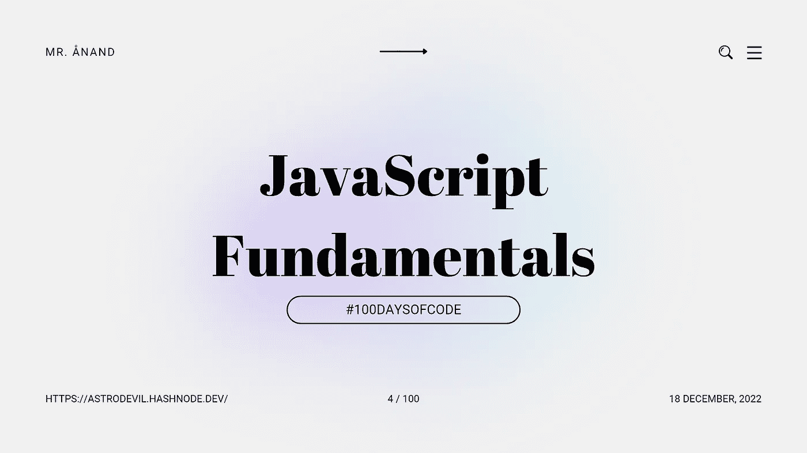

# JavaScript 基础:数学对象

> 原文：<https://javascript.plainenglish.io/javascript-fundamentals-math-object-3e28a05afa2?source=collection_archive---------13----------------------->

## # 100 日代码的第 4 天



今天是我 JavaScript 之旅的第四天。

我通过我的博客和社交网站以一种解释的方式写下我的学习。如果你想加入我的学习之旅，一定要关注我的博客和社交网站，并分享你的博客和社交网站。**让我们一起学习吧！🫱🏼‍🫲🏼**

这篇文章是 JavaScript 基础系列的一部分。

今天，我学习了`Math.random`、`Math.floor`函数以及在函数中调用函数。

# 数学.随机

在 JavaScript 中，`Math`对象上有许多数学工具。为了得到一个随机数，我们可以调用`Math.random`函数。

```
const myRandomNumber = Math.random();
```

上面的行将返回一个在`0`和`1`之间的数字(不包括`1`)。`Math.random`也可以用来生成范围之间的随机数。

**示例:`getRandom`内的**，从`Math.random()`函数中获取一个随机数。然后，还那个号！👇🏼

```
function getRandom() {
    return Math.random();
}
```

在`0`和`100`之间的随机数可以通过简单地乘以输出来创建:

```
// randomNumber will be between 0 and 100
const randomNumber = Math.random() * 100;
```

我们可以相乘，然后相加，得到一个在`15`和`100`之间的随机数:

```
// randomNumber will be between 15 and 100
const randomNumber = (Math.random() * 85) + 15;
```

# 数学.地板

`Math.floor`取参数。

```
const two = Math.floor(2.2598223);
```

`Math.floor`功能将采用`2.2598223`并返回`2`。使用此函数将数字四舍五入为最接近的整数。例如，如果输入是`2.9999`，该方法会将其舍入到`2`。

**示例:**取参数`x`，用`Math.floor`将其转换成一个整数，小数点后没有数值。一旦你有了这个底价，就把它退回去！

```
function getFloor(x) {
    return Math.floor(x);
}
```

# 结论

以关于 JavaScript 函数的额外信息结束…

JavaScript Math 对象允许我们对数字执行数学任务。有各种数学对象属性。

今天我学习了 JavaScript 中的 Math.random，Math.floor 函数。

## 如果你❤️我的内容！在 [Twitter](https://mobile.twitter.com/Astrodevil_) 上联系我，或者通过[给我买一辆 Coffee☕](https://www.buymeacoffee.com/Astrodevil) 来支持我

## 更多内容请访问 [PlainEnglish.io](https://plainenglish.io/) 。

*报名参加我们的* [***免费每周简讯***](http://newsletter.plainenglish.io/) *。关注我们关于* [***推特***](https://twitter.com/inPlainEngHQ) 、 [***领英***](https://www.linkedin.com/company/inplainenglish/) ***、***[***YouTube***](https://www.youtube.com/channel/UCtipWUghju290NWcn8jhyAw)***，以及****[***不和***](https://discord.gg/GtDtUAvyhW) *

## *想扩大你的软件创业规模吗？检查[电路](https://circuit.ooo/?utm=publication-post-cta)。*