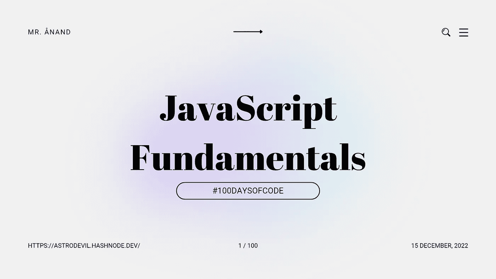

# JavaScript 基础:数字变量、多个变量、布尔值、字符串

> 原文：<https://javascript.plainenglish.io/javascript-fundamentals-number-variable-multiple-variables-booleans-strings-7261deae2c7a?source=collection_archive---------14----------------------->

## # 100DaysOfCode 第 1 天



经过考试和许多拖延，我终于用 JavaScript 重新开始了我的第 100 天代码之旅。今天是我旅程的第一天，我学习了一些 JavaScript 的基本概念。

我将通过我的博客和社交网站，以一种解释的方式写下我所学到的东西。如果你想加入我的学习之旅，一定要关注我的博客和社交，也分享你的博客和社交。**让我们一起学习！🫱🏼‍🫲🏼**

# JavaScript 简介

当代在线应用的基础是 JavaScript。虽然这听起来可能自命不凡或华丽，但这也是现实。JavaScript 为当代网络、你的当代服务器，甚至我们计算机上的开发环境提供动力。无论是 web 2.0 还是 web 3.0，JavaScript 无处不在。

# 数变量

JavaScript 变量只不过是一个存储区域的名称。在 JavaScript 中，有两种不同的变量:局部变量和全局变量。当声明一个 JavaScript 变量时，有几个准则(也称为标识符)。

*   名称必须以字母(从 A 到 Z)、下划线(_)或美元符号($)开头。
*   第一个字母后面可以跟从 0 到 9 的任何数字，例如值 1。
*   JavaScript 变量区分大小写；例如，变量 X 和 X 是不同的
*   JavaScript 变量写在**lowercarmelcase 中。**例如`const isLoggedIn = true;`
*   JavaScript 关心一个词中的变量(不被空格分隔)。

我们把值存储在一个叫做变量的东西里。

`const a = 5`

在上面的代码中，`a`是变量。Number `5`是要存储在`a`中的值，`const`是用于在 JavaScript 中将`a`声明为常量值的关键字。

# 多变量

JavaScript 程序一行行运行，这一行`const a = 5`叫做语句。在 JavaScript 中，语句应以`;`(分号)结尾。在某些情况下，JavaScript 会自动在语句中插入分号。最佳做法是在每个语句末尾插入`;`。

我们可以创建另一个变量来存储前一个变量的值。

`const a = 5;`

`const b = a;`

`a`、`b`均存储值`5`。

# 布尔运算

JavaScript 布尔值表示两个值之一: **true** 或 **false** 。

`const loggedIn = false;`

如果用户登录了上面的行，那么`false`表示他们没有登录。

我们也可以在变量中存储布尔值。如果我们必须将`true`存储在一个变量中，将`false`存储在另一个变量中，那么:

`cont a = false;`

`const b = true;`

# 引用

声明 JavaScript 字符串时，单引号和双引号都可以使用。

这里，我们使用了双引号，所以我们可以在消息中使用单引号:

`const message = "Hello, hope you are doing fine!" ;`

如果我们需要使用双引号:

`const message = 'Then he said, "Hey, are you coming home?"';`

如果我们需要在双引号字符串中使用双引号，我们可以使用反斜杠`\`作为转义符:

`const message = "This is double-quote \" inside double-quotes";`

# 用线串

JavaScript 中的字符串用于存储和修改文本。JavaScript 中的字符串是用引号括起来的零个或多个字符。

字符串不过是一堆字符(`a`、`b`、`c`)放在一起。

在 JavaScript 中，有三种方法来定义字符串。前两个是:

*   `const a = "Hello!";`
*   这里，`myName`和`anotherName`使用了两种不同类型的引号，单引号和双引号。我们可以使用任何一个或内部的对方。
*   `const myName = 'Anand';`
*   `const anotherName = "Vishal";`

现在看看声明字符串的第三种方法:

`const helloMessage = `Hello ${myName}, my name is ${anothername}!`;`

在这里，`helloMessage`变量使用反斜杠```。有了反勾号，我们可以在字符串中添加值。`${variable}`讲的就是这个。在上面的代码行中，我们从`myName`和`anotherName`中取值，并将它们放入字符串中。变量`helloMessage`现在包含`"Hello Anand, my name is Vishal!"`

# 结论

以关于 JavaScript 的额外信息结束…

JavaScript 也使用**大写字母**有时像`const SERVER_KEY_VALUE = "abcdefg";`一样，这种情况通常是为需要在代码执行前确定的环境变量或值保留的。例如，如果您有一些想要存储在服务器上而不是本地机器上的密钥，那么您可以将该变量隐藏在服务器上的一个环境变量中，该变量需要访问或更改权限。这些是我们在这个外壳中经常看到的变量类型。

**今天我学习了 JavaScript 中的数字变量、多元变量、布尔、引号和字符串。**

## 如果你❤️我的内容！在推特[上联系我](https://mobile.twitter.com/Astrodevil_)或者通过[给我买一辆 Coffee☕](https://www.buymeacoffee.com/Astrodevil) 来支持我

*更多内容看* [***说白了。报名参加我们的***](https://plainenglish.io/) **[***免费周报***](http://newsletter.plainenglish.io/) *。关注我们关于* [***推特***](https://twitter.com/inPlainEngHQ) ，[***LinkedIn***](https://www.linkedin.com/company/inplainenglish/)*，*[***YouTube***](https://www.youtube.com/channel/UCtipWUghju290NWcn8jhyAw)*，以及* [***不和***](https://discord.gg/GtDtUAvyhW) ***。*****

***有兴趣缩放你的软件启动*** *？检查出* [***电路***](https://circuit.ooo?utm=publication-post-cta) *。*