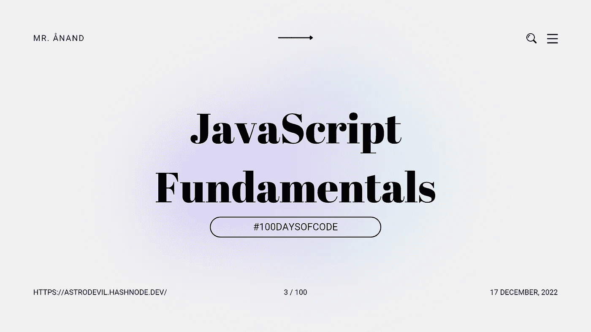

# JavaScript 基础:参数、自变量和运算符

> 原文：<https://javascript.plainenglish.io/javascript-fundamentals-parameters-arguments-and-operators-fe920396e41a?source=collection_archive---------13----------------------->

## # 100 日代码的第 3 天



今天是我 JavaScript 之旅的第三天。

我通过我的博客和社交网站以一种解释的方式写下我的学习。如果你想加入我的学习之旅，一定要关注我的博客和社交网站，并分享你的博客和社交网站。**让我们一起学习吧！🫱🏼‍🫲🏼**

本文是 [JavaScript 基础](https://astrodevil.hashnode.dev/series/js-fundamentals)系列**的一部分。**

昨天学了函数，查了之前的[文章](https://astrodevil.hashnode.dev/javascript-fundamentals-mutable-letcomments-functions)。今天是时候了解更多关于函数和运算符的用法了。

# 参数和自变量

术语**参数**和**自变量**指的是提供给函数的输入。

这是一个有两个输入的函数:

```
function addNumbers(a, b) {
    return a + b;
}
```

上面的代码中，有两个**参数** : `a`和`b`。这些是在函数声明中定义的变量。

如果我们用两个值调用这个函数:`2`和`4`

```
addNumbers(2, 4);
```

值`2`和`4`将被认为是**自变量**。实参是提供给函数以填充到参数中的数据。

# 经营者

JavaScript 运算符是用于对操作数执行运算的符号。这些是`+`、`-`、`*`、`/`。

`+` **操作员**

`+`被称为加法运算符。

完成`addTwo`功能，获取一个输入并将`5`添加到其中。

```
function addTwo(input) {
    const output = input + 5;
return output;
}
```

`*`操作员**操作员**

`*`被称为乘法运算符。

```
const a = 3;
const b = a * 4;
```

在上面的代码中，`b`的值是`12`！我们使用乘法运算符将`3`和`4`相乘。

让我们看看多输入👇🏼通过将多个输入置于用`comma`分隔的`()`下！

```
function product(2,3) {
    return 2*3;
}
```

`/` **操作员**

`/`是指除法运算符。

找出一些数字的平均值:

```
const sum = 2 + 7 + 6;
const average = sum / 3;
```

或者我们可以用括号`()`:

```
const average = (2 + 7 + 6) / 3;
```

以上代码中`2`、`7`、`6`之和为`15`。然后将`15`除以`3` ( `15 / 3`)得到`5`。

括号总是在表达式的任何其他部分之前被首先计算。

# 结论

最后是关于 JavaScript 函数的一些额外信息…

除法和乘法优先于加法和减法。如果运算符的优先级相同，从左到右计算表达式，就像使用除法和乘法一样。

**今天我学习了 JavaScript 中的参数、参数和运算符。**

## 如果你❤️我的内容！在[推特上联系我](https://mobile.twitter.com/Astrodevil_)或者通过[给我买一辆 Coffee☕](https://www.buymeacoffee.com/Astrodevil) 来支持我

## 更多内容见 [PlainEnglish.io](https://plainenglish.io/) 。

*报名参加我们的* [***免费周报***](http://newsletter.plainenglish.io/) *。在* [***推特***](https://twitter.com/inPlainEngHQ)[***领英***](https://www.linkedin.com/company/inplainenglish/)*[***YouTube***](https://www.youtube.com/channel/UCtipWUghju290NWcn8jhyAw)*和****T61**不和上跟随我们 T68**

## **想扩大你的软件启动规模吗？查看[电路](https://circuit.ooo/?utm=publication-post-cta)。**