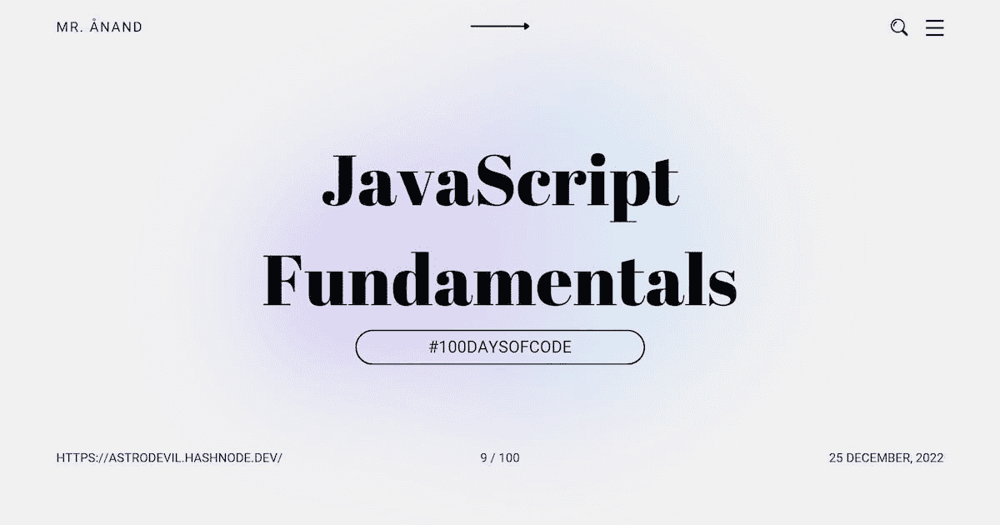

# JavaScript 基础:字符串循环、索引和切片字符串

> 原文：<https://javascript.plainenglish.io/javascript-fundamentals-string-looping-index-of-and-slicing-strings-810ca55f30f?source=collection_archive---------1----------------------->

## # 100 日代码的第 9 天



今天是我的 JavaScript 之旅的第九天。

我通过我的[博客](https://astrodevil.hashnode.dev/)和社交网站以一种解释的方式写下我的学习。如果你想加入我的学习之旅，一定要关注我的博客和社交网站，并分享你的博客和社交网站。**让我们一起学习吧！🫱🏼‍🫲🏼**

这篇文章是 JavaScript 基础知识系列的一部分。

# 字符串循环

字符串很容易循环。我们学习了如何通过使用`.length`属性和`[]`来检索字符。

那么我们如何使用这些来循环字符串呢？

```
const string = "Hello";
for(let i = 0; i < string.length; i++) {
    console.log(string[i]);
}
```

每次迭代后会依次记录:`H`、`e`、`l`、`l`、`o`。

**示例:**完成功能`isAllX`确定**整串**是小写`x`还是大写`X`。如果是，返回`true`，否则返回`false`。

```
function isAllX(string) {
for(let i = 0; i < string.length; i++){
    if(string[i].toLowerCase() !== "x"){
        return false;
    }
}
return true;
}
```

# 索引

在上一节中，我们学习了通过`index`查找字符。现在，是找到特定字符串的`index`的时候了。

`indexOf`方法用于查找第**个字符串的第**个索引。

```
"Hello".indexOf("e"); // 1
"abc".indexOf("q"); // -1 
"happy man dance".indexOf("man"); // 6
```

可以在索引中搜索单个字符和整个字符串！如果找不到索引,`indexOf`将返回`-1`。

**示例:**在`string`参数中找到第一个小写字母“x”的索引并返回。

```
function findFirstX(string) {
    return string.indexOf('x');
}
```

# 分割字符串

我们还有另一个字符串方法**切片！**

切片接受两个参数:一个**开始**索引和一个**结束**索引。得到的字符串是这两个索引之间的分片字符串，除了在**结束**索引处的字符。

```
"An apple".slice(0,2); // An
"The 20 Jokers".slice(4,8); // 20 J
```

如果未提供最后一个索引，切片将继续，直到字符串结束:

```
"Please Slice Me".slice(7); // Slice Me
```

我们也可以使用**负参数**从字符串的结尾开始分割字符串**！**

```
"the apple".slice(-5); // apple
"the apple".slice(-5, -1); // appl
```

**举例:**我们来找一下`x`前后较长的那一半字符串！首先，你需要找到**小写的**T1。一旦你找到了`x`，把绳子分成两半。前半部分是`x`前的字符串，后半部分是`x`后的字符串。

拿起更长的**管柱并返回！**

```
// split the string at the first occurrence of x
// return the larger of the two resulting strings
// i.e. HappyxDeveloper => Developer
function splitAtX(string) {
    const index = string.indexOf('x');
    const a = string.slice(0,index);
    const b = string.slice(index+1);
    return (a.length > b.length) ? a : b;
}
```

# 结论

以关于 JavaScript 函数的额外信息结束…

在字符串上，也有一个`lastIndexOf`方法。它定位字符串的最后一个匹配项，并返回其索引。

今天我学习了 JavaScript 中的字符串循环、索引和切片。

## 如果你❤️我的内容！在推特[上联系我](https://mobile.twitter.com/Astrodevil_)或者通过[给我买一辆 Coffee☕](https://www.buymeacoffee.com/Astrodevil) 来支持我

## 更多内容请访问 [PlainEnglish.io](https://plainenglish.io/) 。

*报名参加我们的* [***免费每周简讯***](http://newsletter.plainenglish.io/) *。关注我们上* [***推特***](https://twitter.com/inPlainEngHQ) ，[***LinkedIn***](https://www.linkedin.com/company/inplainenglish/)***，***[***YouTube***](https://www.youtube.com/channel/UCtipWUghju290NWcn8jhyAw)***，****[***不和***](https://discord.gg/GtDtUAvyhW)*

## 想扩大你的软件创业规模吗？检查[电路](https://circuit.ooo/?utm=publication-post-cta)。