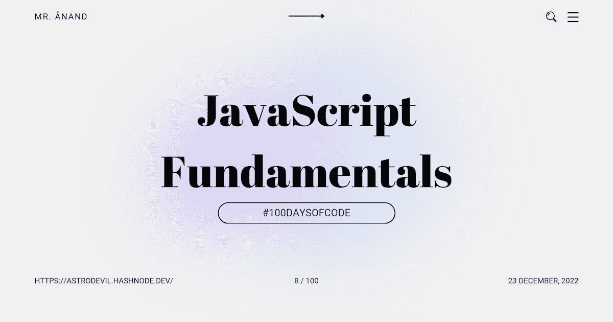

# JavaScript 基础:字符串操作

> 原文：<https://javascript.plainenglish.io/javascript-fundamentals-string-manipulation-3916db5b0a17?source=collection_archive---------5----------------------->

## # 100 日代码的第 8 天



今天是我 JavaScript 之旅的第八天。

我通过我的博客和社交网站以一种解释的方式写下我的学习。如果你想加入我的学习之旅，一定要关注我的博客和社交网站，并分享你的博客和社交网站。**让我们一起学习吧！🫱🏼‍🫲🏼**

这篇文章是 JavaScript 基础知识系列的一部分。

# 比较字符串

字符串比较其实很简单！可以使用我们在之前的讲座中学习过的比较运算符`===`、`<`和`>`。

对于`===`，我们可以区分大小写地比较字符串，看它们是否相同:

```
console.log( 'a' === 'a' ); // true
console.log( 'a' === 'A' ); // false
console.log( 'a' === 'a ' ); // false ------Because the comparison is case-sensitive and requires exact equality, including whitespace.
```

# 查找字符

字符串中的字符可以通过 JavaScript 中的索引来查找。方括号`[]`或`charAt`是两种可用于此的方法。

```
"Hello".charAt(1); // e
"Hello"[1]; // e 

// we are looking up the character at the 1 index, which turns out to be the character e.
```

索引:

`H - 0`

`e - 1`

`l - 2`

`l - 3`

`o - 4`

从零开始的索引用于字符串。这表示第一个字符的索引是`0`，每增加一个字符就加 1。

**示例:**完成`startsWithX`函数，以确定`string`参数的第一个字符是否是小写的`x`。如果第一个字符是`x`则返回`true`。如果没有，返回`false`。

```
function startsWithX(string) {
    if(string[0] === "x") {
        return true;
    }
    return false;
}
```

# 字符大小写

当处理字符串时，我们经常倾向于忽略字符的大小写。无论是大写的“X”还是小写的“X”，我们都在寻找“X”。

操纵字符串的大小写有两种简单的方法:

```
console.log( "Hello".toLowerCase() );// hello
console.log( "Hello".toUpperCase() ); // HELLO
```

以下任一方法可用于确定字符串是否包含单词`"hello"`而不考虑其大小写:

```
console.log( "Hello".toUpperCase() === "HELLO" ); // true
console.log( "Hello".toLowerCase() === "hello" ); // true
```

**示例:**让我们更新我们的`startsWithX`(来自前面的示例)函数，为大写的`X`和小写的`x`返回`true`。

```
function startsWithX(string) {
    if(string[0].toLowerCase() === "x") {
        return true;
    }
    return false;
}
```

# 字符串长度

字符串有一个重要的特征，叫做长度。通过使用这个特性，我们可以快速确定一个字符串中包含多少个字符:

```
console.log( "a".length ); // 1
console.log( "Hello".length ); // 5
```

**示例:**通过检测字符串中最后一个字符是小写`x`还是大写`X`来完成`endsWithX`功能。如果是，返回`true`，如果不是，返回`false`。

注意:长度值将比最后一个字符索引大 1，因为字符索引是从 0 开始的。

```
function endsWithX(string) {
    if(string[string.length - 1].toLowerCase() === "x") {
        return true;
    }
    return false;
}
```

# 结论

以关于 JavaScript 函数的额外信息结束…

JavaScript 中的字符串允许我们存储包含字符、整数和 Unicode 的文本，并且是不可变的。此外，JavaScript 中有许多内置函数，用于以不同的方式创建和操作字符串。

今天我学习了 JavaScript 中的字符串操作。

## 如果你❤️我的内容！在推特[上联系我](https://mobile.twitter.com/Astrodevil_)或者通过[给我买一辆 Coffee☕](https://www.buymeacoffee.com/Astrodevil) 来支持我

## 更多内容请访问 [PlainEnglish.io](https://plainenglish.io/) 。

*报名参加我们的* [***免费每周简讯***](http://newsletter.plainenglish.io/) *。关注我们关于* [***推特***](https://twitter.com/inPlainEngHQ) ， [***领英***](https://www.linkedin.com/company/inplainenglish/) ***，***[***YouTube***](https://www.youtube.com/channel/UCtipWUghju290NWcn8jhyAw)***，以及****[***不和***](https://discord.gg/GtDtUAvyhW)*

## 想扩大你的软件创业规模吗？检查[电路](https://circuit.ooo/?utm=publication-post-cta)。