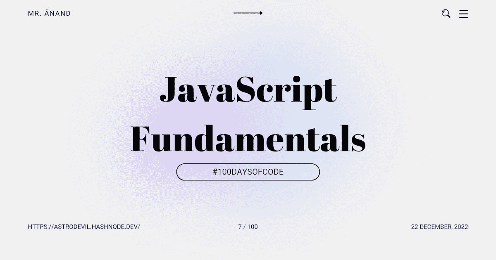

# JavaScript 基础:While 循环、Break 和练习问题

> 原文：<https://javascript.plainenglish.io/javascript-fundamentals-while-loop-break-and-questions-for-practice-4744b6edd4e6?source=collection_archive---------18----------------------->

## # 100 日代码的第 7 天



今天是我的 JavaScript 之旅的第七天。

我通过我的[博客](https://astrodevil.hashnode.dev/)和社交网站以一种解释的方式写下我的学习。如果你想加入我的学习之旅，一定要关注我的博客和社交网站，并分享你的博客和社交网站。**让我们一起学习吧！🫱🏼‍🫲🏼**

这篇文章是 JavaScript 基础知识系列的一部分。

# While 循环

只要测试条件评估为`true`，while 语句就会生成一个执行所提供语句的循环。在执行语句之前，需要对条件进行评估。

```
while(b > 7) {
    // do something
}
```

我们只是声明，如果一个条件是`true`，这个声明将被执行，直到它不是。👇🏼

**示例:**完成`top` double 函数，找到位于`top`下方的`value`的最大 double。

```
function topDouble(value, top) {
```

```
 while (value < top) {
        value = value*2; }
    return value/2;
}
```

# break 语句

一旦点击`break`，我们将退出循环。即使当条件为`true`时，由于`break`语句，仍然有可能退出循环。

```
while(true) {
    if(a > 5) {
        // exit the loop
        break;
    }
}
```

# 练习题

*   给定一个整数值 **num** ，判断它是否为偶数。如果是偶数，返回`true`。否则返回`false`。

```
 function isEven(num) {
      if (num % 2 === 0){
      return true;
      } 
  }

  // or

  function isEven(num) {
      return num % 2 === 0;      
  }
```

*   函数`smallerNumber`将被赋予两个不相等的数字:`num1`和`num2`。你的目标是找到较小的数字并返回它！

```
 function smallerNumber(num1, num2) {
  if (num1 < num2){
      return num1;
  }
  else {
      return num2;
  }
  }
```

*   一个字符串存储在变量`fakeName`中。取这个假名字，用它来代替`message`中每一次出现的`"John"`。不要以其他方式改变信息。

`const fakeName = require('./fakeName');`

`const message = ` Hello, John! You left a package at the office today. You can pick up tomorrow at 10am, John. If not I will drop it off this weekend. Goodbye John! `;`

```
 const fakeName = require('./fakeName');

  const message = `
      Hello, ${fakeName}! You left a package at the office today.
      You can pick up tomorrow at 10am, ${fakeName}. 
      If not I will drop it off this weekend.
      Goodbye ${fakeName}!
  `;
```

*   函数`checkNumber`有一个参数:一个数字`num`。如果数字是正数，该函数应该返回字符串`positive`，如果数字是负数，应该返回字符串`negative`，如果数字是零，应该返回字符串`zero`。

```
 function checkNumber(num) {
      if (num > 0){
          return 'positive';
      }
      else if(num < 0){
          return 'negative';
      }
      else {
          return 'zero';
      }
  }
```

*   函数`maxSum`接受一个数字参数`num`。你的目标是找到所有数字的总和，从 1 开始，直到并包括`num`。

```
 function maxSum(num) {
      let sum = 0;
      for(let i=1; i<=num; i++){
          sum = sum + i;
      }
      return sum;
  }
```

# 结论

以关于 JavaScript 函数的额外信息结束…

我们可以通过使用 return 和 break 语句来退出循环。

今天我学习了 While Loop 和 Break 语句，还练习了几个 JavaScript 问题。

## 如果你❤️我的内容！在 [Twitter](https://mobile.twitter.com/Astrodevil_) 上联系我，或者[给我买辆 Coffee☕](https://www.buymeacoffee.com/Astrodevil) 支持我

## 更多内容请访问 [PlainEnglish.io](https://plainenglish.io/) 。

*报名参加我们的* [***免费每周简讯***](http://newsletter.plainenglish.io/) *。关注我们上* [***推特***](https://twitter.com/inPlainEngHQ) ，[***LinkedIn***](https://www.linkedin.com/company/inplainenglish/)***，***[***YouTube***](https://www.youtube.com/channel/UCtipWUghju290NWcn8jhyAw)***，以及****[***不和***](https://discord.gg/GtDtUAvyhW)*

## 想扩大你的软件创业规模吗？检查[电路](https://circuit.ooo/?utm=publication-post-cta)。