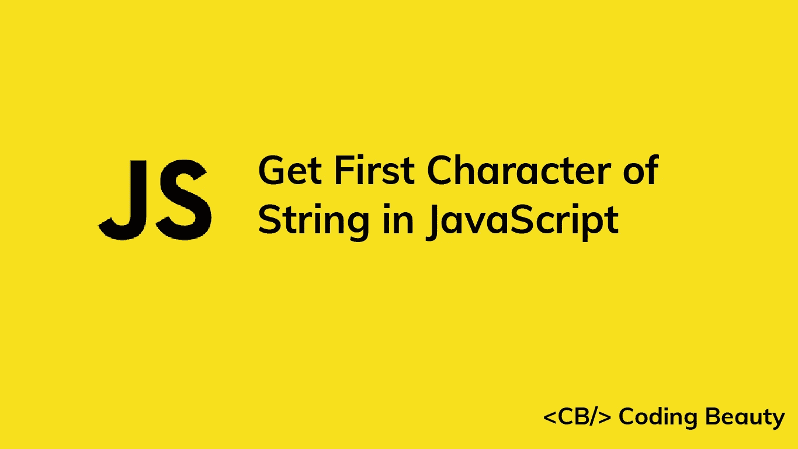

# 在 JavaScript 中获取字符串首字符的 5 种方法

> 原文：<https://javascript.plainenglish.io/javascript-get-first-character-of-string-cdd95333e24a?source=collection_archive---------19----------------------->

## 学习在 JavaScript 中轻松获取字符串第一个字符的多种方法。



在本文中，我们将会看到在 JavaScript 中轻松获取字符串第一个字符的多种方法。

# 1.charAt()方法

为了获得字符串的第一个字符，我们可以在字符串上调用`charAt()`，将`0`作为参数传递。例如，`str.charAt(0)`返回`str`的第一个字符。

```
const str = 'Coding Beauty';const firstChar = str.charAt(0);
console.log(firstChar); // C
```

`String` `charAt()`返回指定索引处的字符串字符。第一个字符的索引是`0`。

# 2.括号符号([])属性访问

或者，为了获得字符串的第一个字符，我们可以使用括号符号(`[]`)来访问字符串的`0`属性:

```
const str = 'Coding Beauty';const firstChar = str['0'];
console.log(firstChar); // C
```

当属性名是无效的 JavaScript 标识符时，括号表示法属性访问是点表示法的有用替代方法。例如，试图用点符号访问`0`属性将导致语法错误，因为`0`不是有效的标识符:

```
const str = 'Coding Beauty';// SyntaxError: Unexpected number
const firstChar = str.0;console.log(firstChar);
```

## 注意

因为`0`是一个整数，所以我们不需要用引号将它括起来来访问它:

```
const str = 'Coding Beauty';// Quotes are not needed to pass 0
const firstChar = str[0];console.log(firstChar); // C
```

## 注意

在 JavaScript 中，访问一个不存在的属性会返回`undefined`。这与`charAt()`不同，后者返回一个空字符串(`''`):

```
const str = 'Coding Beauty';const char1 = str[20];
const char2 = str.charAt(20);console.log(char1); // undefined
console.log(char2); // '' (empty string)
```

# 3.substring()方法

使用这个方法，我们在字符串上调用`substring()`，将`0`作为第一个参数传递，将`1`作为第二个参数传递。

```
const str = 'Coding Beauty';const firstChar = str.substring(0, 1);
console.log(firstChar); // C
```

`substring()`方法返回开始和结束索引之间的字符串部分，分别由第一个和第二个参数指定。索引`0`和`1`之间的子串是只包含第一个字符串字符的子串。

# 4.slice()方法

使用这种方法，我们在字符串上调用`slice()`，将`0`作为第一个参数，将`1`作为第二个参数。

```
const str = 'Coding Beauty';const firstChar = str.slice(0, 1);
console.log(firstChar); // C
```

`slice()`方法提取开始和结束索引之间的一部分字符串，分别由第一个和第二个参数指定。索引`0`和`1`之间的子串是只包含第一个字符串字符的子串。

## 注意

对于我们的用例来说,`slice()`和`substring()`方法的工作方式类似，但并不总是这样。它们之间的一个区别是，如果第一个参数大于第二个参数，`substring()`交换它的参数，而`slice()`返回一个空字符串:

```
const str = 'Coding Beauty';const subStr1 = str.substring(6, 0);
const subStr2 = str.slice(6, 0);// Equivalent to str.substring(0, 6)
console.log(subStr1); // Codingconsole.log(subStr2); // '' (empty string)
```

# 5.at()方法

另一种获取字符串第一个字符的方法是使用`String`T5 方法。我们在字符串上调用`at()`，将`0`作为参数传递。

```
const str = 'Coding Beauty';const firstChar = str.at(0);
console.log(firstChar); // C
```

`at()`方法返回指定索引处的字符串字符。

## 注意

当负整数被传递给`at()`时，它从最后一个字符串开始倒数。这与返回空字符串的`charAt()`不同:

```
const str = 'Coding Beauty';const char1 = str.at(-3);
const char2 = str.charAt(-3);console.log(char1); // u
console.log(char2); // '' (empty string)
```

*更新于:*[*codingbeautydev.com*](https://cbdev.link/6c9bef)

# JavaScript 做的每一件疯狂的事情

一本关于 JavaScript 微妙的警告和鲜为人知的部分的迷人指南。


[**报名**](https://cbdev.link/d3c4eb) 立即免费领取一份。