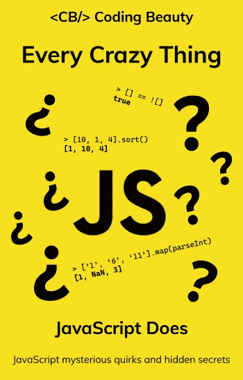

# 如何在 JavaScript 中获取一个字符串的最后 N 个字符

> 原文：<https://javascript.plainenglish.io/javascript-get-last-n-characters-of-string-4a865e1eed7c?source=collection_archive---------13----------------------->


要在 JavaScript 中获得一个字符串的最后`N`个字符，在字符串上调用`slice()`方法，传递`-N`作为参数。例如，`str.slice(-3)`返回包含`str`最后 3 个字符的新字符串。

```
const str = 'Coding Beauty';const last3 = str.slice(-3);
console.log(last3); // utyconst last6 = str.slice(-6);
console.log(last6); // Beautyconst last10 = str.slice(-10);
console.log(last10); // ing Beauty
```

`String()` `slice()`方法返回开始和结束索引之间的字符串部分，分别由第一个和第二个参数指定。当我们只指定一个开始索引时，它返回这个开始索引之后的整个字符串部分。

当我们传递一个负数作为参数时，`slice()`从最后一个字符串开始向后计数，以找到等价的索引。因此将`-N`传递给`slice()`指定了`str.length - N`的开始索引。

```
const str = 'Coding Beauty';const last6 = str.slice(-6);
console.log(last6); // Beautyconst last6Again = str.slice(str.length - 6);
console.log(last6Again); // Beauty
```

## 小费

如果我们试图获取比字符串包含的更多的字符，`slice()`返回整个字符串，而不是抛出一个错误。

```
const str = 'Coding Beauty';const last50 = str.slice(-50);
console.log(last50); // Coding Beauty
```

在这个例子中，我们试图通过将`-50`作为第一个参数传递来获取字符串的最后 50 个字符，但是字符串`'Coding Beauty'`只包含 13 个字符。因此，我们从`slice()`获得了整个字符串。

## 注意

我们可以用`substring()`代替`slice()`来获得一个字符串的前 N 个字符:

```
const str = 'Coding Beauty';const last3 = str.substring(str.length - 3);
console.log(last3); // uty
```

但是，我们必须自己用`str.length - N`手动计算起始索引，这使得代码可读性较差。这是因为与`slice()`不同，如果传递的是负数，`substring()`使用`0`作为起始索引。

```
const str = 'Coding Beauty';// -3 is negative, uses 0 instead
const notLast3 = str.substring(-3);console.log(notLast3); // Coding Beauty
```

【codingbeautydev.com】更新于:[](https://cbdev.link/10f995)

# *JavaScript 做的每一件疯狂的事情*

*一本关于 JavaScript 微妙的警告和鲜为人知的部分的迷人指南。*

**

*[**报名**](https://cbdev.link/d3c4eb) 立即免费领取一份。*