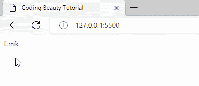
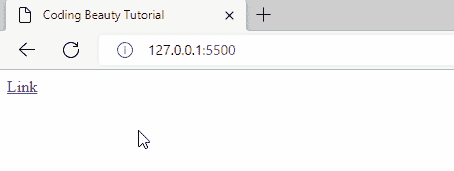
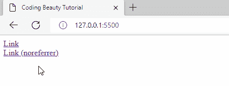
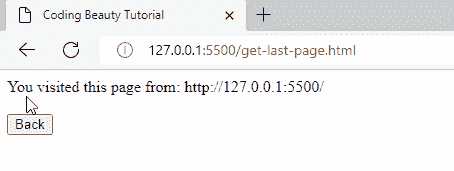

# 如何在 JavaScript 中获取上次访问页面的 URL

> 原文：<https://javascript.plainenglish.io/javascript-get-last-page-url-dc47a2ca5087?source=collection_archive---------6----------------------->

## 了解如何在 JavaScript 中轻松获取最后访问的页面的 URL。


我们可以用 JavaScript 中的`document.referrer`属性获得最后一个页面的 URL。

例如:

```
const lastPageUrl = document.referrer;console.log(`Last visited page URL: ${lastPageUrl}`);
```

`document.referrer`是一个只读属性，返回用于导航到当前页面的页面的 URL。

这里有一个更实际的例子:

**index.html**

```
<!DOCTYPE html>
<html lang="en">
  <head>
    <title>Coding Beauty Tutorial</title>
  </head>
  <body>
    <a href="get-last-page.html">Link</a>
  </body>
</html>
```

**get-last-page.html**

```
<!DOCTYPE html>
<html lang="en">
  <head>
    <title>Coding Beauty Tutorial</title>
  </head>
  <body>
    You visited this page from: <span id="last-page"></span>
    <script src="get-last-page.js"></script>
  </body>
</html>
```

**获取最后一页. js**

```
const lastPage = document.getElementById('last-page');lastPage.textContent = document.referrer;
```



Displaying the last page URL on the visited page.

# document.referrer 的限制

尽管`document.referrer`属性并不总是有效。它通常在用户单击上一页的链接导航到当前页的情况下给出正确的值。

但是，如果用户通过在地址栏中键入或使用书签直接访问 URL，`document.referrer`将没有任何价值。



The last page URL can’t be displayed for a direct visit.

如果被点击的链接标有`rel="noreferrer"`属性，`document.referrer`也不会有值。将`rel`设置为`noreferrer`特别防止推荐信息被传递到所链接的网页。

**index.html**

```
<!DOCTYPE html>
<html lang="en">
  <head>
    <title>Coding Beauty Tutorial</title>
  </head>
  <body>
    <a href="get-last-page.html">Link</a>
    <a href="get-last-page" rel="noreferrer">Link (noreferrer)</a>
  </body>
</html>
```



“rel=noreferrer” prevents access to referral information in the linked page.

# 导航到最后一页

也许您想获得最后一个页面的 URL，以便能够导航到该页面。你可以用`history.back()`方法轻松做到这一点。

**获取最后一页. js**

```
...
const backButton = document.getElementById('back');backButton.onclick = () => {
  history.back();
};
```

**get-last-page.html**

```
<!DOCTYPE html>
<html lang="en">
  <head>
    <title>Coding Beauty Tutorial</title>
  </head>
  <body>
    You visited this page from: <span id="last-page"></span> <br />
    <br />
    <button id="back">Back</button> <script src="get-last-page.js"></script>
  </body>
</html>
```



【codingbeautydev.com】原载于[](https://cbdev.link/871b4c)

# *JavaScript 做的每一件疯狂的事情*

*一本关于 JavaScript 微妙的警告和鲜为人知的部分的迷人指南。*

**

*[报名](https://cbdev.link/d3c4eb)立即免费领取一份。*