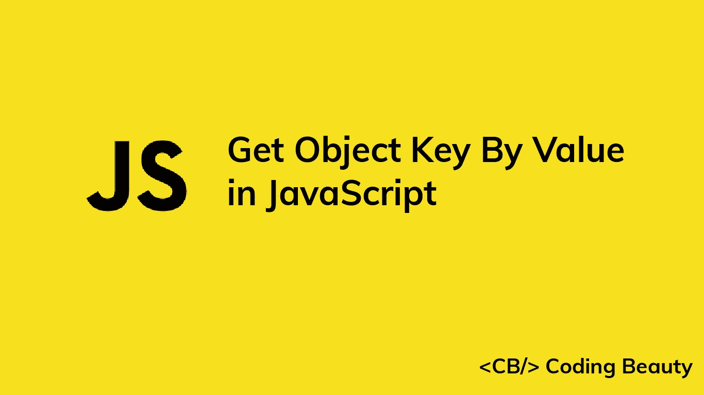

# 如何在 JavaScript 中通过值获取对象键

> 原文：<https://javascript.plainenglish.io/javascript-get-object-key-by-value-2bad7a22dcdb?source=collection_archive---------3----------------------->

## 了解如何在 JavaScript 中快速获取对应于特定值的对象的键。



# 对象键()和数组查找()

要在 JavaScript 中通过值获取对象的键，调用`Object.keys()`方法获取对象键，然后使用`find()`查找与指定值相关联的键。例如:

```
function getObjectKey(obj, value) {
  return Object.keys(obj).find((key) => obj[key] === value);
}const obj = {
  user1: 'John',
  user2: 'Kate',
  user3: 'Peter',
};const key = getObjectKey(obj, 'Kate');
console.log(key); // user2
```

`Object.keys()`方法获取一个对象并返回其所有键的数组:

```
const obj = {
  user1: 'John',
  user2: 'Kate',
  user3: 'Peter',
};const keys = Object.keys(obj);
console.log(keys); // [ 'user1', 'user2', 'user3' ]
```

`Array` `find()`方法在数组中搜索某个条件为`true`的元素。该条件在传递给`find()`的回调测试函数中指定。如果数组中的键的对应值等于传递给`getObjectKey()`函数的值，那么我们指定的条件只对该键求值为`true`。

## 信息

如果`find()`方法找不到任何满足条件的元素，则返回`undefined`:

```
function getObjectKey(obj, value) {
  return Object.keys(obj).find((key) => obj[key] === value);
}const obj = {
  user1: 'John',
  user2: 'Kate',
  user3: 'Peter',
};const key = getObjectKey(obj, 'Sarah');
console.log(key); // undefined
```

# 数组过滤器()与数组查找()

`find()`方法只返回数组中满足测试函数的第一个元素。如果对象包含多个具有相同值的键，它将只返回找到的第一个键:

```
function getObjectKey(obj, value) {
  return Object.keys(obj).find((key) => obj[key] === value);
}const obj = {
  user1: 'John',
  user2: 'Kate',
  user3: 'Peter',
  user4: 'John',
};const key = getObjectKey(obj, 'John');
console.log(key); // user1
```

要获得对应于某个值的所有键，可以使用`Array` `filter()`方法代替`find()`:

```
function getObjectKey(obj, value) {
  return Object.keys(obj).filter(
    (key) => obj[key] === value
  );
}const obj = {
  user1: 'John',
  user2: 'Kate',
  user3: 'Peter',
  user4: 'John',
};const key = getObjectKey(obj, 'John');
console.log(key); // ['user1', 'user4']
```

与`find()`不同，`filter()`返回一个包含所有匹配值的键的数组。

*更新于:*[*codingbeautydev.com*](https://cbdev.link/af2ed0)

# JavaScript 做的每一件疯狂的事情

一本关于 JavaScript 微妙的警告和鲜为人知的部分的迷人指南。


[**报名**](https://cbdev.link/d3c4eb) 立即免费领取一份。