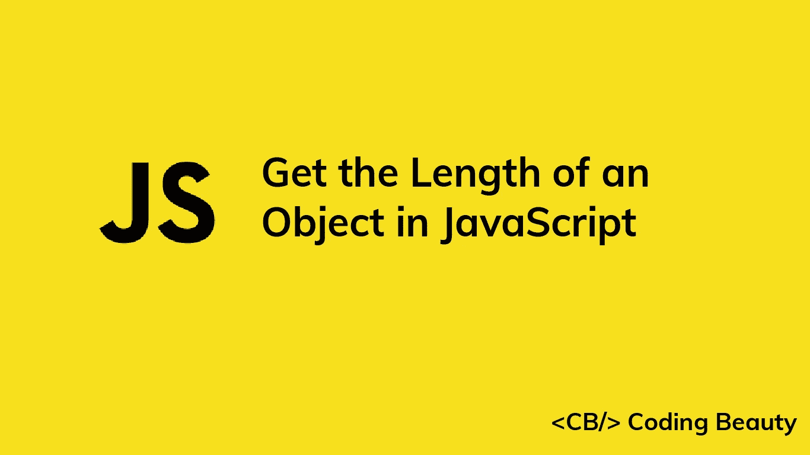

# 如何在 JavaScript 中获得对象的长度

> 原文：<https://javascript.plainenglish.io/javascript-get-object-length-1df5eeb3e16a?source=collection_archive---------12----------------------->



让我们来看看在 JavaScript 中快速获得对象长度的一些方法。

# 1.Object.keys()方法

要获得对象的长度，我们可以将对象传递给静态的`Object` `keys`()方法，并访问结果数组的`length`属性。例如:

```
const obj = {
  color: 'red',
  topSpeed: 120,
  age: 2,
};const objectLength = Object.keys(obj).length;
console.log(objectLength); // 3
```

**注意** : `Object.keys()`只返回直接在对象上找到的可枚举属性。如果您想在计数中包含不可枚举的属性，请使用`Object.getOwnPropertyNames()`:

```
const obj = {
  color: 'red',
  topSpeed: 120,
  age: 2,
};
Object.defineProperty(obj, 'acceleration', {
  enumerable: false,
  value: 5,
});console.log(Object.keys(obj).length); // 3
console.log(Object.getOwnPropertyNames(obj).length); // 4
```

**注意** : `Object.keys()`和`Object.getOwnPropertyNames()`对符号属性不起作用。要计算符号属性，使用`Object.getOwnPropertySymbols()`:

```
const obj = {
  color: 'red',
  speed: 120,
  age: 2,
  [Symbol('acceleration')]: 5,
  [Symbol('weight')]: 1000,
};console.log(Object.keys(obj).length); // 3
console.log(Object.getOwnPropertyNames(obj).length); // 3
console.log(Object.getOwnPropertySymbols(obj).length); // 2
```

# 2.为..in 循环和 hasOwnProperty()

另一种获得对象长度的方法是使用 JavaScript `for...in`循环来迭代对象的属性，并在每次迭代中递增一个变量。变量将包含循环后的对象长度。

```
const obj = {
  color: 'red',
  topSpeed: 120,
  age: 2,
};let objectLength = 0;
for (let key in obj) {
  if (obj.hasOwnProperty(key)) objectLength++;
}
console.log(objectLength); // 3
```

因为`for...in`循环也迭代对象的继承属性，所以我们使用`hasOwnProperty()`方法来确保在递增变量之前属性直接存在于对象上。

*更新于:*[*codingbeautydev.com*](https://codingbeautydev.com/blog/javascript-get-object-length/)

每周获取新的 web 开发技巧和教程。


[**订阅**](https://codingbeautydev.com/newsletter)