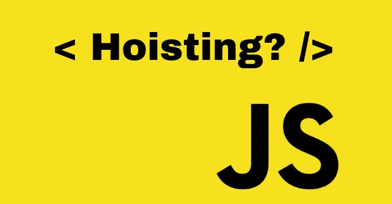

# JavaScript 提升——综合指南

> 原文：<https://javascript.plainenglish.io/javascript-hoisting-a-comprehensive-guide-89211c219d45?source=collection_archive---------13----------------------->

## 关于 JavaScript 提升你应该知道的一切。



```
var name = 'John';function printName() {
  console.log(name);
  var name = 'Mike';
  console.log(name);
}printName();
```

你能说出上面代码示例中的`console.log()`会打印出什么吗？

你能给出正确的答案吗？你能解释你的答案吗？

```
printNumber();var printNumber;function printNumber() {
  console.log(1);
}printNumber = function () {
  console.log(2);
};
```

上述代码示例的输出会是什么？

是 1 还是 2？

你能解释它是如何发生的吗？

如果我把`printNumber()`函数移到代码块的底部会怎么样？

如果你对 **JavaScript 提升**有更好的理解，你就可以对以上问题给出恰当的答案。如果你做不到，不要担心。今天就来了解一下吧…😎

**根据** [**MDN**](https://developer.mozilla.org/en-US/docs/Glossary/Hoisting) ，**JavaScript 提升是指在执行代码之前，解释器将函数或变量的声明移动到其作用域的顶部的过程。**

**那是什么意思？**

**JavaScript 在执行特定代码块之前创建[执行上下文](https://developer.mozilla.org/en-US/docs/Web/JavaScript/Reference/Operators/this)。JavaScript 将在创建执行上下文时为变量和函数分配内存。**

```
**console.log(str); *// undefined* console.log(fn); *// ƒ fn() { console.log(str) }*str = 'John Doe';var str;function fn() {
  console.log(str)
}**
```

**`console.log()`上述代码示例中的语句将一些值打印到控制台，尽管`str`和`fn`既没有声明也没有初始化。在运行脚本之前创建执行上下文的过程中，JavaScript 为`str`和`fn.`分配内存，用`undefined`初始化`str`，用`fn`函数初始化`fn`。所以我们可以说上面脚本中的`str`变量和`fn`函数是**吊起来的**。**

**我们可以将 JS 吊装分为以下两大部分。**

1.  **可变提升**
2.  **功能提升**

## **可变提升**

**用`var`、`let`和`const`定义的变量被提升到程序块的顶部。**

```
**console.log(str); // undefined
str = 'John Doe';
var str;**
```

**如果您在浏览器中运行上述代码示例，您将在浏览器控制台中看到`undefined`。**

*****JavaScript 只将变量的声明提升到顶部，而没有将变量的初始化*** 。**

```
**// ReferenceError: Cannot access 'str' before initialization
console.log(str1);str1 = 'John Doe';
let str1;// SyntaxError: Missing initializer in const declaration
console.log(str2);str2 = 'John Doe';
const str2;**
```

**运行上面的代码示例将给出一个用于在初始化前访问`str1`的`ReferenceError`，以及一个用于在没有初始化的情况下定义`const`的`SyntaxError`。原因是代码块知道变量，但是在声明之前不能使用它们。从块的开始到声明，这些变量都在一个**时间死区**中。**

**变量提升的结论是:所有用`var`、`let`、`const`定义的变量都是**提升**。但是只有用`var`定义的变量才会用`undefined`初始化。一个 JavaScript 块中的变量是 ***部分提升*** 。**

## **功能提升**

```
**console.log(sayHello); 
// ƒ sayHello() { console.log('Hello World...!'); }function sayHello() {
  console.log('Hello World...!');
}**
```

**如果您在浏览器中运行上面的代码示例，您将看到完整的`sayHello`函数。所以一个 JavaScript 块中的变量是 ***全吊*** 。**

**现在让我们看看在 JavaScript 面试中你会被问到的一些有趣的问题。**

## **问题 1**

```
**printNumber();var printNumber;function printNumber() {
  console.log(1);
}printNumber = function () {
  console.log(2);
};**
```

**它将记录 1。现在你知道原因了。**

**如果我们将`printNumber()`函数调用移到块的底部会发生什么？现在它将记录 2。**

**`printNumber`变量在上面脚本的底部被初始化，它代替了`printNumber()`函数，并导致 log 2 到控制台。但是在第一种情况下，`printNumber`变量没有用第二个函数初始化。由于用`var`定义的变量被部分提升，它们将用`undefined`初始化。**

## **问题 2**

```
**sayHello();var sayHello = function () {
  console.log('Hello world..!');
};**
```

**上述代码示例的输出会是什么？它将给出一个`TypeError`，因为`sayHello`变量的值是`undefined`，直到它被函数初始化。**

## **问题 3**

```
**var name = 'John';function printName() {
  console.log(name);var name = 'Mike';
  console.log(name);}printName();**
```

**上述代码示例的输出会是什么？**

**第一个`console.log()`里会是`undefined`第二个会记录“Mike”。**

**这是怎么发生的？**

**在创建全局执行上下文时，`name`将用“John”初始化。但是，在调用`printName()`函数时，JavaScript 解释器将为`printName()`函数创建另一个执行上下文，并且`name`将是`undefined`，直到它被“迈克”初始化。这就是在第一个`console.log()`中将`name`记为`undefined`的原因。**

# **你是 JavaScript 爱好者吗？**

**请阅读下面我写的文章，了解一些关于 JavaScript 的令人兴奋的事情。**

*   **[*什么是 JavaScript 中的闭包——综合指南*](https://medium.com/@sudarshanadayananda/what-is-a-closure-in-js-eab2fcb68ccc)**
*   **[*箭头函数与 JavaScript 中的常规函数——综合指南*](/arrow-functions-vs-regular-functions-in-js-fa1a1f235c86)**
*   **[*什么是 JavaScript 中的严格模式—综合指南*](/what-is-strict-mode-in-javascript-a-comprehensive-guide-b3fcd9daa220)**
*   **[*JavaScript 中的本地存储与会话存储—综合指南*](/local-storagevs-session-storage-in-javascript-a-comprehensive-guide-df887398e69)**

**感谢阅读。😍**

**希望你从这篇文章中学到一些新东西。以后请跟着我看这类文章。干杯！**

***更多内容请看*[***plain English . io***](https://plainenglish.io/)*。报名参加我们的* [***免费周报***](http://newsletter.plainenglish.io/) *。关注我们关于*[***Twitter***](https://twitter.com/inPlainEngHQ)*和*[***LinkedIn***](https://www.linkedin.com/company/inplainenglish/)*。查看我们的* [***社区不和谐***](https://discord.gg/GtDtUAvyhW) *加入我们的* [***人才集体***](https://inplainenglish.pallet.com/talent/welcome) *。***