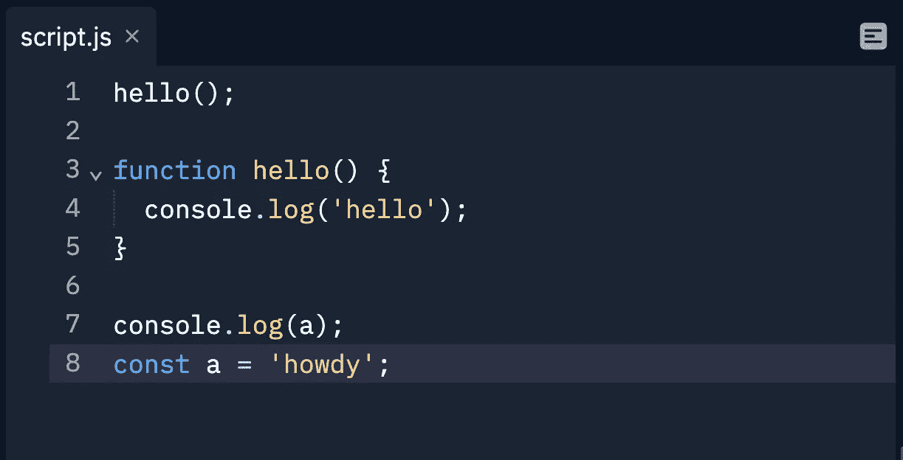
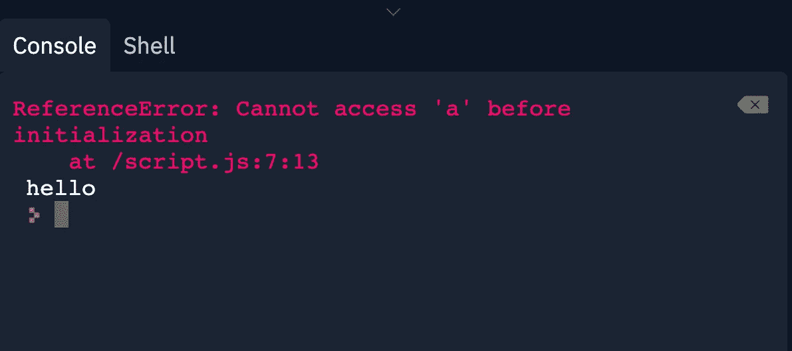
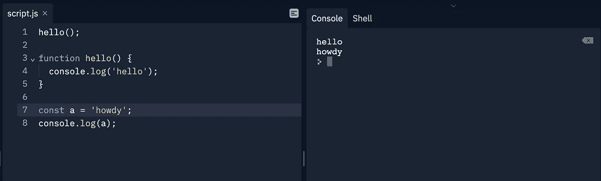

# JavaScript 吊装解释像你五岁

> 原文：<https://javascript.plainenglish.io/javascript-hoisting-explained-like-your-five-2168936fcf19?source=collection_archive---------6----------------------->

简单来说，提升指的是在函数和变量被实际定义之前就可以访问它们的现象。

但是，函数的处理方式不同于变量。函数可以在它们的定义之前被调用，并将计算出函数返回的任何值。另一方面，变量将被评估为未定义的，直到 JavaScript 引擎(逐行读取)到达变量的定义。

请看下面的例子:

The function is called and the variable is logged to the console before the thread actually reads what the definition of the function is and what the value of “a” is.

当我们运行这段代码时，你期望会发生什么？向下滚动之前，请考虑一下…

The error is thrown because the JavaScript engine recognizes the name “a”, but doesn’t know what the value is yet, whereas it knows both the name and definition of the function.

为什么会这样？发生了什么事？在编写函数定义之前，如何调用它呢？我记得你说过变量在它们的值被定义之前就存在了？

放轻松，到时候一切都会有意义的。

当您运行 JavaScript 代码时，在引擎开始逐行读取代码之前会发生一些事情。其中一件事就是提升成为可能:创建了一个容器，其中有所有的函数标签(名称)和定义以及变量名，但没有变量值。

等等，什么？

变量的**名称**被存储，但是变量的**值**被设置为未定义，直到 JavaScript 线程到达特定变量的值时才被读取——这指的是“逐行”读取。

如果这仍然没有意义，可以这样看:您可以在定义函数之前调用它们，因为完整的函数定义存在于运行 JavaScript 代码时创建的容器中。变量名也存在于这个容器中，但是值等于 undefined，直到到达告诉变量值实际是什么的特定行。这就是为什么上面的例子的错误说，“不能在初始化前访问‘a’”。引擎知道它在那里，但是直到线程到达值声明时才知道值是什么。

不出所料，为了获得“a”的预期值以记录到控制台，您只需在将它记录到控制台之前定义“a”的值，如下所示:

变量“a”是在我们控制它之前定义的，所以它的行为就像我们期望的那样。尽管函数“hello”是在第 3–5 行中定义的，但它在第 1 行中被调用，并且仍然记录了由于提升而应该记录的内容。

为什么函数和变量会有这样不同的表现？归根结底，函数是一级对象，而变量不是，这超出了本文的范围。但是如果你想了解更多这方面的信息，我推荐你去看看 freeCodeCamp 的[文章](https://www.freecodecamp.org/news/discover-the-power-of-first-class-functions-fd0d7b599b69/.)。

在定义函数之前调用它们是很奇怪的，但是程序员有时会做一些奇怪的事情。如果您是编程新手，您可能(肯定)不应该像上面的“hello”示例那样编写代码，但这并不意味着您不会在需要修复或解释的旧代码中遇到它。

因此，如果你遇到函数被调用而找不到函数的定义，继续向下滚动。如果你一直得到一个关于一个在初始化之前不能被访问的变量的错误，通过向下滚动来检查变量的值是否在被使用之前被定义。

*更多内容请看*[***plain English . io***](https://plainenglish.io/)*。报名参加我们的* [***免费周报***](http://newsletter.plainenglish.io/) *。关注我们关于*[***Twitter***](https://twitter.com/inPlainEngHQ)*和*[***LinkedIn***](https://www.linkedin.com/company/inplainenglish/)*。加入我们的* [***社区不和谐***](https://discord.gg/GtDtUAvyhW) *。*