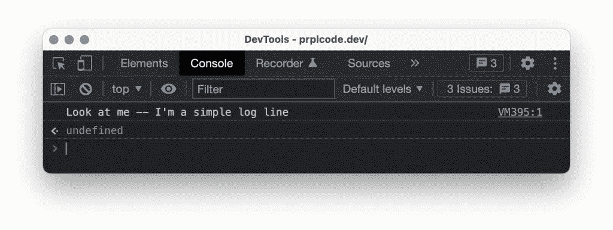
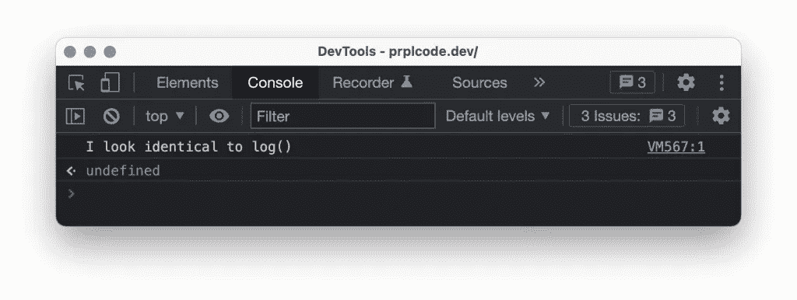
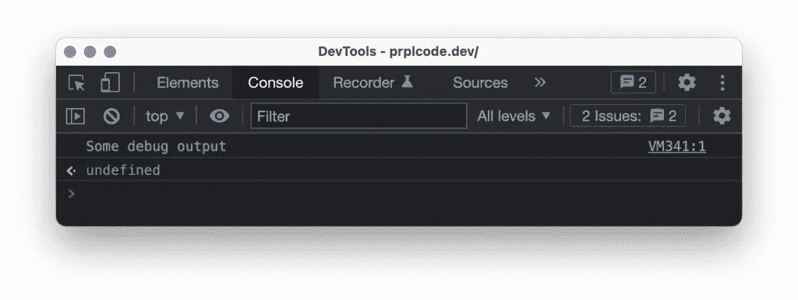
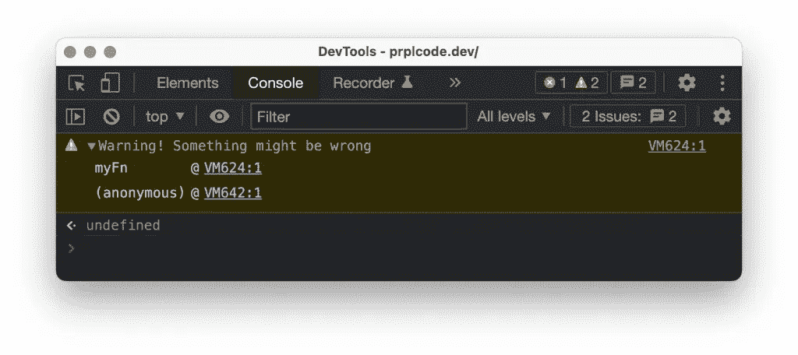
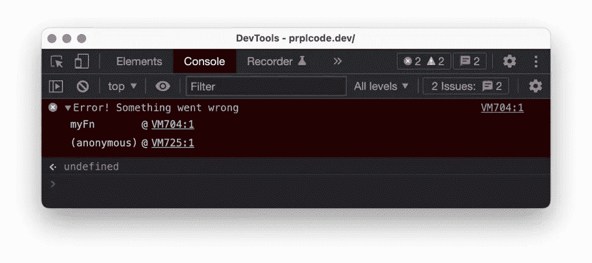
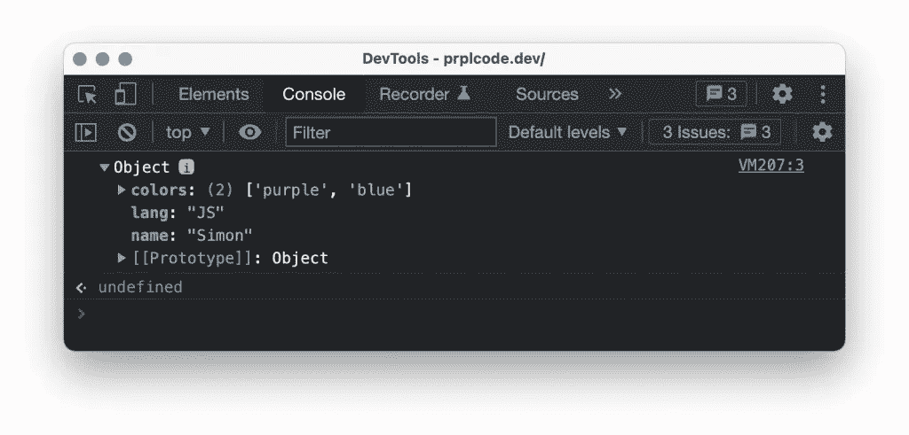
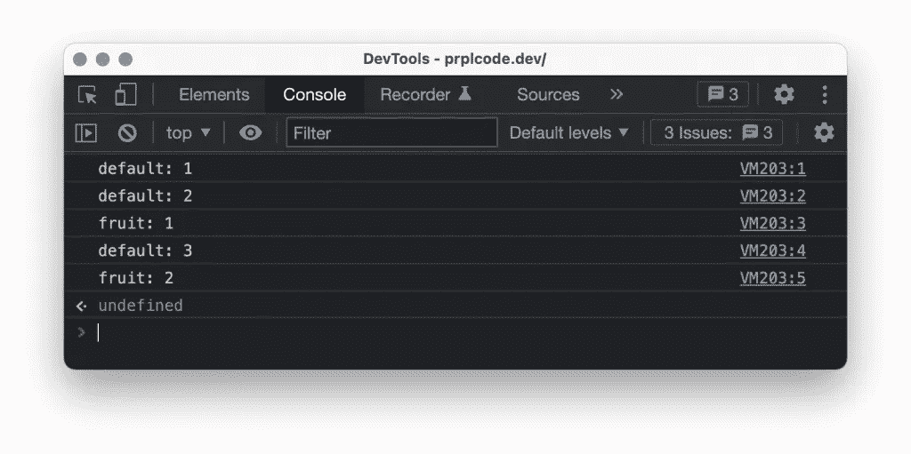
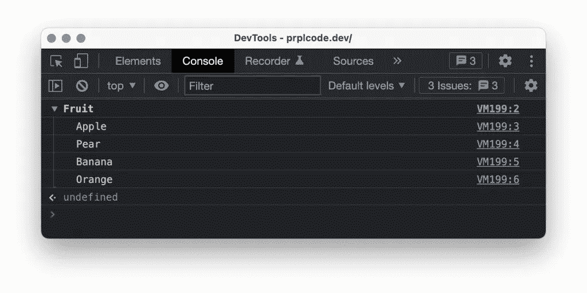
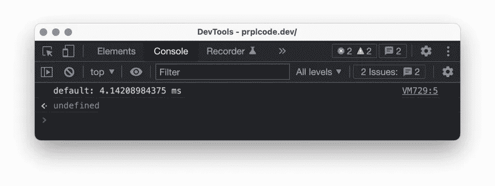
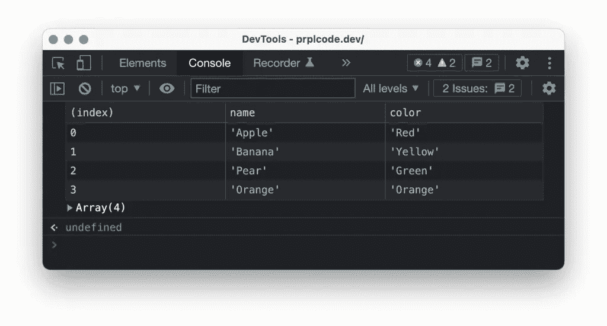

# JavaScript:如何启动您的日志记录

> 原文：<https://javascript.plainenglish.io/javascript-how-to-power-up-your-logging-bbf33064929f?source=collection_archive---------3----------------------->

增强您的日志记录并培养良好的开发习惯。随着代码库的增长，你需要更容易地调试它。调试中的一个重要工具是日志。本文主要关注客户端 JavaScript 的基本方面。

相反，要了解 Node.js 中的日志记录，请参见 [Node.js:如何启动日志记录。](https://medium.com/@prplcode/node-js-how-to-power-up-your-logging-8f0df7bcef93)


# 客户端日志记录

对于 JavaScript，您的应用程序将输出的日志将在浏览器的控制台中可见。这不同于服务器端日志记录，在服务器端日志记录中，日志将被写入文件或发送到日志聚合服务器。

知道浏览器处理日志的方式不同很重要，但是基本原理是一样的。查看不同浏览器如何处理日志记录:

*   [Chrome](https://developer.chrome.com/docs/devtools/console/api/)
*   [火狐](https://developer.mozilla.org/en-US/docs/Web/API/console)
*   [Safari](https://support.apple.com/guide/safari-developer/log-messages-with-the-console-dev4e7dedc90/mac)
*   [微软 Edge](https://docs.microsoft.com/en-us/microsoft-edge/devtools-guide-chromium/console/console-log)

关于如何使用`console`进行日志记录，有一个[标准](https://console.spec.whatwg.org/#logging)存在，但不幸的是，[并不是所有的浏览器都尊重它](https://github.com/whatwg/console/blob/main/NOTES.md)。

很可能你已经习惯使用`console.log()`，但是在`console`对象上有更多的方法来增强你的日志记录！

# 记录消息级别

JavaScript 支持不同级别的消息。它们都工作相同，但输出看起来不同。消息的级别传达不同的含义，例如，当出现问题时，您应该使用`error`级别，而`info`级别可以用于更一般的日志。

在我的例子中，我使用的是谷歌浏览器版本 98.0.4758。

## console.log()

用于常规输出。通常和`info`一个级别。

```
console.log("Look at me -- I'm a simple log line");
```



## console.info()

通常与`log`相同。

```
console.info("I look identical to log()");
```



## console.debug()

用于您不希望在生产应用程序日志输出中出现的详细日志。这个关卡很特别，因为你需要[自己激活](https://support.google.com/chrome/a/answer/6271282?hl=en)。

```
console.debug("Some debug output");
```



## console.warn()

用于警告。将消息格式化为警告，并且在某些浏览器中包含堆栈跟踪。

```
console.warn("Warning! Something might be wrong");
```



## console.error()

用于错误。将消息格式化为错误，并包含堆栈跟踪。

```
console.error("Error! Something went wrong");
```



# 像 JSON 这样的日志对象

为了更容易阅读对象，可以应用 JSON 格式来记录它。

```
const obj = { name: "Simon", lang: "JS", colors: ["purple", "blue"] };
console.dir(obj);
```



# 数数东西

例如，记录一个函数被调用的次数可能是有用的。为此，您可以调用`console.count([label])`。它会记录它被调用的次数。如果没有提供`label`，它将返回到`default`标签。

```
console.count();
console.count();
console.count("fruit");
console.count();
console.count("fruit");
```



# 群组日志消息

有时您可能想要记录属于一起的行。为此，您可以使用`console.group(label)`来创建日志组。您可以使用`console.groupCollapsed(label)`将群组记录为折叠状态。

```
const label = "Fruit";
console.group(label);
console.info("Apple");
console.info("Pear");
console.info("Banana");
console.info("Orange");
console.groupEnd(label);
```



# 测量时间

在职业生涯的某个阶段，您可能需要优化代码运行的时间。在知道你优化什么之前，你想知道时间花在哪里。你可以使用的一个测量时间的工具是`console.time([label])`。这将启动一个计时器，然后您可以使用`console.timeEnd([label])`停止并记录。

```
console.time();
for (var i = 0; i < 100000; i++) {
  let random = Math.floor(Math.random() * i);
}
console.timeEnd();
```



# 表格格式

为了更容易阅读你的数组，你可以用表格格式记录它。

```
const array = [
  { name: "Apple", color: "Red" },
  { name: "Banana", color: "Yellow" },
  { name: "Pear", color: "Green" },
  { name: "Orange", color: "Orange" }
];
console.table(array);
```



# 结论

使用 JavaScript 进行客户端日志记录非常简单！使用内置控制台对象是登录浏览器的首选方式。有很多图书馆，但是真的没有必要去使用它们。

*在*[*Twitter*](https://twitter.com/prplcode)*，*[*LinkedIn*](https://linkedin.com/in/simeg)*，或者* [*GitHub*](https://github.com/simeg)

*最初发布于*[*prplcode . dev*](https://prplcode.dev/)

*更多内容请看*[***plain English . io***](https://plainenglish.io/)*。报名参加我们的* [***免费周报***](http://newsletter.plainenglish.io/) *。关注我们关于*[***Twitter***](https://twitter.com/inPlainEngHQ)*和*[***LinkedIn***](https://www.linkedin.com/company/inplainenglish/)*。查看我们的* [***社区不和谐***](https://discord.gg/GtDtUAvyhW) *加入我们的* [***人才集体***](https://inplainenglish.pallet.com/talent/welcome) *。*