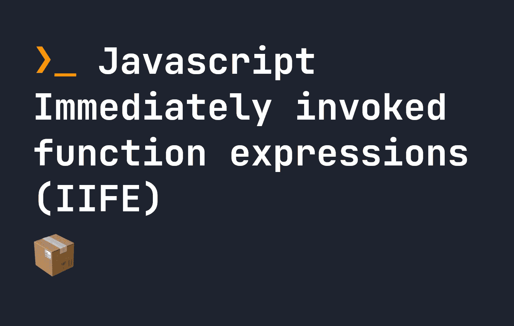

# Javascript 立即调用函数表达式(IIFE)

> 原文：<https://javascript.plainenglish.io/javascript-immediately-invoked-function-expressions-iife-6951ff6c029b?source=collection_archive---------6----------------------->

## Javascript 中到处都有立即调用的函数或匿名函数。让我们看看它们是如何工作的。



立即调用的函数表达式，或 IIFE，是一旦定义了函数就运行的函数。你也可能看到人们称它们为匿名函数。它们为我们提供了一种简单的方法来隔离函数中的变量，而不是全局隔离——之后，我们可以轻松地立即运行函数。当顶级`await`不可用时，它们对于运行异步函数也很有用。

虽然我们通常这样定义函数:

```
let x = () => {
    console.log("hello");
}
let y = function() {
    console.log("world");}function z() {
    console.log("!");
}x(); y(); z();
```

定义一个生命意味着调用我们编写的函数。所以我们可以这样定义生活:

```
(function() {
    console.log("hello world!")
})()
```

这个函数是匿名的(它没有名字)，并且立即运行。您也可以使用箭头符号来运行它，如下所示:

```
(() => {
    console.log("hello world!")
})()
```

虽然上面的生命没有名字，但是你可以给它们起名字。但是，这实际上没有意义，因为你不能在其他地方调用它们。一旦函数以这种格式创建和调用，就不能在其他地方使用。这意味着在下面的例子中，试图在其他地方调用`myFunction()`是行不通的:

```
(function myFunction() {
    console.log("hello world!")
})()
```

匿名或立即调用的函数表达式可以用来封装异步行为。您仍然可以通过使用`async`关键字来使生活异步:

```
(async () => {
    console.log("hello world!")
})()
```

# 在 Javascript 中给生命提供参数

我们可以使用预期的格式将变量直接传递给生命。例如，下面我们有一个生活中的争论——那就是`x`。我们可以通过使用最后一组括号为`x`传入一个值:

```
let getNumber = 10;
(function(x) {
    console.log(x + 10)
})(getNumber) // console logs 20
```

# 生活中的防御性分号

当在开头添加了分号的地方定义字符时，有时您可能会看到下面的代码。

```
;(() => {
    return 10;
})
```

这看起来很混乱，但这是为了避免一个奇怪的问题，如果前一行没有分号，函数的最后一行将被用作函数名。考虑以下代码:

```
let b = 5
let c = 10
let a = b + c
(function () {
    return 10
})();
```

如果有人忘记在`let a = b + c`上加上分号，或者如果您将生命导入到一行，而前一行不包含分号，您可能会遇到一些奇怪的错误。在上面的例子中，您将得到错误`Uncaught TypeError: c is not a function`。这是因为代码将其解释为试图运行`c`函数。本质上，代码是这样理解的:

```
c(() => {
    return 10
})()
```

因此，在生命开始时使用防御性分号是避免这种情况的简单方法。

# 结论

IIFEs 在 Javascript 代码库中很常见，并且是执行许多事情的有用方法，比如异步代码和在特定的函数块中定义变量或代码。虽然现在在 Javascript 中有其他方法来实现这一点，但你仍然会在任何地方看到这些方法——所以理解它们是如何工作的很重要。

*更多内容请看*[***plain English . io***](https://plainenglish.io/)*。报名参加我们的* [***免费周报***](http://newsletter.plainenglish.io/) *。关注我们关于*[***Twitter***](https://twitter.com/inPlainEngHQ)[***LinkedIn***](https://www.linkedin.com/company/inplainenglish/)*[***YouTube***](https://www.youtube.com/channel/UCtipWUghju290NWcn8jhyAw)*[***不和***](https://discord.gg/GtDtUAvyhW) *。对增长黑客感兴趣？检查* [***电路***](https://circuit.ooo/) *。***