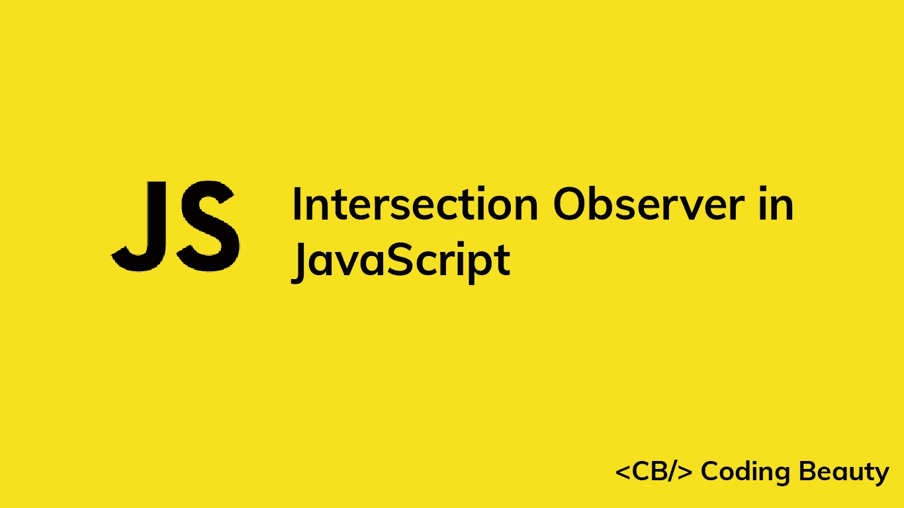
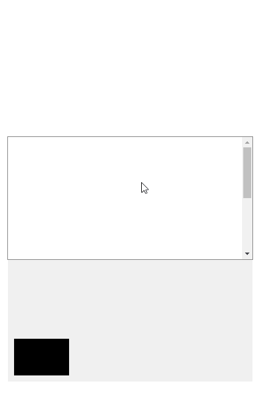
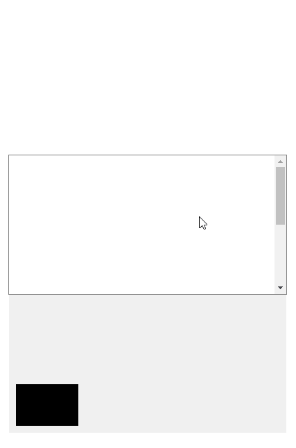
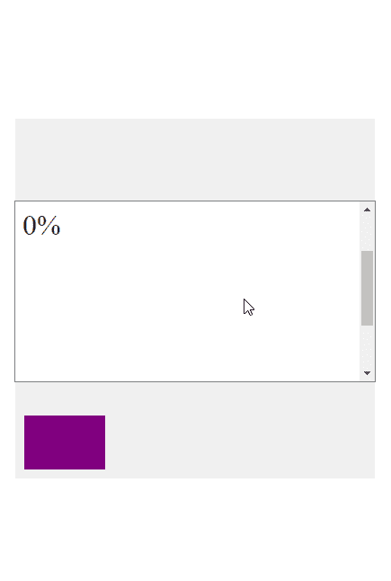
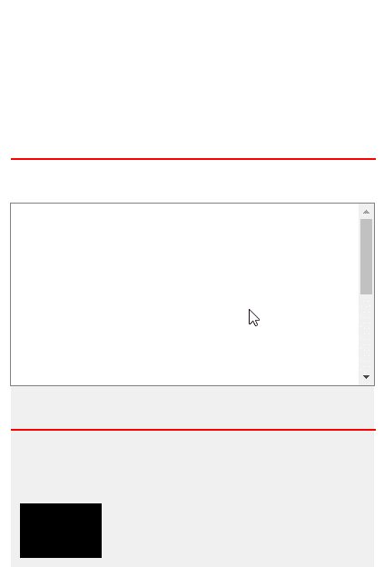
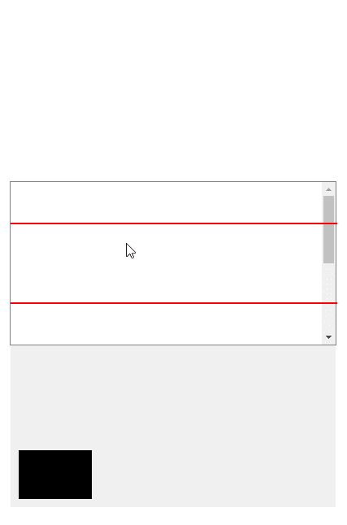

# JavaScript 中的交集观察者:您需要知道的一切

> 原文：<https://javascript.plainenglish.io/javascript-intersection-observer-cded4e80a377?source=collection_archive---------0----------------------->

## 使用交叉点观察器 API 实现延迟加载、无限滚动等。，而不使用复杂的逻辑或导致性能问题。



交叉点观察器 API 用于异步观察元素与浏览器视窗的交叉点的变化。它使得检测一个元素的可见性，或者两个元素相对于彼此的可见性的任务变得容易，而不会使站点变得缓慢和降低用户体验。我们将在这篇文章中了解这一切。

# 交叉口观察器的用途

在我们开始探索交叉点观察器 API 之前，让我们看看在我们的 web 应用程序中使用它的一些常见原因:

## 无限滚动

这是一种网页设计技术，当用户向下滚动时，内容被持续加载。它消除了分页的需要，并可以改善用户停留时间。

## 惰性装载

延迟加载是一种设计模式，在这种模式下，只有当图像或其他内容滚动到用户的视图中时，才加载它们，以提高性能并节省网络资源。

## 基于滚动的动画

这意味着当用户上下滚动页面时动画元素。有时，当到达某个滚动位置时，动画会完全播放。其他时候，动画中的时间会随着滚动位置的变化而变化。

## 广告收入计算

我们可以使用交叉点观察器来检测广告何时对用户可见，并记录印象，从而影响广告收入。

# 创建交叉点观察点

让我们来看看 JavaScript 中交集观察器的一个简单用法。

`index.js`

```
const observer = new IntersectionObserver((entries) => {
  for (const entry of entries) {
    const intersecting = entry.isIntersecting;
    entry.target.style.backgroundColor = intersecting ? 'blue' : 'orange';
  }
});const box = document.getElementById('box');observer.observe(box);
```

回调函数接收一个包含`IntersectionObserverEntry`接口对象的数组。此对象包含观察者当前正在观察的元素的交叉点相关信息。

每当目标元素与视口相交时，都会调用回调。它也被称为第一次要求观察者观察元素。

我们使用`for...of`循环来遍历传递给回调函数的条目。我们只观察一个元素，所以`entries`数组将只包含代表盒子的`IntersectionObserverEntry`元素，而`for...of`循环将只有一次迭代。

`IntersectionObserverEntry`元素的`isIntersecting`属性返回一个布尔值，表明该元素是否与视口相交。

当`isIntersection`为`true`时，表示元素正在从不相交向相交过渡。但是当它是`false`时，它表示元素正在从相交过渡到不相交。

因此，我们使用`isIntersection`属性将元素进入视口时的颜色设置为`blue`，并在元素离开时返回到`black`。

我们在`IntersectionObserver`对象上调用`observe()`方法，让观察者开始观察元素的交集。

在下面的演示中，带有滚动条的白色区域代表视口。灰色部分表示页面上位于视窗之外的区域，通常在浏览器中不可见。

观察当一个像素进入视口时，长方体的颜色如何变化:



The element changes color once a single pixel of it enters the viewport.

# 交叉点观察点选项

除了回调函数之外，`IntersectionObserver()`构造函数还接受一个`options`对象，我们用它来定制回调被调用所必须满足的条件。

## `threshold`

`threshold`属性接受一个介于 0 和 1 之间的值，该值指定元素在视口中必须可见的百分比，以便调用回调。默认情况下，它的值为`0`，这意味着一旦元素的单个像素进入视口，回调就会运行。

让我们修改前面的例子，使用阈值`1` (100%):

`index.js`

```
const observer = new IntersectionObserver(
  (entries) => {
    for (const entry of entries) {
      const intersecting = entry.isIntersecting;
      entry.target.style.backgroundColor = intersecting ? 'blue' : 'black';
    }
  },
  // 👇 Threshold is 100%
  { threshold: 1 }
);const box = document.getElementById('box');observer.observe(box);
```

现在，只有当元素的每个像素在视口中都可见时，才会执行改变颜色的回调。



The element changes color once every single pixel of it enters the viewport.

`threshold`也接受多个值，这使得每次元素通过一个阈值集时回调 get。

例如:

`index.js`

```
const threshold = document.getElementById('threshold');const observer = new IntersectionObserver(
  (entries) => {
    for (const entry of entries) {
      const ratio = entry.intersectionRatio;
      threshold.innerText = `${Math.round(ratio * 100)}%`;
    }
  },
  // 👇 Multiple treshold values
  { threshold: [0, 0.25, 0.5, 0.75, 1] }
);const box = document.getElementById('box');observer.observe(box);
```

我们将数组中的 5 个百分比值传递给`threshold`属性，并在元素到达时显示每个值。为了做到这一点，我们使用了`intersectionRatio`属性，一个介于 0 和 1 之间的数字表示元素在视口中的当前百分比。



The text is updated each time a percentage of the element in the viewport reaches a certain threshold.

请注意，显示的文本并不总是与我们的阈值相匹配，例如，在演示中，`2%`是针对`0%`阈值显示的。发生这种情况是因为当我们快速滚动并达到一个阈值时，等到回调可以触发以更新文本时，我们已经滚动了超过阈值的更多元素。

如果我们滚动得更慢，回调将有时间在元素滚动超过当前阈值之前更新文本。

`rootMargin`

`rootMargin`属性在视窗或根元素周围应用边距。它接受 CSS `margin`属性可以接受的值，例如`10px 20px 30px 40px`(上、右、下、左)。边距增大或缩小相交观察者观察的与目标元素相交的视口区域。

下面是一个使用`rootMargin`属性的例子:

`index.js`

```
const observer = new IntersectionObserver(
  (entries) => {
    for (const entry of entries) {
      const intersecting = entry.isIntersecting;
      entry.target.style.backgroundColor = intersecting ? 'blue' : 'black';
    }
  },
  // 👇 Root margin 50px from bottom of viewport
  { rootMargin: '50px' }
);const box = document.getElementById('box');observer.observe(box);
```

在设置了一个`50px`的`rootMargin`之后，为了相交的目的，视口的高度被有效地增加了，当元素进入视口的`50px`时，回调函数将被调用。

演示中的红线表示观察者观察的任何交叉点区域的边界。



The element changes color when it comes within 50px of the viewport.

我们还可以指定负边距来缩小用于相交的视口区域。

```
const observer = new IntersectionObserver(
  (entries) => {
    for (const entry of entries) {
      const intersecting = entry.isIntersecting;
      entry.target.style.backgroundColor = intersecting ? 'blue' : 'black';
    }
  },
  // 👇 Negative margin
  { rootMargin: '-50px' }
);const box = document.getElementById('box');observer.observe(box);
```

现在，当元素的单个像素在视口内超过`50px`时，就会触发回调。



The element changes color when a single pixel of the element is more than 50px inside the viewport.

`root`

属性接受的元素必须是被观察元素的祖先。默认为`null`，表示使用视口。您不需要经常使用该属性，但是当您的页面上有一个可滚动的容器，并且您希望检查它与其中一个子元素的交集时，该属性非常方便。

例如，为了创建本文中的演示，我将`root`属性设置为页面上的一个可滚动容器，以便于您可视化视口及其外部区域，并更好地理解交叉点是如何工作的。

# 第二个回调参数

传递给`IntersectionObserver()`构造函数的回调实际上有两个参数。第一个参数是我们之前看的`entries`参数。第二个是观察十字路口的观察者。

```
const observer = new IntersectionObserver((entries, o) => {
  console.log(o === observer); // true
});
```

此参数对于从回调中访问观察器很有用，尤其是在回调位于无法访问观察器变量的位置时，例如，在与包含观察器变量的文件不同的文件中。

# 防止内存泄漏

当不再需要观察元素时，我们需要停止观察它们，比如当它们从 DOM 中移除或者在一次基于滚动的动画之后，以防止内存泄漏或者性能问题。

我们可以用`unobserve()`方法做到这一点。

```
new IntersectionObserver((entries, observer) => {
  entries.forEach(entry => {
    if (entry.isIntersecting) {
      doAnim(entry.target);
      observer.unobserve(entry.target);
    }
  });
});
```

`unobserver()`将单个元素作为其参数，并停止观察该元素。

还有一种`disconnect()`方法，让观察者停止观察所有元素。

# 结论

Intersection Observer 是一个强大的 JavaScript API，用于轻松检测元素何时与视口或父元素相交。它让我们可以实现延迟加载、基于滚动的动画、无限滚动等等，而不会导致性能问题，也不必使用复杂的逻辑。

*原载于*[*【codingbeautydev.com】*](https://cbdev.link/563df1)

# JavaScript 做的每一件疯狂的事情

一本关于 JavaScript 微妙的警告和鲜为人知的部分的迷人指南。


[**报名**](https://cbdev.link/d3c4eb) 立即免费领取一份。