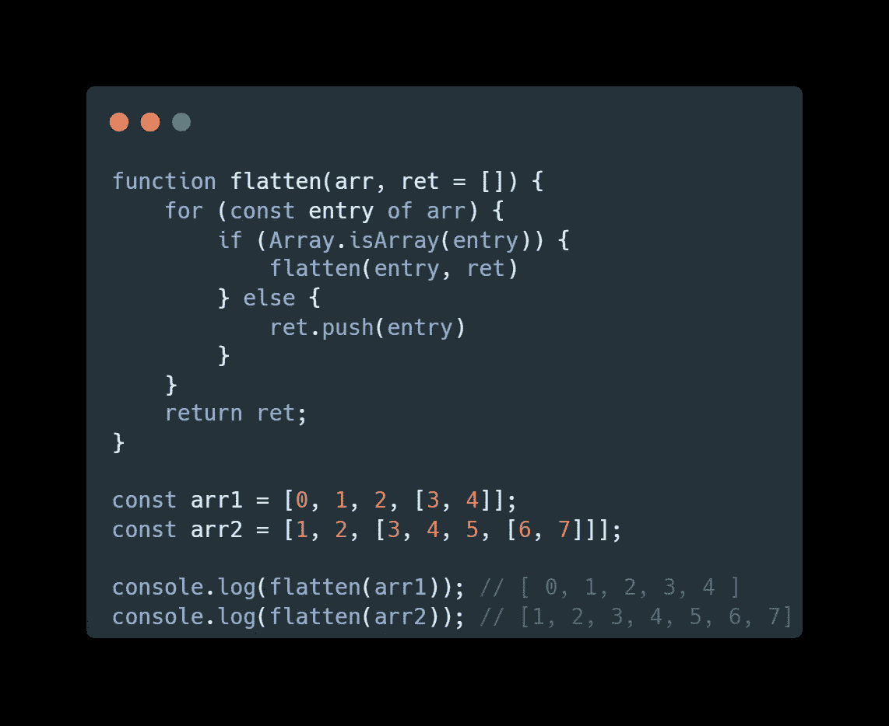
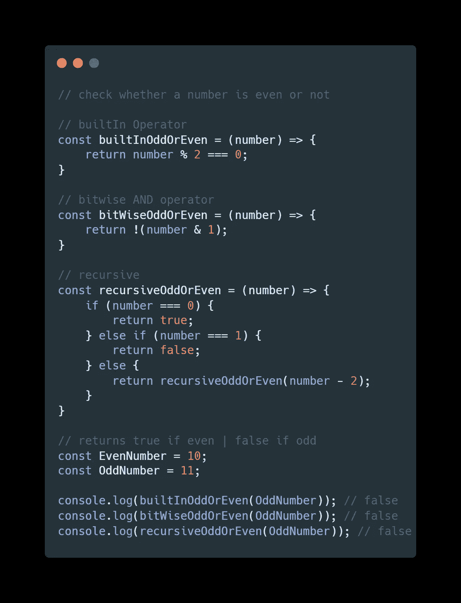
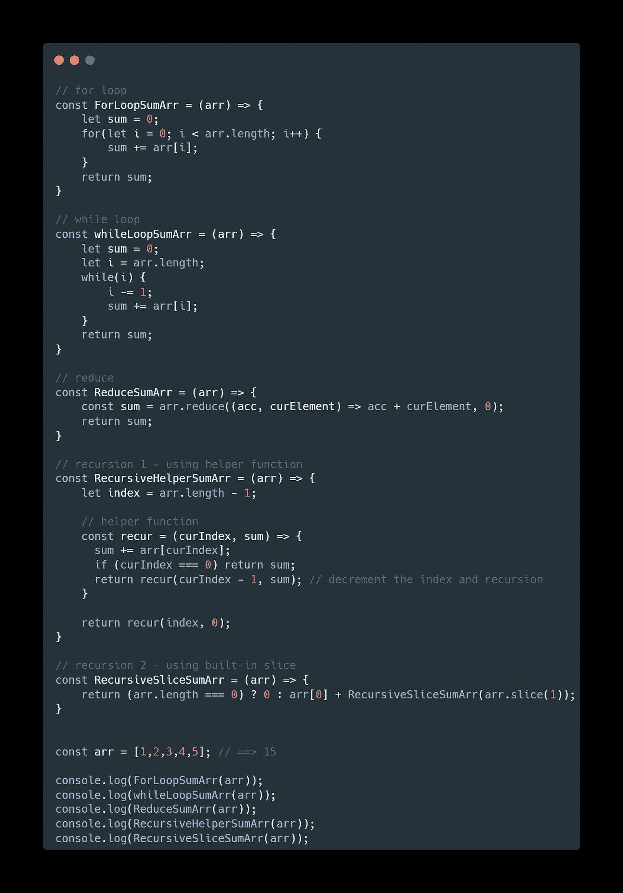
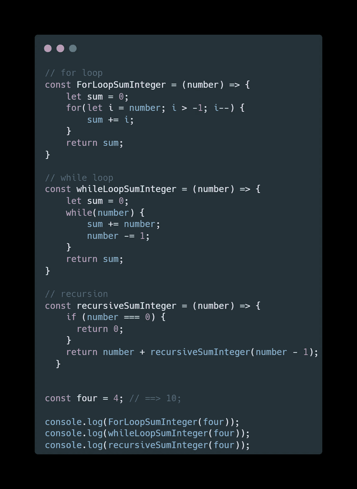
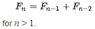
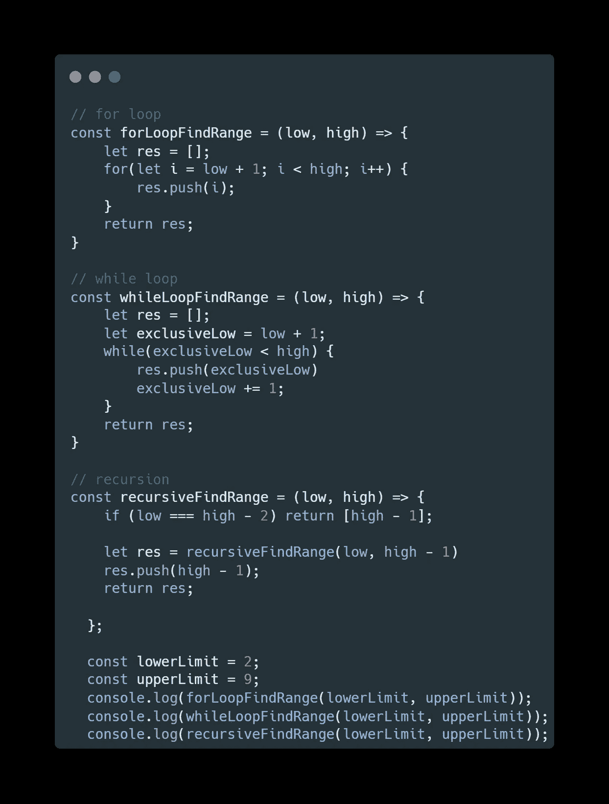

# JavaScript 面试问题——10 个常见的递归问题

> 原文：<https://javascript.plainenglish.io/javascript-interview-question-10-common-recursion-problems-d6ac97f65d0d?source=collection_archive---------0----------------------->

## 你能以递归的方式实现这个内置函数吗？在你的 JS 面试之前刷新你的记忆。


Photo by [Mitchell Luo](https://unsplash.com/@mitchel3uo?utm_source=medium&utm_medium=referral) on [Unsplash](https://unsplash.com?utm_source=medium&utm_medium=referral)

# TL；速度三角形定位法(dead reckoning)

*“你能以递归的方式实现它吗？”* —递归是最常见的 JavaScript 面试问题之一。在这篇文章中，我想回顾一下常见的递归问题，以帮助你在面试前恢复记忆。

通过解决下面的问题来测试你的递归编码技能水平。如果你解决了所有的问题，那太好了！如果没有，我希望你能从这篇文章中学到一些东西

*   对 n 以内的所有非负整数求和

```
Input: 4
Output: 10
Exp: 1 + 2 + 3 + 4 = 10
```

*   以递归方式实现内置的`.length`函数

```
Input : str = "abcd" 
Output :4
Exp: CANNOT use str.length NOR For loop
```

*   以递归方式实现 findRange

```
Input: findRange(2,9)
Output: [3,4,5,6,7,8]
```

# 0.使用递归实现 JS 内置函数

最常见的 JS 面试问题🔥🔥

**挑战 1:** 使用递归实现`flat()`函数

**亮点:** `Array.isArray()`

**难度:** 2 / 5

```
arrayObject.flat([depth])------------------------const arr1 = [0, 1, 2, [3, 4]];console.log(arr1.flat()); // [0, 1, 2, 3, 4]
```



**挑战 2:** 使用递归实现`getElementByClassName()`函数

**高亮:** `element.children.length` & `getAttribute("class")`

**难度:** 3 / 5

挑战 3: 使用递归实现`String.length`函数

**高亮:**

**难度:** 3 / 5

```
Input : 
  const str = "abcd"; 
  console.log(str.length);
Output :4
```

**挑战 4:** 使用递归实现`Array.fill()`函数

**高亮:** `.concat()`

**难度:** 3 / 5

```
Input : 
  const twos = Array(5).fill(2);

Output :
  console.log(twos); // [2, 2, 2, 2, 2]
```

# 1.检查一个数是否是偶数

**类型:**基例不明显

**难度:** 3 / 5

使用内置的模数运算符(%)，可以很容易地解决这个问题。然而，面试官想测试你是否能在不使用内置函数的情况下实现它。这个问题的难点是找到好的基本情况

```
Input: 11
Output: false
Exp:11 is an odd numberInput: 10
Output: true
Exp:10 is an even number
```



# 2.对数组中的每个整数元素求和

**类型:**基本情况明显(带数组输入)

**难度:** 1 / 5

我觉得这是最常见的面试问题。面试官可以要求你先用 ***实现循环*** ，然后用 ***while 循环，*** 然后 ***reduce*** ，然后 ***递归。*** 对于这个问题，我们可以利用数组索引从 **(0)** &开始到 **(array.length)** 结束的特点

```
Input: [1,2,3,4,5]
Output: 120
Exp:5 + 4 + 3 + 2 + 1 = 15
```

**挑战 1:** 返回数组中每个元素的**乘积**而不是总和

> **下面有答案**



**挑战 1 的答案:**返回数组中每个元素的**乘积**而不是总和

```
Input: [1,2,3,4,5]
Output: 120
Exp:5 * 4 * 3 *2 * 1 = 120
```

你只需要做两个小的改变

```
1) change addition to product
acc += arr[curIndex]; -> acc *= arr[curIndex];2) change base case
0 -> 1return recur(index, 0); -> return recur(index, 1);
```

# 3.对 n 以内的所有非负整数求和

**类型:**基本情况明显(w/数字输入)

**难度:** 1 / 5

类似于上面的问题，但是你现在得到的是一个数字而不是一个数组

```
Input: 4
Output: 10
Exp:4 + 3 + 2 + 1 = 10
```

**挑战 1:** 斐波那契数

```
Input: 7
Output: 13
Exp: 
 F6 = 8 
 F5 = 5 
 F7 = 8 + 5 = 13
```

**挑战 2:** 一个数的阶乘

```
Input: 5
Output: 120
Exp: 5! = 5 * 4 * 3 * 2 * 1 = 120
```

**挑战 3:** 给定数字的位数之和

```
Input: 687
Output: 21
Exp: 6 + 8 + 7 = 21
```

> **下面有答案**



**挑战 1 的答案:**斐波那契数

```
Input: 7
Output: 13
Exp: 
 F6 = 8 
 F5 = 5 
 F7 = 8 + 5 = 13
```

斐波纳契数列的规则可以写成如下



**挑战 2 的答案:**一个数的阶乘

```
Input: 5
Output: 120
Exp: 5! = 5 * 4 * 3 * 2 * 1 = 120
```

你只需要做两个小的改变

```
1) change base case from 0 to 1
if (number === 0) return 0; -> if (number === 1) return 1;2) change addition to product
0 -> 1return number + recursiveSumInteger(number - 1);
-> 
return num * factorialNumber(num - 1);
```

**挑战 3 的答案:**给定数字的位数之和

```
Input: 687
Output: 21
Exp: 6 + 8 + 7 = 21
```


# 4.范围内的整数(x，y)

**类型:**基例明显&数组返回类型

**难度:** 3 / 5

我们知道下限和上限；因此，很容易设置基本情况。我们需要更新一些地方来返回数组(而不是原始类型)

```
Input: 2,9
Output: [3,4,5,6,7,8]
Exp: return an array of integers in-between the lower & upper limits
```

**挑战 1:** 返回斐波那契数列

```
Input: 5
Output: [0, 1, 1, 2, 3, 5]
Exp: Fibonacci sequences up to 5 number
```

> **下面有答案**



**挑战 1 的答案:**返回斐波那契数列

```
Input: 5
Output: [0, 1, 1, 2, 3, 5]
Exp: Fibonacci sequences up to 5 number
```

你只需要做两个小的改变

```
1) change base case
if (low === high -2) return [high -1]; -> if (n == 1) return [0, 1];2) change the operation logic
res.push(high-1); -> 
res.push(res[res.length - 1] + res[res.length -2 ])
```

# 摘要

递归是常见的 JavaScript 面试问题之一，我希望你做好充分准备。感谢您的阅读


Photo by [Lidya Nada](https://unsplash.com/@lidyanada?utm_source=medium&utm_medium=referral) on [Unsplash](https://unsplash.com?utm_source=medium&utm_medium=referral)

*更多内容请看*[***plain English . io***](http://plainenglish.io/)*。报名参加我们的* [***免费周报***](http://newsletter.plainenglish.io/) *。在我们的* [***社区***](https://discord.gg/GtDtUAvyhW) *获得独家获得写作机会和建议。*