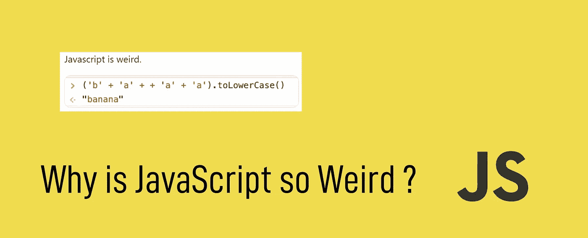

# JavaScript 很奇怪，这也是我们喜欢它的原因

> 原文：<https://javascript.plainenglish.io/javascript-is-weird-and-that-is-why-we-love-it-2b46dff3ec73?source=collection_archive---------6----------------------->



JavaScript 是世界上最流行的语言之一。大多数精通技术的公司都在寻找 JavaScript 开发者，这并不奇怪。但是除此之外，它也是一种奇怪的语言。这篇文章将详细讨论为什么会这样，并且在这个过程中，也试图消除你的一些疑虑。

还有，这只是为了学习，也是为了好玩。这将有助于提高您的 JavaScript 知识的深度，所以我们开始吧。🚗 😉

1.  `ParseInt()`

这个函数应该将传递的变量转换成整数，但是如果我们传递这个呢？

```
parseInt(0.0000005)
#output 
5#but if we passed that 
parseInt(0.000005)
#output 
0
```

是不是很奇怪？在两种情况下我们都应该得到 0，但是我们得到了不同的结果😖。这个问题的答案在于 ParseInt 的定义，它首先将传递的值转换为字符串，然后返回在任何特殊字符之前收到的第一个数值。因此，当我们转换`0.0000005 to String`时，我们得到`‘5e-7’` ，这导致了问题。

2.`JSON.parse()`

当你得到一个非常大的数字时，这个函数有一些限制。它开始变得像这样奇怪:

```
JSON.parse('{"key":12345678910111213}')
#output
{key: 12345678910111212}
```

结尾的 13 怎么自动变成 12？为了正确地工作，您必须将那个`12345678910111213`作为一个字符串传递，或者您可以使用另一个库，比如 [json-bitint](https://npmjs.org/package/json-bigint) 。

3.`NaN`是一个数字

在 JavaScript 中，NaN 是“**非数字**”的缩写。在 JavaScript 中，NaN 不是一个数字，但是当我们这样做时:

```
typeof NaN;
#output
'number'
```

我们得到“number”作为输出，这意味着 NaN 的全局属性也是一个数字。

4.`(‘b’+ ‘a’ + + ‘a’ + ‘a’).toLowerCase()`

JavaScript 似乎非常喜欢香蕉，因为这段代码显示了这一点。😆

```
(‘b’+ ‘a’ + + ‘a’ + ‘a’).toLowerCase()
'banana'
```


5.`0.2+0.1 == 0.3`不是真的😕

```
0.5+0.1 == 0.6
#output
true#but when we pass
0.1+0.2 == 0.3
#output
false
```

这似乎让我感到困惑，因为这是一件非常愚蠢的事情。但这背后也有一个逻辑。当您这样做时:

```
0.2+0.1
#output
0.30000000000000004
```

**解释**

> *“数字类型正好有 18437736874454810627(即 2⁶⁴ — 2⁵ + 3)个值，表示 IEEE 二进制浮点运算标准中规定的双精度 64 位格式 IEEE 754 值”“* [*ECMAScript 语言规范*](https://www.ecma-international.org/ecma-262/5.1/#sec-8.5)

为什么会发生这种情况？

> *“你的语言没坏，是在做浮点数学。计算机本身只能存储整数，所以它们需要某种方式来表示十进制数。这种表述并不完全准确。这就是为什么，* `*0.1 + 0.2 != 0.3*` *”—*
> 
> [*埃里克·威芬*](https://medium.com/u/a2ac2bff6025?source=post_page-----d7e218224a72--------------------------------)

*上*下[上*0.30000000000000004.com*下](https://0.30000000000000004.com/)

6.`Math.max()`小于`Math.min()`

```
Math.max()
#output
-InfinityMath.min()
#output
InfinityMath.min() > Math.max()
#output
true
```

我知道这没有意义，因为 max 和 min 函数用于从列表中查找 max 和 min 值；所以这是没有用的，但它仍然表现得如此怪异。😆

# **就这样**

谢谢你花时间读完它。为你找到这些东西需要付出很多努力和研究。JS 中还有更多奇怪的东西，但是今天已经足够了。评论你的观点，与你的 JavaScript 程序员朋友分享。

[](https://www.linkedin.com/in/jaykishan-khemani-a0452850/) [## Jaykishan Khemani -解决方案工程师- GAMMASTACK | LinkedIn

### 查看 Jaykishan Khemani 在世界上最大的职业社区 LinkedIn 上的个人资料。Jaykishan 列出了 3 个工作…

www.linkedin.com](https://www.linkedin.com/in/jaykishan-khemani-a0452850/) 

*更多内容看* [***说白了就是***](https://plainenglish.io/) *。报名参加我们的* [***免费周报***](http://newsletter.plainenglish.io/) *。关注我们* [***推特***](https://twitter.com/inPlainEngHQ) *和*[***LinkedIn***](https://www.linkedin.com/company/inplainenglish/)*。查看我们的* [***社区不和谐***](https://discord.gg/GtDtUAvyhW) *加入我们的* [***人才集体***](https://inplainenglish.pallet.com/talent/welcome) *。*