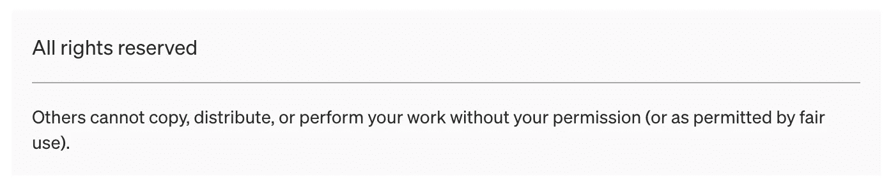

# 理解 JavaScript 运算符——JavaScript 学习之旅

> 原文：<https://javascript.plainenglish.io/javascript-learning-journey-coding-operators-8c19ca32253f?source=collection_archive---------20----------------------->

## 第 8 课—编码基础:运算符


Photo by [ThisisEngineering RAEng](https://unsplash.com/@thisisengineering?utm_source=medium&utm_medium=referral) on [Unsplash](https://unsplash.com?utm_source=medium&utm_medium=referral)

# 学习 JavaScript 基础知识——JavaScript 编码和运算符入门

在上一课(第 7 课)中，我们讲述了 JavaScript 代码的调试和故障排除，以及代码中有哪些语句的细节。第 7 课可以通过下面的链接找到。

[](https://medium.com/@m_sally/javascript-coding-basics-debugging-and-troubleshooting-24045bce7aeb) [## JavaScript 学习之旅—第 7 课—编码基础:代码调试和故障排除

### 深入研究 JS 代码的调试和故障排除。代码中肯定会出现错误，通常称为 bugs

medium.com](https://medium.com/@m_sally/javascript-coding-basics-debugging-and-troubleshooting-24045bce7aeb) 

到目前为止，在课程中，您已经看到或听到了核心客户端 JavaScript 语言，它由一些常见的编程功能组成，这些功能允许您执行以下操作:

*   将有用的值存储在变量中。—第六课
*   对文本(在编程中称为“字符串”)和其他数据值类型的操作。—本课，第 8 课
*   运行代码来响应网页上发生的某些事件，如单击事件，以检测何时单击了某个内容，然后运行代码来更新被单击的项目。
*   还有更多！

这些课程在第 6 课中详细介绍了 JavaScript 变量，链接如下:

[](/javascript-learning-journey-lesson-6-coding-basics-variables-a6e985d6076c) [## JavaScript 学习之旅:理解变量

### 第 6 课—编码基础:变量

javascript.plainenglish.io](/javascript-learning-journey-lesson-6-coding-basics-variables-a6e985d6076c) 

在第 8 课中，我们将学习更多的 JavaScript 编码基础知识，特别是对数据值执行操作的运算符**和**。

# 经营者

在 JavaScript 中，运算符允许您执行测试、进行数学计算和等式、将字符串连接在一起以及许多其他事情。JavaScript 中有很多操作符，使用操作符时需要考虑一个**优先级表。该表可以在 **MDN** [**Docs**](https://developer.mozilla.org/en-US/docs/Web/JavaScript/Reference/Operators/Operator_Precedence) 中找到，它将帮助您了解每个运算符与其他运算符组合使用时的处理顺序。**

# JavaScript 中运算符的类型

JavaScript 有以下类型的运算符:

*   算术运算符
*   赋值运算符
*   按位运算符
*   逗点算符
*   比较运算符
*   复合运算符
*   条件(三元)运算符
*   逻辑运算符
*   关系运算符
*   字符串运算符
*   一元运算符

根据 [MDN](https://developer.mozilla.org/en-US/docs/Web/JavaScript/Guide/Expressions_and_Operators) ，

> JavaScript 既有二元运算符，也有一元运算符*和一个特殊的三元运算符，即条件运算符。二元运算符需要两个操作数/数据对象，一个在运算符之前，一个在运算符之后。而一元运算符需要一个操作数，要么在运算符之前，要么在运算符之后，如在递增/递减运算中。操作数是任何可以被操作和操纵的数据对象。*

## **算术运算符:**

`**+**` 用于**加法**和**串联—** 需要注意的是,+运算符不仅用于数学加法，还用于将文本字符串连接在一起(在编程中称为*串联*)。二元运算符`+`是唯一支持字符串和数字的运算符，而其他算术运算符只处理数字，并且总是将其操作数转换为数字。加号(+)也有一元功能，可以通过在前面加上加号(+)来将字符串数据类型转换为数字。

`**—**` 用于**减法** —从左侧数字中减去右侧数字

`*****` 用于**乘法运算**

`**/**` 用于**除法** —将左边的数除以右边的数

`**%**` 百分号( **%** )被称为余数运算符或技术上称为**模**——当执行整数除法计算时，它返回余数，例如 5 % 2 给出 1 的结果，14 % 3 给出 2 的结果。

`******` 用于**求幂运算**表示为`x**y`当使用数字‘x’时，它是‘y’的幂，是‘x’乘以自身的次数。有时，这可以被视为工作方式类似的`Math.pow()`方法。例如，在`Math.pow(2,5)`中，括号内的参数设置表示 2 是基数，5 是指数，相当于`2**5`，表达式的结果是 32(来自 2 x 2 x 2 x 2 x 2 x 2 x 2)。

`**++**`用于**递增**操作，将一个数值变量值递增(增加)1，变量值加 1。

`**— -**`用于**减量**操作减 1 (2 个减号—无空格)。

**注意:** **递增和递减**只能通过名字应用于变量，不能直接应用于数字。比如尝试用 5++会出错。因此，操作符`++`和`— —`需要应用于变量名，因为该操作是给变量分配一个新的更新值，而不是直接对数值本身进行操作，例如`count++`中，计数变量将首先被分配(给定)一个起始数值，如`let count=1;`。递增或递减运算符可以放在变量名的前面(前缀)或后面(后缀)。将这些操作符放在前缀还是后缀上会有一些区别，但是如果不使用递增或递减结果的结果，则使用哪种形式没有区别。运算符的不同之处在于前缀增加了一个值，并立即使用运算符的结果，而如果需要使用前一个值，则需要运算符后缀，如循环中所示。

## 算术运算符优先顺序

如果一个计算(在编程中称为表达式)有多个运算符，则执行顺序由运算符的默认优先级顺序(运算符优先顺序)定义。这种计算顺序就像在学校里教的一样，在那里处理数学方程计算的顺序被学习为**BIMDAS**——这种顺序转化为括号指数乘法/除法加法/减法。这种顺序处理计算的命名可能会有一些变化，例如 **PEMDAS** 是相同的，并被翻译为括号指数乘法除法加法减法都是相同的，只是命名选择不同。有时，除法的 D 可能会放在乘法的 M 之前，顺序对它们来说并不重要，因为它们基本上是相同的，并且在相同的代数运算优先级上，您可以按照它们在等式中从左到右的顺序来执行它们。加法和减法也是一样，你按照它们在等式中出现的顺序来做，但是它们在乘法/除法之后被处理。要更改和覆盖运算符的优先顺序，可以在要首先计算的部分加上括号。

处理顺序来自每个具有相应优先数的运算符，优先数较大的运算符首先执行。如果优先数相同，则执行顺序是从左到右。如果想在[https://developer . Mozilla . org/en-US/Docs/Web/JavaScript/Reference/Operators/Operator _ Precedence 查看完整的优先级详细信息，请参考 MDN 文档中的优先级表。](https://developer.mozilla.org/en-US/docs/Web/JavaScript/Reference/Operators/Operator_Precedence.)

## 赋值运算符

等号在 JavaScript 中用作赋值运算符，为变量赋值。正如在变量创建/声明中看到的，`=`在左边指定变量名，在右边指定值。

## **复合赋值运算符**

如上所述，正常的赋值操作符是等号`=`,用来给变量赋值。在变量创建/声明中,=在左边指定变量名，在右边指定变量值。还有一些快捷操作符，称为增强或复合赋值操作符。这些快捷的“修改-赋值”操作符适用于所有算术、位和逻辑操作(除了——!)运算符。

最常用的复合赋值运算符有`**+=**`、`***=**`、`**/=**`、`**-=**`。它们与普通赋值运算符(=)具有相同的优先顺序，并且在大多数其他计算之后执行，它们还可以添加函数。

复合赋值操作符的完整列表可以在 MDN 的[https://developer . Mozilla . org/en-US/docs/Web/JavaScript/Guide/Expressions _ and _ Operators # assignment _ Operators](https://developer.mozilla.org/en-US/docs/Web/JavaScript/Guide/Expressions_and_Operators#assignment_operators))中找到。

复合赋值运算符是下列运算的简写:

**赋值:**

**加法赋值:** `x += f();`同`x = x + f();`

**减法赋值:** `x -= f();`与`x = x — f();`相同

**乘法赋值:** `x *= f();`同`x = x * f();`

**分工:** `x /= f();`同`x = x / f();`

**余数赋值:** `x %= f();`同`x = x % f();`

**取幂赋值:** `x **= f();`与`x = x ** f();`相同

**左移分配:** `x <<= f();`与`x = x << f();`相同

**右移分配:** `x >>= f();`同`x = x >> f();`

**无符号右移位赋值:** `x >>>= f();`同`x = x >>> f();`

**按位 AND 赋值:** `x &= f();`与`x = x & f();`相同

**按位异或赋值:** `x ^= f();`与`x = x ^ f();`相同

**按位或赋值:** `x |= f();`与`x = x | f();`相同

**逻辑与赋值:** `x &&= f();`与`x&&(x=f());`相同

**逻辑或赋值:** `x ||= f();`与`x||(x=f());`相同

**逻辑无效赋值:** `x ??= f();`与`x??(x=f());`相同

**注:**`+=`加法赋值操作符可以处理字符串和数字，并且是这些双符号复合赋值操作符中唯一一个完成这项工作的算术操作符。当您想要向现有值添加新值并返回结果时，可以使用它们。例如:

`x +=5;`与 x = x + 5 相同；

仅使用加法赋值的字符串文本的示例如下:

`let name1 = "Adam";
name1 += " says Hi!";` *//评论:结果 being = Adam 说嗨！*

减法赋值运算符`-=`将左边的变量值减去右边的值，返回新的变量值，如`x-=5;`与`x=x-5;`相同。

乘法赋值运算符`*=`将左边的变量值乘以右边的值，返回新的变量值，如`x*=5;`与`x=x*5;`相同。

除法赋值运算符`/=`将左边的变量值除以右边的值，并返回新的变量值，例如`x/=5;`与`x=x/5;`相同。

## **逻辑运算符**

在 JavaScript 中，有四个逻辑运算符:

*   `||`是使用两个垂直线符号的“或”逻辑运算符，例如`result=a||b;`
*   `&&`是使用两个&符号&和&的“与”逻辑运算符，例如`result=a&&b;`
*   `!`是使用感叹号的“非”逻辑运算符，如`result=!value;`
*   `??`代表使用两个问号符号的“无效合并”逻辑运算符。

虽然这些运算符被称为“逻辑”，但它们可以应用于任何类型的值，而不仅仅是布尔值，并且它们的结果也可以是任何类型的。

下面是每个逻辑运算符的更多细节。

**OR 运算符||** 在传统编程中，逻辑 OR 运算符只用于处理布尔值，如果它的任何参数为真，结果返回真，否则返回假。

在 JavaScript 中，操作符有点不同，而且更强大。

有四种可能的逻辑组合:

*   alert(true | | true)；// *真实*
*   alert(假||真)；// *真*
*   alert(真||假)；// *真*
*   alert(假||假)；// *假*

上面显示，除了两个操作数都为假时，结果为真。如果操作数不是布尔值，它将被转换为布尔值进行评估，其中**数字 1 被视为真**(等于开)，而**数字 0 被视为假**(等于关)，例如:

```
if(1||0){
 alert("truthy!");
}
*// Comment: the first line works just like* *if(true||false)*
```

带有 OR ||运算符的多个值通常用在 if()语句中，以测试任何条件(可以是多个)是否为真。这些语句从左到右计算操作数，每个操作数都被转换为布尔值。如果结果为真，检查停止并返回该操作数的原始值。如果所有操作数都已求值，这意味着它们都为假，则返回最后一个操作数值。如果找不到真值，此运算符结果将返回第一个真值或最后一个值，并且该值以其原始形式返回。

**AND 运算符& &** 如果两个操作数都为真，AND 运算符& &返回真，否则返回假，可能的组合如下:

*   alert(true & & true)；// *真*
*   alert(false & & true)；// *假*
*   警报(真和假)；// *假*
*   alert(false & & false)；// *假*

if()语句中 AND 运算符的示例:

```
let hour = 8:
let minute = 45;
if(hour == 8 && minute == 45){
alert("The time is 8:45");
}
```

当使用 AND &&运算符计算多个值时，从左到右计算这些值，并将每个值转换为布尔值。如果结果为假，检查停止并返回原始值。如果所有操作数都已求值，并且都为真，则返回最后一个值。AND 运算符返回第一个假值，如果没有找到，则返回最后一个值。

在语句中可以使用 AND &&和 OR ||运算符。AND &&运算符的优先级高于 OR ||。用代码

a && b || c && d 就像括号中的&&表达式一样:(a && b) || (c && d)。

为了可读性，不要用||或&&语句替换 if()语句。

**不(！)运算符** NOT 运算符接受单个参数值，并将其转换为布尔值 true 或 false，然后返回相反的值。例如

alert(！真)；// *表示错误结果*

alert(！0 );// *表示真实结果*

也有可能是双非！！用于将值转换为布尔类型的。第一个 NOT 将值转换为 boolean 并返回相反的值，第二个 NOT 再次反转它。最终的结果是一个普通的值到布尔的转换，使用起来毫无意义！！，取而代之的是可以使用的内置布尔函数:

```
alert( Boolean(“non-empty string”) ); // *true*alert( Boolean(null) ); // *false*// instead of:alert( !!”non-empty string” ); // *true*alert( !!null ); // *false*
```

不是的！运算符在所有逻辑运算符中具有最高的优先级，并且总是在&&或||之前首先执行。

**无效合并运算符？?'** 那个？？运算符通常用于为变量分配默认值。例如:

```
let user;
alert(user ?? "Anonymous");
// *Anonymous would be the result as the user is not defined and only declared as a variable. If the initial code was let user = “Adam”; then Adam would be the alert result as the user then is defined in the user variable.*
```

`b ?? c`的结果是如果 b 是一个定义的值(非空或未定义)，那么 b 就是结果，如果 b 没有定义，那么 c 就是结果。因此，`??`运算符返回第一个非空或未定义的参数，并获得两个参数中第一个“已定义”的值。

一系列的`??`操作符可以用来从一个非空或未定义的列表中选择第一个值。例如，当希望通过检查经由字段输入输入的用户信息来获得用户名时，检查它们是否被定义，检查用户是否决定填写相应的值。例如:

```
let firstname = " ";
let lastname = " ";
let nickname = "Star";// *the below code checks and shows the first defined value:* usernameResult = firstname ?? lastname ?? nickname ?? "Anonymous"); 
// *the result is Star, however, if the nickname was empty too then Anonymous would be the result.*
```

该操作符是最近添加的，旧的浏览器可能需要 polyfill(在下一课中有更多关于 poly fill 的详细信息)。可以认为`??`操作符类似于`||`(“或”)操作符，并得到相同的结果。但是，最大的区别是||返回第一个*真值*值，而？？返回第一个*定义的*值。||不区分 false、0、空字符串(" ")和 null 或 undefined，将它们都视为 false 值。

只有当变量实际上为空或未定义时，当值实际上未知或未设置时，才需要使用`??`的默认值选项。

考虑到与其他运算符符号一起处理的优先表顺序，表达式中的该运算符可能需要将它们放在括号中，因为结果可能不尽如人意。

JavaScript 禁止将`??`与`&&`和`||`运算符一起使用，因为它们的优先级相同，除非用括号指定优先级，否则会产生错误。例如，下面的代码触发了一个语法错误:

```
let x = 1 && 2 ?? 3;
```

绕过上述语法错误代码的方法:

```
let x = (1 &&2 ) ?? 3;
 *// Works alert(x); = 2*
```

**注意:**在使用任何运算符时，如果没有得到正确的结果，请考虑优先级表，它显示了运算符的处理顺序。还要对值进行调试检查。

## **按位运算符**

按位运算符将参数视为 32 位整数，并在其二进制表示级别上工作。这些操作符不是特定于 JavaScript 的，很少在 web 开发中使用。大多数编程语言都支持它们。

操作员列表:

和(&)

或者(|)

异或(^)

不是(~)

左移(<< )

Ÿ RIGHT SHIFT ( >>)

零填充右移( >>> )

## **比较运算符**

当运行真/假布尔测试(例如，内部条件)时，使用比较运算符。它们都返回真或假值的布尔结果。在 JavaScript 中，比较运算符是:

`**>**`大于:a > b .测试左值是否大于/高于/大于右值。

`**>**`小于:a < b .测试左值是否小于/小于/低于右值。

`**>=**`大于或等于:a > = b .测试左值是否大于/大于/高于或等于右值。

`**>=**`小于等于:a < = b .测试左边的值是否小于等于右边的值。

`**==**` Equals: a == b，注意双等号/等号==是相等测试，而单=表示赋值，就像在 a = b 中一样，不同类型的操作数通过相等运算符==转换为数字，以检查它们是否相同。一个空字符串，就像一个 false，变成了一个零。在比较中使用和阅读时，我喜欢说“等于”。只测试值的比较，不测试值类型的比较。

`**===**`严格相等，即值类型和值必须相等并且完全相同。它在没有类型转换的情况下检查相等性，并帮助确保数据完全匹配。在比较中使用和阅读时，我喜欢说“必须等于”。

`**!=**` Not equals/Non-Equality:在 JavaScript 中写成 b！= c；在数学上相当于≦。只测试值的比较，不测试值类型的比较。

`**!==**`严格不等测试左右值是否**不**相同。

所有比较运算符都返回布尔值:

*   true —表示“是”、“正确”、“正确”或“真实”、“真实”。
*   false —表示“不”、“错误”、“关闭”或“不真实”、“虚假”。

比较运算符用于数字和字符串。在 JavaScript 中，字符串是在每个数据文本值上逐字母比较的，并使用类似字典或“词典”的顺序。但是，重要的是要注意大小写。大写字母“A”不等于小写字母“A”。小写的“A”比大写的“A”大，因为小写字符在 JavaScript 使用的内部编码表中有更大的索引，这是 Unicode 顺序。

当比较不同类型的值时，JavaScript 将这些值转换为数字。对于布尔值，true = 1，false = 0。

注:可能存在一些异常情况，同时:

*   两个值相等。
*   其中一个布尔值为真，另一个布尔值为假。

例如:

```
let a=0;
alert(Boolean(a)); // *Result = false*let b="0";
alert(Boolean(b)); // *Result = true*alert(a==b); // *Result = true!*
```

在上面的示例中，相等检查(`==`)使用数字转换来转换值(使作为字符串输入的“0”变成数字 0)，而布尔转换使用另一组规则，在该规则中，它只在输入的值中确认 like，无论是否有引号。但是，如果在上一次比较中使用了三重等号(`===`)比较检查，结果将为假。

另一种特殊情况是 null = 0 和 undefined = NaN(非数字)无数值转换。比较中存在一些异常情况，例如:

```
alert( null > 0 ); // false
```

```
alert( null == 0 ); // false *** here we would expect true but we get false
```

```
alert( null >= 0 ); // *true*
```

基于值比较转换，这在示例的第二行中没有增加。最后一个结果表明 null 大于或等于零，因此上面的比较应该是真的，但却给出了假的结果。原因是相等检查`==`和比较`>`、`<`、`>=`、`<=`的工作方式不同。比较将 null 转换为数字，将其视为 0，这就是为什么`null >= 0`为真而`null > 0`为假。然而，对 undefined 和 null 的相等检查`==` 是在没有任何转换的情况下定义的，它们彼此相等并且不等于任何其他值，这使得`null==0`为假。这个异常也使得`null==undefined`为真。

另外**请注意，值“undefined”不应与其他值**进行比较，因为 undefined 会被转换为 NaN，这是一个特殊的数值，在所有比较中都会返回 false。Undefined 只等于 null、undefined，没有其他值。**在对可能为空且未定义的变量进行比较时(如果不确定，对变量进行检查)，以及与其他变量类型进行比较时，应小心谨慎。**

**注意:**当比较不同类型的值时，它们会被转换为数字，而不管原始类型是什么(除了不进行严格的相等检查`===`之外，它们会在类型出现时进行类似的比较)。值 null 和 undefined 彼此相等(`==`)，但不等于任何其他值。

比较测试允许您在代码中做出决定，并在做出某种选择时使用。例如，布尔可用于:

*   根据功能是打开还是关闭，在按钮上显示正确的文本标签。
*   满足条件时显示一条消息，比如游戏结束时显示“游戏结束”,或者游戏获胜时显示一条胜利消息。
*   根据一天中的时间显示正确的问候语，例如“早上好/下午好/晚上好”。
*   根据选择的缩放级别放大或缩小地图。

# 参考

一些有用的资源(除了上文已经提到的资源之外)，包括一些用作本文参考点的资源，包括:

*   [w3 学校](https://www.w3schools.com/)
*   [MDN 网络文档](https://developer.mozilla.org/)
*   [javascript.info](https://javascript.info/) 网站

这些资源(带有其网站的链接)提供了对 JavaScript 以及其他语言(包括 HTML、CSS 等)的进一步深入研究，以帮助您探索 Web 开发的编码之旅。他们也向你展示了如何用信息和练习来帮助你进行编码。莎莉·M

希望您喜欢这堂关于 JavaScript 操作符的课，并学到了一些新的信息。

期待在下一课中见到您——第 9 课，了解更多 JavaScript 基础知识。

[](/javascript-learning-journey-understanding-conditionals-620207b9d56f) [## 理解 JavaScript 条件— JavaScript 学习之旅

### 第 9 课—编码基础:条件

javascript.plainenglish.io](/javascript-learning-journey-understanding-conditionals-620207b9d56f) 

*Sally M——本故事中的所有文字和图片均属于作者——Sally M(除非另有注明)。这种作品受版权法保护。作者 Sally M 花了很多时间写这篇文章。由于使用媒体的人侵犯了版权，作者添加了这段文字。这篇文章的最后更新:2022 年 8 月 25 日。*

如果你喜欢这些课程，请注意，你可以捐赠给作家的教学和喂养/咖啡事业，以继续这些课程和其他伟大的作品。查看下面的*“奖励作家”*细节。

*更多内容请看*[***plain English . io***](https://plainenglish.io/)*。报名参加我们的* [***免费周报***](http://newsletter.plainenglish.io/) *。关注我们关于*[***Twitter***](https://twitter.com/inPlainEngHQ)[***LinkedIn***](https://www.linkedin.com/company/inplainenglish/)*[***YouTube***](https://www.youtube.com/channel/UCtipWUghju290NWcn8jhyAw)*[***不和***](https://discord.gg/GtDtUAvyhW) *。***