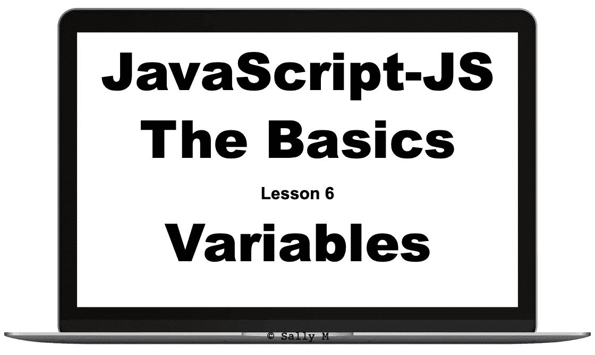
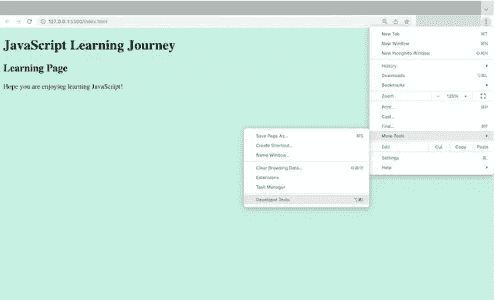
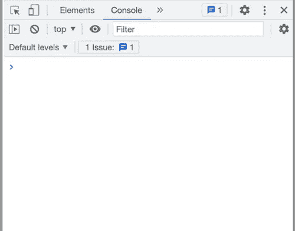
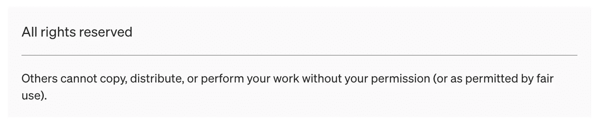

# 理解变量和变量值类型— JavaScript 学习之旅

> 原文：<https://javascript.plainenglish.io/javascript-learning-journey-lesson-6-coding-basics-variables-a6e985d6076c?source=collection_archive---------15----------------------->

## 第 6 课—编码基础:变量、变量值和全局对象



# 学习 JavaScript 基础知识——JavaScript 编码和变量入门。

在第 6 课中，我们将探讨变量和它们存储的数据值类型。如果您错过了最后一课——第 5 课，您可以通过下面的链接找到它。

[](https://medium.com/@m_sally/javascript-learning-journey-day-5-lesson-5-coding-basics-of-modals-9d9527c6584f) [## JavaScript 学习之旅—第 5 天，第 5 课—模态编码基础

### 学习 JavaScript 基础——JavaScript 编码入门——与模态的交互

medium.com](https://medium.com/@m_sally/javascript-learning-journey-day-5-lesson-5-coding-basics-of-modals-9d9527c6584f) 

## 变量

变量用于在 JavaScript 中存储信息。应用程序经常需要处理数据/信息，因此需要一种存储信息的方式来使用它。JavaScript 使用变量来存储信息，每个变量就像文件存储一样，需要一个名字来找到和使用。

变量通常被称为数据的“命名存储容器”,用于存储数值、文本字符串甚至函数(下面将详细介绍变量的数据值)。给变量命名的最佳实践是，应该给它们命名，以便你能容易地理解它们里面有什么/它们存储什么。有些人还喜欢将“变量”的概念比作一个贴有独特名称标签的数据“盒子”。例如，如果我们制作一个名为`greeting`的变量，可以把它想象成一个标有“问候”的盒子，我们可以给它赋值“Hello！”在里面——下图演示。


©Sally M — Above Picture is a demonstration of a Variable being a box with the name of Greeting and storing the value of "Hello".

任何值都可以放入框/变量中，并且该值可以根据需要多次更改。值得注意的是，如果变量的值发生变化，那么旧的数据值将从变量中删除。

## 变量类型

在 JavaScript 中，您可以创建/声明 3 种变量类型来存储数据。使用关键字`**var**` **、** `**let**` **、**或`**const**`声明变量。这些变量类型的简要概述:

*   `**let**` —是一个现代的变量声明。
*   `**var**` —是通常不再使用或极少使用的旧变量声明。
*   `**const**` —用于不变值变量，为“常量”。当一个值被赋值给一个 const 时，这个值不能被改变，const 用于存储你不想改变的值。

**注意:**也可以不使用上述任何一个关键字声明变量，但是，最好使用它们。关于变量声明需要知道的另一个要点是，一旦你使用了上面的一个关键字来声明一个变量，你就需要为这个变量取一个名字，这样它就可以被使用了。在下面的章节中会有更多关于每个变量类型的细节。

## 命名变量

在 JavaScript 中命名变量时，对可以使用的名称有一些限制，命名约定有一些规则:

*   每个变量必须有一个唯一的名字，你可以重复使用你的变量，但是如果你想存储唯一的数据，每个变量需要有自己不同的名字，特别是对于常量，它的值不能改变。但是，如果你不介意数据值改变，你可以重用你的变量名；每个名称只能声明一次。唯一的名称通常称为“标识符”。
*   名字可以很短，像代数一样使用一个字母；但是，最好使用更具描述性的名称标识符。名称可以很长，但请记住，您不希望键入长名称；我们的代码最好是简洁的，但也是描述性的；评论会有所帮助。
*   名称/标识符可以包含字母(主要是小写字母)、数字/数字，唯一允许的符号是$和 _(下划线和美元符号——我不建议在开头使用这些符号，但这是允许的)。
*   名称的第一个字符不能是数字。
*   通过 **camelCase 可以实现多个单词的使用；**不允许有空格，通常以小写字母开头，然后每个新单词都有一个大写字母开头。命名时不要全部使用大写字母(但是，例外情况确实适用于此，下面的“别名常量”有更多详细信息)。
*   变量的名字应该有描述它存储的数据的含义，并且是人类可读的。在声明变量之前，花点时间考虑一下它的正确名称，因为这样可以更容易地找到您的编码信息。
*   有一个不能使用的保留字列表(在代码中有其他含义和用途的字)，使用它们会给你一个错误。**在命名变量**时不使用的单词包括:async、await、break、case、catch、class、const、continue、debugger、default、delete、do、enum、else、export、extends、false、finally、for、function、if、implements、import、in、infinity、instanceof、interface、let、math、new、null、package、protected、private、public、return、static、string、super、switch、this、throw、true、try、typeof、undefined、var、void、while、with、yield 和 pos 您可以在这些受限制的单词中添加其他单词，只是不要使用上面列表中出现的单词。例如， *isTrue* 将被允许，或者 *typeOfVeg* 。但是，在命名标识符时一定要小心。
*   标识符的命名是区分大小写的！当你试图调用你的变量并测试/使用它们时，这是很重要的。当在声明后引用变量时，使用它们时的名称引用/标识符区分大小写意味着您需要准确地引用声明时的标识符。例如，变量名称*城市*不同于*城市、*和*名字*不同于*名字*。

标识符声明规则的命名约定/构造适用于所有变量类型(`let`、`var`和`const`)。关于变量名的另一个值得注意的地方是，一个变量名可能被指定为另一个变量的值。

注意:在使用变量之前，通常需要定义一个变量。你可能会在旧代码中发现，不使用关键字`let`或`var`，通过简单赋值来创建/声明变量在技术上是可行的。如果我们不把`use strict`放在我们的脚本中以保持与旧脚本的兼容性，这仍然有效。然而，不使用`let`或`const`甚至`var`关键字来声明变量是一种不好的做法。

## **让变量**

要在 JavaScript 中创建/声明一个变量，可以使用关键字`**let**` 后跟一个变量名称。例如，下面的语句创建/声明了一个名为`greeting`的变量:

`**let greeting;**`

变量可以声明为不带值的空容器。如果检查变量的结果，它会给出`undefined`，这不是错误。变量的存储容器存在，但其中没有值。要将一个值/一些数据放入变量存储容器中，您可以使用赋值运算符`**=**` ，它是等号，后跟您想要存储在其中的数据值。例如，在上面已经设置的变量声明之后，我们现在将添加数据存储:

`**greeting = "Hello";**`

上面的例子存储了一个字符串的赋值类型，在名为`greeting`的变量中是`"Hello"`。字符串值`Hello`现在被保存到与名为`greeting`的变量相关联的存储区中。

**需要注意的是，在 JavaScript 中，等号** `**=**` **被称为“赋值”运算符**，而不是数学中的“等于/等于”运算符。换句话说，`=`等号在 JavaScript 中的含义与它在数学等式中的含义不同。

要使用变量(比如我们示例中的`greeting`)并访问它的数据值(比如示例中的`hello`)，您需要通过它的名字调用变量，比如通过一个警告:`alert(variableName);`来测试它。你也可以使用`console.log(variableName);`——但是我们还没有学到这个`console.log`，所以有另一种方法来使用浏览器测试我们的代码。在浏览器中，通常有一些开发工具可以用来帮助开发代码。开发者工具通常可以在工具/更多工具菜单中找到(下图显示了在 Chrome 浏览器中哪里可以找到开发者工具)。开发人员工具区包含一个名为“控制台”的部分(如下图)，您可以在控制台窗口中出现的`**>**`“大于”符号后直接键入 JavaScript 代码，如下图所示。您可以输入上面 alert 和 console.log 语句的代码示例(如果您已经设置了名为`greeting`的变量)，并在控制台窗口中测试它们。



©Sally M — Screenshot image demonstration of where to find Developer Tools in Chrome Browser.



©Sally M — Screenshot image of Console area in Developer Tools of Chrome Browser.

**注意:**一个变量只能用`let`关键字及其名称声明一次。然后，当您想要使用变量或更改它的数据值时，您只需通过它的名称来引用它，而不需要使用`let`。

为了使我们的代码更加简洁，变量声明和数据值的赋值可以合并成一行。例如:

```
**let greeting ="Hello";**
```

您也可以在一行中声明多个变量:

```
**let user = "Adam", age = 22, gender = "male";**
```

上面在一行代码中声明多个变量可能看起来更短更快，但不推荐这样做。为了提高可读性，每个变量使用一行，如下例所示:

```
**let user = "Adam";
let age = 22;
let gender = "male";**
```

有些人也用这种多行样式定义多个变量:

```
**let user = "Adam",
 age = 22,
 gender = "male";**
```

## 变量的 Var 声明

有几种声明变量的方法，在旧的脚本中，您可能还会发现另一个常用于`**var**`而不是`**let**`的关键字，例如:

`*var* greeting = "Hello";`

最初创建 JavaScript 时，`var`是声明变量的唯一方式。`var`关键字显然是单词 variable 的缩写，与`let`几乎相同，它也声明一个变量，但方式略有不同。`let`和`var`之间有细微的区别——内部`var`非常不同，起源于旧时代，JavaScript 的开端。虽然`var`目前在现代脚本中并不常用，但在旧脚本中仍然可以看到它，并且在将旧脚本从`var`迁移和集成到`let`时理解它的差异以避免一些错误是很重要的。

与`let`相比，`var`有两个主要区别:

*   `**var**`声明的变量没有块范围；它们要么是函数作用域的，要么是全局作用域的，通过块可见/忽略代码块。`var`可见性的作用域是当前函数，如果在函数外声明，则是全局的。
*   `**var**`声明在函数开始时被处理，不管它们在函数中的什么地方被声明，因为代码块被忽略(全局的脚本开始)。开发人员将`var`变量的这种行为称为“提升”(raising)，因为所有的`var`变量都被“提升”(raised)到函数的顶部。**声明悬挂，赋值不悬挂。**用下面的例子演示:
    `function sayGreeting(){
    alert(greetingPhrase);
    *var* greetingPhrase = "Hello";
    }
    sayGreeting();` 在这个例子中，`*var* greetingPhrase = Hello";`这一行有两个动作:
    1。使用`var`的变量声明和变量命名——有标识符；
    2。变量赋值使用`=`等号。
    从上面的例子来看，声明是在函数开始执行时被处理并“提升”/提升的，但是变量的赋值总是在它出现的地方起作用。因此幕后的代码是这样工作的:
    `function sayHi(){
    **var greetingPhrase;** *// Comment:declaration works at the start*
    **alert(greetingPhrase);** *// = undefined*
    **greetingPhrase = "Hello";** *// Comment: assignment here and this is when the execution reaches it*
    }
    sayGreeting();`

因此，因为所有的`var`声明都是在函数内的函数开始处处理的，所以您可以在任何地方引用它们。**变量在赋值之前是未定义的。**

在上面的两个例子中，`alert`代码运行没有错误，因为由于提升，`greetingPhrase`的变量声明存在于`alert`之前。即使`greetingPhrase`变量的值没有在`alert`代码前赋值，它最初也会显示为未定义(根据我们的注释)。

**在 JavaScript 中，一个变量既可以在全局作用域中声明，也可以在局部作用域中声明** ( —详细内容来自 *JavaScript 变量，示例见教程老师*[*https://www . tutorialsteacher . com/JavaScript/JavaScript-variable*](https://www.tutorialsteacher.com/javascript/javascript-variable))*。*除了以上几点，用`var`声明的变量的区别在于它们要么是函数作用域的，要么是全局作用域的，这意味着它们是通过块可见的，`var`忽略代码块，是一个全局变量。如果一个代码块在函数内部，那么`var`就变成了一个函数级变量，在函数外部是不可访问的。然而，同样值得注意的是，`var`穿透了`if`语句、`for`和`while`循环或其他代码块，因为在 JavaScript 的早期，代码块没有词法环境(=编写函数的环境/保存标识符变量映射的数据结构)。关于作用域细节的更多信息在下面另一个标题为“JavaScript 中的*变量作用域*”的部分。

与`var`变量的另一个区别是`var`允许每次使用关键字`var`重新声明，但`let`不允许。因此，如果您试图在代码中的同一个范围内用`let`重新声明一个变量两次，将会产生一个错误。

另外需要注意的一点是，在 JavaScript 的过去/开始阶段，因为只有`var`用于声明变量，而且它没有块级可见性，所以开发人员/程序员发明了一种模仿和复制它的方法。这是通过所谓的“立即调用函数表达式”(缩写为**life**)来完成的，这不是我们现在应该使用的东西，但可以在旧脚本中找到。

生活是这样的:

```
(function(){
 var greetingMessage = "Hi there.";
 alert(greetingMessage);
})();
```

在上面的例子中，您可以看到一个函数表达式被创建并被立即调用。代码会立即执行，并有自己的私有变量。

函数表达式用括号`(function(){ });`括起来，因为当 JavaScript 引擎在代码中遇到`function`时，它会将其理解为函数声明的开始。注意，通常函数声明必须有一个名字，如果名字不在括号中，代码会给出一个错误。即使您为函数添加了一个名称，它也不会起作用，因为 JavaScript 不允许立即调用函数声明。因此，函数周围的括号是向 JavaScript 显示函数是在另一个表达式的上下文中创建的，这是一个函数表达式:不需要名称，可以立即调用。

除了括号，还有其他方法告诉 JavaScript 我们指的是函数表达式。这里有一些创造生活的其他方法:

```
(function(){
 alert("This is parentheses around just the function");
})();
```

```
(function (){
alert("This is parentheses around the whole thing including the call");
}());
```

```
!function(){
alert("This is Bitwise=NOT operator starting the expression");
}();
```

```
+function(){
alert("This is Unary plus operator starting the expression");
}();
```

在上面所有的例子中，函数表达式被声明并立即运行。**注意:现在没有理由写这个代码。**但是，了解这一点是有好处的，因为您可能会在较旧的代码格式中遇到这些代码。

所有这些差异使得`var`在大多数时候比`let`更糟糕，这也是为什么`let`现在是除常量以外的变量的首选声明。块级变量是一个很棒的东西，为什么在标准中引入了`let` 。

## **常量—常量变量**

常量的创建/声明与上述其他变量声明类似，因为它们也用于命名和存储值，而是使用关键字`const`。与其他变量不同,`const`的最大区别在于，一旦赋值，就不能更改。当一个常量`const`引用了初始化它的同一个 HTML 元素时，这些元素中的文本可能会改变。

就像其他变量设置一样，您使用关键字创建一个常量，关键字是`**const**` ，后跟常量变量声明的名称。然后当你声明`const`的时候，你也必须在命名之后立刻给它赋值，这是通过等号`=`后面跟你想要给它的值来完成的。

注意:当你用`const`声明时，你可以更新、添加或删除一个正在使用的对象的属性，因为常量仍然指向同一个对象，即使对象的内容已经改变。

**大写常量/别名常量** 你可能会遇到用大写字母和下划线命名的常量——这是将常量用作别名的普遍做法。这通常用于难以记忆的值，这些值在执行前已知并且是不变的设定值，例如以下示例中的颜色代码:

```
const COLOR_RED = "#F00";
const COLOR_BLUE = "#00F";
const COLOR_ORANGE = "FF7F00";
*//Comment: When needing to pick a color you use the code of:*
let color = COLOR_ORANGE;
```

上面的示例用于使颜色引用更容易，更不容易出错，因为键入 COLOR_ORANGE 比使用“#FF7F00”更容易记住，也更有意义，而且更容易记住十六进制数字以及它们匹配的颜色名称。

## 使用可变关键字

**最佳实践原则什么时候使用** `**let**` **什么时候使用** `**const**` 建议在可以的时候使用`const`，在必须的时候使用`let`。因此，如果你可以在声明变量时用一个值初始化它，并且以后不需要重新赋值/改变它的值，就把它做成`const`，否则就用`let`。

## JavaScript 中的变量范围

在 JavaScript 中，作用域定义了变量、对象和函数的可访问性。JavaScript 中有两种类型的作用域:

1.  全球范围
2.  局部范围

**全局范围** =在任何函数之外声明的变量成为全局变量。任何函数都可以访问和修改全局变量。

**全局变量** =从任何函数中声明出来的变量称为全局变量。可以在 JavaScript 代码的任何地方访问它们，甚至在任何函数内部。

**局部变量** =在函数内部声明的变量被称为该函数的局部变量。它们只能在声明它们的函数中访问，而不能在外部访问。

**一些小技巧…** 如果局部变量和全局变量同名，那么改变一个变量的值并不影响另一个变量的值。

**参考**关于作用域和 JavaScript 变量的详细信息:
[https://www . tutorialsteacher . com/JavaScript/scope-in-JavaScript](https://www.tutorialsteacher.com/javascript/scope-in-javascript)

## **可变数据值类型**

在 JavaScript 中，我们可以在变量中存储/分配一些不同的数据值类型，十种基本类型是:

*   **数字** —这些数字可以是整数，如 12(在 JavaScipt 中称为“整数”)，也可以是十进制数字，如 1.23(称为“浮点数”或浮点数)。数字也可以是负数。
    注意:当你给一个变量赋值时，不要把它放在引号里。与其他编程语言不同，在 JavaScript 中，你也不需要通过显示变量类型是一个数字声明来声明变量类型。除了常规数字之外，还有“特殊数值”，属于这种数据类型的有:
    `Infinity`、`-Infinity`、`NaN`(=非数字)。
*   BigInt —这个值类型最近被添加来表示长长度的整数/数字，因为数字数据类型在数字长度方面有一些限制，有时您可能需要非常大的数字。创建了一个`BigInt`值，可以通过将`n`附加到一个整数的末尾来查看。
*   **字符串** —可以是单词、字母或必须用引号括起来的文本片段/行。当你给一个变量一个字符串值时，你需要用单引号或双引号把它括起来，否则，JavaScript 会试图把它解释为另一个变量类型。
    在 JavaScript 中，有 3 种类型的引号:单引号(`**'**`)、双引号(`**"**`)和反引号( **`** )。在使用单引号和双引号时，它们之间并没有什么区别，只是要与你使用的开始和结束类型保持一致，它们必须是相同的。您还需要注意在引号内放置引号，以及您选择使用的引号，尤其是在您的字符串/文本中使用撇号，如“I'm”、“Adam's”，正如我在此所示，因此建议使用双引号作为更好的选项来解决这个问题。另一种避免这个问题的方法是使用反斜杠(例如“我是亚当的朋友”)。
    反斜线被称为模板文字，并具有扩展功能，允许将变量和表达式嵌入到通过将它们包装在${ }中创建的字符串中，例如:
    `let name = "Adam";
    *// Comment: embedding a variable below* alert(`Hello, ${name}!`); *//Comment: this line = Hello, Adam!
    // Comment: another example embedding an expression below* alert(`the result is ${1+2}`); *//Comment: the result is 3*`$ { }中的表达式可以是任何内容(上面的示例显示了一个名称变量和一个数学等式/表达式)，表达式被求值，结果(或变量/表达式的值)成为字符串的一部分。使用模板文字，您可以避免串联操作符(稍后将有更多详细信息)并提高代码的可读性，它们还考虑源代码中的换行符—使用普通字符串的等效输出必须在字符串中包含换行符(\n)。一个字符串也可以由零个字符(`" "` =空引号)组成，或者由许多字符/字母/符号组成。JavaScript 包含相当多的操作字符串的特性，包括创建自定义的欢迎消息和提示，在需要时显示正确的文本标签，按照所需的顺序对术语进行排序，等等——这些将在后面的另一课中讨论。
    `let name = "Adam";
    *// Comment: embedding a variable below* alert(`Hello, ${name}!`); *//Comment: this line = Hello, Adam!
    // Comment: another example embedding an expression below* alert(`the result is ${1+2}`); *//Comment: the result is 3*`$ { }里面的表达式可以是任何东西(上面的例子展示了一个 name 的变量，也展示了一个数学等式/表达式)，表达式被求值，结果(或者变量/表达式的值)成为字符串的一部分。使用模板文字，你可以避免连接操作符(后面会有更多的细节)并提高你代码的可读性，它们也考虑到了源代码中的换行符——使用普通字符串的等效输出，你必须在字符串中包含换行符(\n)。一个字符串也可以由零个字符(`" "` =空引号)组成，或者有许多字符/字母/符号。
    JavaScript 包含了相当多的操作字符串的特性，包括创建自定义的欢迎消息和提示，在需要时显示正确的文本标签，按照所需的顺序对术语进行排序，等等——这将在后面的另一课中讨论。
*   **布尔值** —(逻辑类型)该值类型只有两个值可用，要么是**真**要么是**假**。这种类型的值通常用于存储是/否值，其中 true 表示“是，正确”，false 表示“否，不正确”。布尔通常用于测试条件语句/比较，然后确定运行哪个其他代码合适。这种值类型甚至可能以数学等式的形式出现，例如大于号或小于号等式，它会导致 true 或 false 值的结果。
*   **Null** —对于未知值，有一个单独的值`null`。
*   **未定义**——对于未赋值的值，有一个单独的值`undefined`。
*   **数组** —该值类型是一种在单个变量名下存储数据项/多值列表的方式。数组是一个单一的对象，包含多个用逗号分隔并用方括号括起来的值，例如`[0,1,2,3,4,5]`或字符串数组`['apple','banana','cherry']`。
    定义数组后，您可以通过数组中的位置来访问每个值。数组中的每个值/项目自动分配一个索引数值给它在数组中的位置，分配的**索引数值从第一个项目的 0** 开始。为了访问数组中的一个项，使用方括号`[ ]`并包含一个索引号来指定一个索引值，该索引值对应于您想要返回/调用的值/项的位置。
    注意:JavaScript 中的数组是零索引的，因此第一个元素值在索引 0 处，因为**计算机从 0 开始计数**。
    数组可以存储各种数据类型:字符串、数字、对象以及其他数组，也可以在单个数组中混合各种数据类型；没有必要在一个数组中只存储数字，而在另一个数组中只存储字符串。
*   **对象** —用于存储数据集合和更复杂的实体。对象是可以模拟现实生活中的对象的代码结构。例如，表示一个人的对象可以包含关于他们的姓名、年龄、身高、体重、位置等数据。对象值在花括号`{ }`中声明，并作为**键输入:值对**逗号分隔，例如:
    `let person = {name:'Adam', age:33, location:'Australia'};`
    检索存储在对象中的信息(使用上面的例子)，使用以下语法:
    `person.name;`或
    `person.age;`或
    `person.location;`。
*   **符号** —这些值类型用于创建对象的唯一标识符。
*   **函数** —是另一种可以赋给变量的值类型。有关这些函数的详细说明，请参考后面课程中的函数部分。

注意:如前所述，JavaScript 是一种“动态类型语言”，与其他一些编程语言不同，这意味着您不需要指定变量将包含什么数据值类型(如数字、字符串、数组等)。).浏览器理解值类型取决于它们是如何声明的，就像引号中的值被认为是字符串，即使你把数字放在引号中，它也会使它们成为字符串值！因此，在声明一个数值时要小心，不要将数字放在引号中。

您可以使用一个名为`**typeof**` 的特殊操作符和一个变量名来检查变量值的类型。此代码将返回变量的数据值类型，以确定是否分配了字符串、数字或其他值类型。代码可以直接输入到浏览器开发工具窗口的控制台中。使用此代码的呼叫通常输入为`typeof x`和`typeof(x)`也是可能的。结果返回一个带有值类型名称的字符串，如“number”或“string”。注意:对于使用`typeof`的`null`查询，返回“object ”,这是语言中的一个错误，null 实际上不是一个对象。

## **值类型转换**

在 JavaScript 中，大多数时候操作符和函数会自动将赋予它们的值转换为正确的类型。例如，`alert`自动将任意值转换为字符串来显示，数学运算将值转换为数字(除了`+`运算符)。但是，有时您需要强制将值转换为预期的类型。有三种最广泛使用的类型转换，用于转换为数字、字符串和布尔值。

*   **数字/数字转换** —这种值类型转换是最常见的强制数字值类型状态，发生在使用`**Number( );**`代码的数学运算中，括号中是值或其他代码输入，如数学等式。这种数字转换对于转换需要数字输入的表单上的文本输入字段是有用的，并且字段类型是给出字符串结果但想要数字作为结果的文本。
*   **字符串转换** —这种值类型转换发生在我们输出一些东西的时候，可以用代码`**String(value);**`来执行。另一种将数字转换成字符串的方法是通过一种叫做`.toString()`的方法，例如`const numberString = 123; const myString123 = numberString.toString();`。
*   **布尔转换** —这种值类型转换发生在逻辑运算中，可以用代码`**Boolean(value);**`执行。

**注意**在编码值类型转换中，转换类型以大写字母开头，如`Number( )`、`String(value)`和`Boolean(value)`。

## **全球对象**

JavaScript 中的全局对象提供了应该在代码中随处可用的变量和函数，包括 JavaScript 内置的，比如数组和特定于环境的值，比如`window.innerHeight`(浏览器的窗口高度)。在浏览器中它被命名为 window，对于 Node.js 它是全局的，对于其他环境它可能有另一个名字。如果这些值对您的项目来说确实是全局的，那么您应该只将它们存储在全局对象中，并尽可能少地使用它们。

JavaScript 最近增加的一项功能是`globalThis`作为一个全球对象的标准化名称，应该在所有环境和所有主流浏览器中得到支持。注意:全局对象有一个通用名称`globalThis`。

下面的例子使用“窗口”,假设我们的环境是一个浏览器。如果你的脚本在其他环境下运行，最好使用`globalThis`。如下例所示，可以直接访问全局对象的所有属性:

```
alert("Hi there"); *//Comment: this code is the same as window.alert("Hi there");*
```

在浏览器中，用`var`(不是`let` / `const`)声明的全局函数和变量成为全局对象的属性，例如:

```
var globalVar = 5;
alert(window.globalVar); 
*//Comment: 5 becomes a property of the global object*
```

函数声明与`var`声明具有相同的效果，其中代码流中带有`function`关键字的语句与 not 函数表达式相同。但是，不要依赖这种行为，因为它是出于兼容性原因而存在的。现代脚本在不发生这种情况的地方使用 JavaScript 模块。

另一个使用`let`代替的例子:

```
let globalLet = 5;
alert(window.globalLet);
*// Comment: the alert result would say* ***undefined*** *as 'let' doesn't become a property of the global object*
```

如果一个值非常重要，以至于你想让它在全局范围内可用，你应该直接把它写成一个属性。对于下面的示例，为了使当前用户信息成为全局信息并让所有脚本访问该信息，您可以使用以下代码:

```
window.currentUser = {name:"Adam"}; */* Comment: this would appear somewhere else in code and then later be used as the following code */*
alert(currentUser.name);
*// Comment: the above alert gives the result= Adam*
```

使用上述示例的另一种方法是，如果我们有一个名为“currentUser”的局部变量，则通过以下代码从 window 中显式获取它:

```
alert(window.currentUser.name);
```

通常不鼓励使用全局变量，并且应该尽可能少使用全局变量。与使用外部变量或全局变量相比，函数获取“输入”变量并产生特定“输出”的代码设计更清晰，更不容易出错，也更容易测试。Reference = Global object —位于[https://javascript.info/global-object](https://javascript.info/global-object)的 JavaScript。

## 参考

一些有用的资源(除了上文已经提到的资源之外)，包括一些用作本文参考点的资源，包括:

*   [W3Schools](https://www.w3schools.com/)
*   [MDN 网络文档](https://developer.mozilla.org/)
*   [javascript.info](https://javascript.info/) 网站
*   [freeCodeCamp](https://www.freecodecamp.org/)

这些资源(带有其网站的链接)提供了对 JavaScript 以及其他语言(包括 HTML、CSS 等)的进一步深入研究，以帮助您探索 Web 开发的编码之旅。他们也向你展示了如何用信息和练习来帮助你进行编码。莎莉·M

希望你已经了解了这段相当长的 JavaScript 变量信息，并且喜欢这一课，还学到了一些新的信息。你应该清楚:

*   **变量可用的变量类型和关键字，**
*   **变量的命名约定，**
*   **可以分配/存储给变量的数据值类型，**
*   **如何声明变量和赋值/存储值，**
*   **值类型转换，**
*   **变量范围，**
*   **全局对象，**
*   还有更多。

期待在下一课中见到您——第 7 课，了解更多 JavaScript 基础知识。

[](https://code.likeagirl.io/javascript-coding-basics-debugging-and-troubleshooting-24045bce7aeb) [## JavaScript 学习之旅—第 7 课—编码基础:代码调试和故障排除

### 深入研究 JS 代码的调试和故障排除。代码中肯定会出现错误，通常称为 bugs

code.likeagirl.io](https://code.likeagirl.io/javascript-coding-basics-debugging-and-troubleshooting-24045bce7aeb) 

*莎莉 M——本故事所有文字及图片均归作者——莎莉 M 所有(除非另有注明)。这种作品受版权法保护。作者 Sally M 花了很多时间写这篇文章。由于使用媒体的人侵犯了版权，作者添加了这段文字。这篇文章的最后更新:2022 年 11 月 30 日。*

如果你喜欢这些课程，请注意，你可以捐赠给作家的教学和喂养/咖啡事业，以继续这些课程和其他伟大的作品。查看下面的*“奖励作家”*细节。

*更多内容请看* [***说白了就是***](https://plainenglish.io/) *。报名参加我们的* [***免费每周简讯***](http://newsletter.plainenglish.io/) *。关注我们关于*[***Twitter***](https://twitter.com/inPlainEngHQ)，[***LinkedIn***](https://www.linkedin.com/company/inplainenglish/)*，*[***YouTube***](https://www.youtube.com/channel/UCtipWUghju290NWcn8jhyAw)*，以及* [***不和***](https://discord.gg/GtDtUAvyhW)**。**